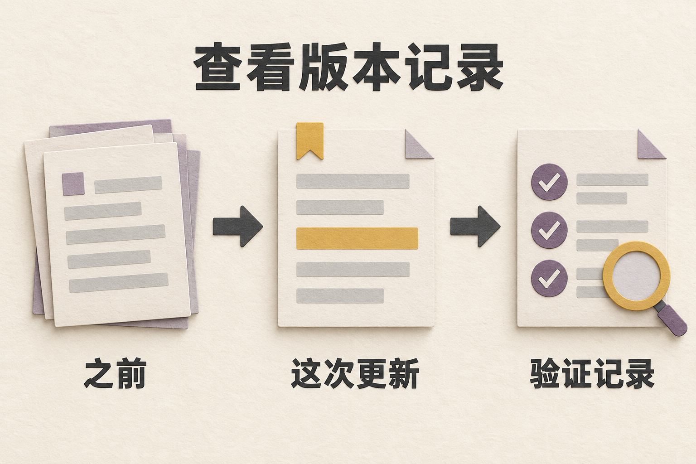
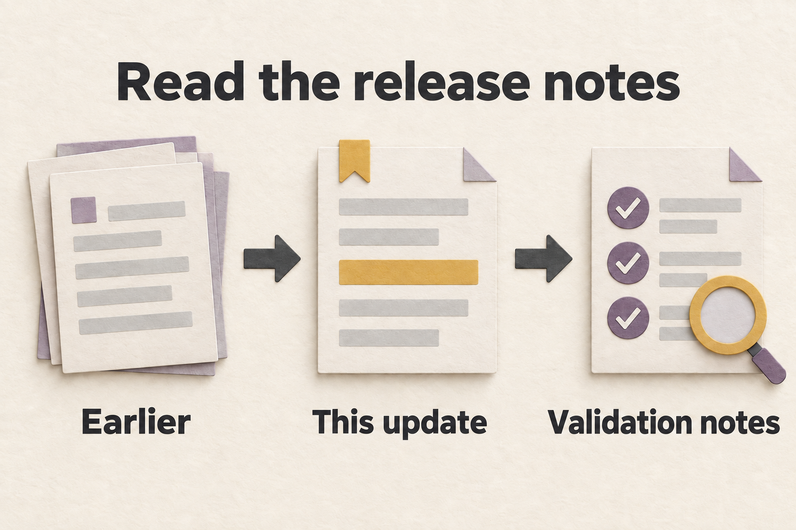

# 更新记录 / Changelog

记录值得公开说明的变化，格式遵循 [Keep a Changelog](https://keepachangelog.com/en/1.1.0/)。维护者正式发布版本前，条目写在 `Unreleased`，不猜测或重建发布历史。

Notable public changes are recorded here. The format follows [Keep a Changelog](https://keepachangelog.com/en/1.1.0/). Until maintainers cut a versioned release, add entries under `Unreleased`; do not reconstruct release history from guesses.

*未发布记录说明改动，不代表版本已发布。*

English illustration / 英文配图

*Unreleased entries describe changes; they do not announce a release.*

## 未发布 / [Unreleased]

### 2026-09-19：双语文档 / Bilingual documentation

- 公开文档改为相邻中英对照，并配中英文独立插图；更新锁定依赖、配置、安全、备份与贡献指引，区分样例浏览、真实调用和不同发布证明。

  Public docs now pair Chinese and English text with separate illustrations for each language. Updated locked setup, configuration, security, backup, and contribution guidance, distinguishing sample browsing, live calls, and release evidence.

### 2026-09-19：跨平台检查 / Cross-platform checks

- 修正 Windows 端口占用探测，避免把已有监听的端口报成可用；脚本测试改为识别实际清理作用域，并用明确的本地可执行文件验证离线 npx。

  Corrected Windows port probing so an existing listener is not reported as available. Script tests now inspect the owning cleanup block and use an explicit local executable to verify offline npx.

- 保留 Windows npx 的换行、路径和空参数：需要时仅为该次调用使用已有 Git Bash；同时让删除流测试由父测试持有完整应用生命周期，避免测试提前关闭运行时。

  Preserved newline, path, and empty arguments in Windows npx by using existing Git Bash for that call when needed. The stream-deletion test now keeps the app lifespan under the parent test until both requests finish.

- 补充 Windows npx 的回车转义，防止 Git Bash 把 CRLF 改成 LF；转义只作用于该子进程，不改写已安装的 npm。

  Added carriage-return escaping for Windows npx so Git Bash preserves CRLF. The escaping is limited to that child process and does not modify the installed npm files.

- 运行锁续期测试改用受控时钟和事件同步，避免 CI 调度延迟使短租约意外过期；仍验证真实 SQLite 续租和最终释放。

  Runtime-lock renewal tests now use a controlled clock and event synchronization so CI scheduling delays cannot expire the short test lease. They still verify real SQLite renewal and final release.

### 2026-09-18：推演与交互 / Simulation and interaction

- 公共承诺只在本轮参与者明确同意同一目标后采纳；竞争提案保持分开，采纳状态不表示执行完成。

  Public commitments are adopted only when the round's participants explicitly agree on the same target. Competing proposals remain separate, and adoption does not mean execution.

- reasoning effort 随运行持久化，并贯穿子调用和后续操作的继承路径；运行策略优先于子调用默认值。

  Reasoning effort persists with the run and follows child-call and later-operation inheritance paths. Bound run policy takes priority over child-call defaults.

- 收紧角色对话的来源坐标、心跳续租、取消与唯一终态；保留多轮历史和部分回答，并隔离会话切换后的迟到数据。

  Tightened conversation origin coordinates, heartbeat lease renewal, cancellation, and terminal outcomes. Preserved multi-turn history and partial answers, and isolated late data after session changes.

- 区分当前简报与过期完整报告归档；账本、报告和 Snapshot 携带确定性状态边界，并明确说明叙述一致性未获通用语义验证。

  Separated the current brief from stale full-report archives. Ledgers, reports, and Snapshots carry deterministic state boundaries and disclose that narrative consistency has no general semantic-verification guarantee.

- 图谱保留一个检查界面，按“详情 → 追问”操作；改善键盘分屏、手机输入区、历史、筛选空态、角色名和编辑入口。

  Kept one graph inspection surface with a details-to-question flow. Improved keyboard split panes, mobile input access, history, filtered empty states, character names, and editing entry points.

- 恢复 Pixel Theater 的 16:9 舞台与 PNG 捕获，改善手机和短屏布局；修正 Replay 人物名、Journal 保存反馈、会客厅状态与圆桌计时。

  Restored Pixel Theater's 16:9 stage and PNG capture and improved phone and short-screen layouts. Corrected Replay names, Journal save feedback, room status, and roundtable timing.

- 结果工具按“核对依据／追问角色／尝试改变”组织，区分比较已有分支与改写重演，并显示真实分支名和可验证来源角色。

  Organized result tools around verifying evidence, asking characters, and trying changes. Distinguished comparing existing branches from rewriting and rerunning, with actual branch names and verifiable source characters.

- 辩论显示独立规模与启动核对，确认和同 UUID 重试使用同一参数快照；修正取消后的焦点与专用文案。

  Debate now shows its own scale and launch review. Confirmation and retries with the same UUID use the same parameter snapshot; cancellation restores focus and uses dedicated copy.

- Agent 导入按规范化内容处理 409 冲突：相同内容不重复提交，有效编辑后可再试，网络失败仍可重试。

  Agent import handles 409 conflicts using normalized content: unchanged content does not resubmit, valid edits unlock another attempt, and network failures remain retryable.

以下保留此前记录的变化及英文原文，并补中文对照。历史条目不是当前提交的测试通过声明；复验方式见[贡献指南](CONTRIBUTING.md)和[部署说明](deploy/README.md)。

The entries below retain earlier changes and their original English wording, with Chinese translations. Historical entries are not test-pass claims for the current commit; see [Contributing](CONTRIBUTING.md) and [Deployment](deploy/README.md) for verification procedures.

### 新增 / Added

- 新增可配置的初始世界事件 Feed，最多包含 20 条有界、不受信任的输入，可回放来源账号，并支持九种原生社交动作：`POST`、`COMMENT`、`REACTION`、`FOLLOW`、`MUTE`、`SEARCH`、`TREND`、`REFRESH` 和 `IDLE`。

  A configurable initial world-event Feed with up to 20 untrusted, bounded entries, replayable source accounts, and nine native social actions: `POST`, `COMMENT`, `REACTION`, `FOLLOW`, `MUTE`, `SEARCH`, `TREND`, `REFRESH`, and `IDLE`.

- 在 Causal Review 新增按 owner 隔离的 Action Ledger，显示原生动作、目标和状态；另有证据账本投影，展示已保存发言、上下文观察、派生后果和记忆 hash 引用，不含记忆正文。

  An owner-scoped Action Ledger panel in Causal Review for native actions, targets, and states, plus a separate evidence-ledger projection for persisted utterances, context observations, derived consequences, and hashed memory references without memory text.

- 新增有界 `domain_world_v1`：代码校验并冻结模型提出的 schema，依据已验证的持久动作确定性裁定状态变化；Replay、Compare、Snapshot、Action Ledger、实时状态条、阈值提示、IDLE 归因和结果共用同一分支历史。

  A bounded `domain_world_v1` whose model-proposed schema is frozen by code validation, whose state changes are deterministically adjudicated from verified durable actions, and whose Replay, Compare, Snapshot, Action Ledger, live state strip, threshold tooltips, IDLE attribution, and result outcomes share the same branch-scoped history.

- 新增纯领域阈值机会层，在 Agent 决策前结合 N−1 轮社交机会与冻结的领域前置条件，不使用配额、随机动作或强制轮换。

  A pure domain-threshold opportunity layer that combines N−1 social opportunities with frozen domain preconditions before Agent decisions, without quotas, random actions, or forced rotation.

- 新增默认关闭的后端 verified-memory-promotion 核心：只接纳已验证内容，使用确定性幂等键、manifest 完整的版本化 Chroma 记录、稳定 hash 召回引用、非破坏 reader 回滚，以及有界尽力清理。尚无 capability、REST 或 UI 激活入口。

  A default-off backend verified-memory-promotion core with verified-only eligibility, deterministic idempotency keys, manifest-complete versioned Chroma records, stable hashed recall refs, non-destructive reader rollback, and bounded best-effort purge coverage. It has no capability, REST, or UI activation surface yet.

- 随附三个官方样例，无需 API key、文件选择器或模型调用即可作为完整本地运行打开；继续支持本地 `*.swarm` 导入。

  Three bundled official samples that open as complete local runs without an API key, file picker, or model call; local `*.swarm` import remains available.

- 新增持久化 Director 游玩流程，串联 Gameplay Cards、预测下注、世界线承诺和运行结束后的 Causal Archive。

  A durable Director play loop spanning Gameplay Cards, prediction bets, worldline commitments, and the post-run Causal Archive.

- 新增运行中的 Agent 档案，区分配置立场与观察到的情绪，并显示对应世界线和轮次。

  In-run Agent profiles that distinguish configured stance from observed emotion and show the matching worldline and round.

- 新增带场景、分支、轮次和事件类型坐标的 Agent 成长历史；“Current”表示匹配当前路由场景与明确选定的分支片段，其它可分类事件标为“Past”。

  Agent growth history with scenario, branch, round, and event-type coordinates; “Current” means the event matches the routed scenario and explicitly selected branch segment, while other classifiable events are “Past.”

- 新增报告生命周期与已保存章节分层、回退原因、证据坐标，以及生成、重写和静态回退内容在刷新或重开后仍可查看的有界章节工具记录；同时显示临时实时进度，并为模型综合的历史摘录标注推演坐标。

  Truthful report lifecycle and saved-section tiers, fallback reasons, evidence coordinates, bounded per-section tool traces that survive refresh/reopen for generated, rewritten, and static-fallback output, transient live current-position progress, and model-synthesized historical excerpts labeled with simulation coordinates.

- Setup 完成前要求当前连接测试成功，或由用户明确接受未验证保存。

  A Setup completion gate that requires a successful test of the current connection or explicit acceptance of saving it unverified.

- 新增脱敏 Snapshot 演示路径，无需实时 LLM 即可浏览已保存运行。

  Sanitized Snapshot demo path for browsing saved runs without a live LLM.

- 新增独立结果报告、model profiles、Local Packs、多次运行结果和公开分享工件。

  Standalone result reports, model profiles, Local Packs, multi-run results, and public sharing artifacts.

- 新增可点击的 Local Pack `demo_snapshots`，通过 catalog 白名单与校验直接导入，并区分确定失败和未知传输结果的恢复方式。

  Clickable Local Pack `demo_snapshots` with catalog-whitelisted, validated direct import and explicit recovery for definite failures or unknown transport outcomes.

- 新增结构化事前验尸分析，明确可用性、失败模式、不确定性和每种模式的证据链，与普通报告章节分开。

  Structured premortem analysis with explicit availability, failure modes, uncertainty, and per-mode evidence chains independent from ordinary report sections.

- 新增有序 Agent Pack v1 导出与原子导入，用于迁移角色组；排除身份 ID、owner 数据、记忆、成长历史、对话和单独保存的凭据，并脱敏常见凭据模式。

  Ordered Agent Pack v1 export and atomic import for portable Agent groups, excluding identity IDs, owner data, memories, growth history, conversations, and separately stored credentials while redacting common credential patterns.

- 新增离线 Public Artifact 分享：脱敏 JSON、单文件 HTML、Gallery hash 链接和本地文件加载；不意味着存在托管 registry 或社区发布服务。

  Offline Public Artifact sharing through redacted JSON, single-file HTML, Gallery hash links, and local-file loading; no hosted registry or community publishing is implied.

- 新增双语截图、静态展示和贡献/安全指南。

  Bilingual screenshots, static showcase, and contributor/security guidance.

### 调整 / Changed

- 初始 Feed 的来源账号支持关注和静音；静音来源不再进入该 Agent 后续 Feed、搜索和趋势投影。Snapshot 保留并重映射 Feed、来源账号和原生动作，Replay 遵循有效谱系与截止轮次。

  Source accounts from the initial Feed can be followed or muted; muted sources are excluded from that Agent's subsequent Feed, search, and trend projections. Snapshots preserve and remap the Feed, source accounts, and native actions, while Replay respects effective lineage and cutoff.

- `COMMENT`、`REACTION`、`FOLLOW`、`MUTE`、`SEARCH`、`TREND` 和 `REFRESH` 依据真实前一轮机会快照开放；领域绑定动作还要求匹配 schema、状态修订、规则绑定并满足阈值。

  COMMENT, REACTION, FOLLOW, MUTE, SEARCH, TREND, and REFRESH decisions are now gated by a real prior-round opportunity snapshot; domain-bound actions additionally require the same schema, state revision, rule binding, and satisfied threshold.

- Agent 轮次带入分支范围内的个人记忆、继承但隔离的 fork 状态和有界的上一轮关系信号。

  Agent turns now carry branch-scoped personal memory, inherited-but-isolated fork state, and bounded previous-round relationship signals.

- Campaign 结算依据持久化服务端状态和已完成终端叶世界线，计算下注、目标、承诺、档案评级和奖励。

  Campaign settlement now derives bets, objectives, commitments, archive grades, and rewards from persisted server state and completed terminal leaf worldlines.

- 官方样例包支持可复现生成，并校验完整结果、Replay 坐标、图谱引用、报告和 Agent 状态。

  Official sample bundles are reproducibly generated and validated for complete results, replay coordinates, graph references, reports, and Agent state.

- 后端 Docker 镜像随附 `packs/` 和 `samples/`，供容器内使用。

  The backend Docker image now bundles `packs/` and `samples/` for container-local use.

- 生产文本处理、路由和传递工具依赖升级到修补版本。

  Production text-processing, routing, and transitive utility dependencies were upgraded to patched releases.

- 公开文档拆分为项目概览、使用、配置、功能索引、安全和宣传快照。

  Public documentation now separates project overview, usage, configuration, feature index, security, and promotional snapshots.

- Docker 默认将前端 `18928` 与后端 `18927` 绑定到 loopback。

  Docker defaults bind frontend `18928` and backend `18927` to loopback.

- 生产启动要求 `ENV=production`、`SESSION_SECRET` 和 `ADMIN_TOKEN`。

  Production startup requires `ENV=production`, `SESSION_SECRET`, and `ADMIN_TOKEN`.

- 后端 `init_db()` 继续负责数据库迁移。

  Backend `init_db()` remains the database migration owner.

- 结果概率使用已完成终端叶世界线，排除 fork 父分支。

  Result probabilities use completed terminal leaf worldlines; fork parents are excluded.

- 报告 likelihood 与分析置信度只使用已完成终端叶与证据计数；fork 父分支及带符号情感收敛代理不提高分析置信度。

  Report likelihood and analytic confidence use completed terminal leaves and evidence counts only; fork parents and signed affect-convergence proxies do not raise analytic confidence.

- 精确本地 OpenAI-compatible 端点支持无 key、无 `Authorization` header 运行；其它自定义和远端端点仍要求 key。

  Exact-local OpenAI-compatible endpoints can run without a key or `Authorization` header; all other custom and remote endpoints remain key-required.

- BYOK 连接测试将 provider fanout 设为显式选择：`include_probe` 默认 false；fanout 要求调用者凭据、精确本地端点或配置的 admin token，并行宽度最多 4、附加调用最多 10 次；仍允许手动测试免 key 本地端点，自动启动检查不做 fanout。

  BYOK connection testing now keeps provider fan-out explicit: `include_probe` defaults to false, fan-out requires caller-controlled credentials, an exact-local endpoint, or the configured admin token, parallel width is capped at four with at most ten additional provider calls, manual exact-local keyless tests remain available, and automatic launch checks do not fan out.

- 选择 Local Pack 时原子导入有界的问题、语言、设置、世界上下文、stakes 和角色预览。角色组不创建持久 Agent 身份，其有界字段作为不受信任的世界上下文进入运行；作者提示仍标为不受信任的参考证据。

  Local Pack selection now atomically imports bounded question, language, settings, world context, stakes, and cast preview. Casts do not create persistent Agent identities, but their bounded fields enter the run as untrusted world context; author prompts remain explicitly untrusted reference evidence.

- Agent 观察及分支范围内的因果、阵营、报告、Replay 和比较路径共用有效根到叶谱系与截止轮次。纳入符合条件的 fork 前祖先轮次，排除兄弟分支、父分支 fork 后未来数据和截止点后的数据；自包含 Replay 分支在自身边界停止继承。旧因果/阵营 `stance`、`trust`、`opposition` 仍明确标为从模型 `emotion` / `diverge` 派生的情感代理。

  Agent observations and branch-scoped causal, faction, report, Replay, and compare paths now use one effective root-to-leaf lineage and round cutoff. Eligible pre-fork ancestor rounds are included, while siblings, parent post-fork future data, and post-cutoff data are excluded; self-contained Replay branches stop at their Replay boundary. Legacy causal/faction `stance`, `trust`, and `opposition` fields remain disclosed as affect proxies derived from model-generated `emotion` / `diverge`.

- 主题包演示条目仅引用实际随附的 Snapshot；启用 Snapshot 导入后提供可点击的直接导入操作。

  Pack demo entries now reference only shipped Snapshots that actually exist and provide a clickable direct-import action when Snapshot import is enabled.

- 发布校验精确的 CI 通过 SHA，构建不可变前后端镜像对，两个镜像均成功后才晋升标签；任一晋升失败则触发并校验整对回滚。版本标签要求已执行签收，跳过过时 edge 发布，将 dry-run 标为计划，并传播浏览器关闭失败。

  Release publication now verifies the exact CI-passed SHA, builds an immutable backend/frontend pair, promotes both tags only after both images succeed, triggers and verifies pair rollback if either promotion fails, requires an executed signoff for version tags, skips stale edge publication, labels dry-run work as planned, and propagates browser teardown failures.

### 修复 / Fixed

- 旧运行缺少上下文 receipt 时标为 `unavailable`，不推断历史；记忆 receipt 只包含 hash 引用和来源场景坐标。

  Kept legacy runs truthful by reporting missing context receipts as `unavailable` instead of inferring history, and kept memory receipts bounded to hashed references and source-scenario coordinates.

- 畸形或过期领域传输数据、缺轮历史、缺失比较侧和不可用世界结果保持关闭，不把部分值显示为权威；货币最小单位按 ISO 小数位格式化，不直接显示原始存储整数。

  Kept malformed or stale domain wire data, incomplete round history, missing compare sides, and unavailable world outcomes fail-closed instead of rendering partial values as authoritative; currency minor units are formatted with their ISO exponent rather than as raw storage units.

- 为 Action Ledger、领域历史分页、机会推导、已验证记忆召回和协调工作设置边界，同时保持稳定排序与精确 receipt 绑定。

  Bounded Action Ledger and domain-history pagination, opportunity derivation, verified-memory recall, and reconciliation work while preserving stable ordering and exact receipt binding.

- 反事实 payload 重写时保留可移植 Snapshot 的 JSON 数字 token，包括高精度、指数与负零形式；继续拒绝重复 key 和非有限数字。

  Preserved portable Snapshot JSON number tokens during counterfactual payload rewriting, including high-precision, exponent, and negative-zero forms, while continuing to reject duplicate keys and non-finite numbers.

- 第二阶段情绪/立场解析失败时保留成功的 Agent 发言，并在实时、Replay、Snapshot、导入导出、报告和 Pixel Theater 传播明确的不可用状态，不再把缺失观察展示为中性。

  Preserved successful Agent speech when second-pass emotion/stance parsing fails, propagated an explicit unavailable status through live, Replay, Snapshot, import/export, reports, and Pixel Theater, and stopped missing observations from being presented as neutral.

- 阻止过期场景、WebSocket 事件、Replay payload 和自动化状态跨越路由或 Replay 边界。

  Prevented stale scenarios, WebSocket events, replay payloads, and automation state from crossing route or replay boundaries.

- 修正 fork、嵌套 Replay、反事实替换、续跑、重名和分支截止轮次中的 Agent 记忆与情绪连续性。

  Corrected Agent memory and emotion continuity across forks, nested replay, counterfactual replacement, resume, duplicate names, and branch round cutoffs.

- 扩展 Snapshot 和 Replay 的凭据脱敏、引用重映射和导入恢复，同时保留 localhost LLM URL 和自然语言中普通 “bearer” 用法。

  Expanded Snapshot and replay credential redaction, reference remapping, and import recovery without blocking localhost LLM URLs or ordinary natural-language uses of “bearer.”

- 结果页分析链接按实际场景数据与 capability 检查显示，提供可重试的可用性错误和明确空态。

  Made result-page analysis links follow actual scenario data and capability checks, with retryable availability errors and explicit empty states.

- 强化 BYOK URL 校验和报告重试。连接检查与 provider probe 必须收到明确成功终态和可见文本，并忽略终态后的数据；要求正文的生成不再接受 error envelope、未完成结果、空白输出或不完整流，仍保留已完成的纯原生工具/推理 Responses。输出前清洗 provider 诊断与结构化日志凭据。

  Hardened BYOK URL validation and report retries; made connection checks and provider probes require an explicit successful terminal signal plus visible text and ignore data after that terminal, kept text-required generation from accepting error envelopes, non-terminal completions, empty visible output, or incomplete streams while retaining completed native-tool/reasoning-only Responses, and scrubbed provider diagnostics and structured-log credentials before output.

- 必需的 Debate 发言和裁判、以及会客厅初始核心方案，在 LLM 输出不可用时明确失败，不把确定性锚点当作模型生成成功；明确禁用 LLM 的模式与会客厅后续步骤保留各自的确定性或尽力行为。

  Made required Debate turns and judging, plus initial Ending Room core plans, fail closed after unusable LLM output instead of reporting deterministic anchors as successful model generation; explicitly disabled LLM modes and Ending Room follow-up retain their scoped deterministic or best-effort behavior.

- REST、列表和 WebSocket 路径统一校验 Agent Conversation 线程、所属 Scenario 与可选 AgentIdentity 的签名 principal owner；隐藏 owner 不匹配，不接管旧 ownerless 行。

  Enforced signed-principal ownership across an Agent Conversation thread, its Scenario, and its optional AgentIdentity for REST, list, and WebSocket paths; owner mismatches remain concealed and legacy ownerless rows are not adopted.

- 防止解析、持久化、广播和交接中的 runtime-lock 丢失或释放清理覆盖粘性终态、成功响应或原始调度错误；完成初始广播期间的用户取消，只在原子错误转换后发出解析后失败事件，并保留中断恢复。

  Prevented runtime-lock loss and lock-release cleanup during parse, persist, broadcast, and handoff from overwriting sticky terminal states, successful responses, or original scheduling errors; finalized user cancellation during the initial broadcast, emitted post-parse failure events only after an atomic error transition, and retained interrupted-run recovery.

- 阻止 Replay、Snapshot、报告和分享路径暴露已知凭据字段。

  Kept replay, Snapshot, report, and share paths from exposing known credential fields.

- 更换端点或 Debate 角色 profile 时不携带旧 profile 的密钥、模型、限速或能力策略；完整覆盖解除旧 profile，部分 session 覆盖在混入恢复配置前拒绝；结果页不提交未变化的 profile 镜像字段，模型编辑要求完整远端元组，显式免 key 本地请求不注入服务端默认 key。

  Prevented an old profile secret, model, rate limit, or capability policy from following a changed endpoint or Debate role profile; detached the old profile on complete provider overrides; rejected partial session overrides before they can mix with a recovered scenario profile; kept unchanged profile mirrors out of result-page session overrides; required complete remote tuples for model edits; and prevented the server default key from being injected into an explicit keyless local request.

- 阻止 Local Pack 上下文与角色预览泄漏到后续 Quick Start 或非 pack 启动。

  Prevented Local Pack context and cast previews from leaking into a later Quick Start or other non-pack launch.

- 同 ID 刷新后重新加载已选 Local Pack 详情，切换前清除旧详情、模板和操作，阻止迟到响应覆盖新选择。

  Reloaded selected Local Pack detail after same-ID refresh, cleared stale detail/template/actions before switching, and prevented late detail responses from overwriting the new selection.

- 区分确定的 Local Pack 演示导入失败与未知传输结果；请求可能已提交时，先引导用户查看 History 再重试。

  Distinguished a definite Local Pack demo import failure from an unknown transport outcome, directing users to History before a retry when the request may already have committed.

- 首次 Snapshot 数据库写入前拒绝重复 Agent、Message、Graph Node 来源 ID，以及一个 Round 来源 ID 的冲突复用。

  Rejected duplicate Agent, Message, and Graph Node source IDs, plus conflicting reuse of one Round source ID, before the first Snapshot import database write.

- 保留失败、取消、跳过、停滞、截断和部分报告状态，同时保留已保存章节，不把历史摘录展示为实时访谈。

  Kept failed, cancelled, skipped, stalled, truncated, and partial report states visible without discarding saved sections or presenting historical excerpts as live interviews.

- 让反事实 Agent 和轮次选择器适配窄手机视口，避免水平溢出。

  Made counterfactual Agent and round selectors fit narrow phone viewports without horizontal overflow.

[Unreleased]: https://github.com/AGI-is-going-to-arrive/Swarm-Oracle/commits/main
