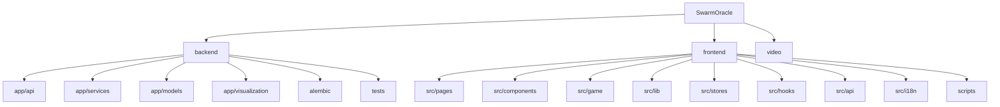

# SwarmOracle

> 群体预言机 -- AI "What-If" Prediction Playground
> 一个基于 FastAPI + React + Phaser 的 AI 驱动互动叙事游戏平台。

## 项目愿景

SwarmOracle 允许用户提出 "如果...会怎样" 的假设性问题，由 AI 代理群体模拟多分支叙事推演，支持辩论竞技场、神谕密室、世界线圆桌等多种互动模式，最终生成可分享的预测结果。

## 架构总览

| 层级 | 技术栈 | 端口 |
|------|--------|------|
| 前端 | Vite + React 19 + TypeScript + Phaser 3 + Zustand | 18928 |
| 后端 | FastAPI + SQLModel + Alembic + ChromaDB | 18927 |
| LLM  | MiniMax-M2.5 (可配置任意 OpenAI 兼容 API) | 可配置 |
| 数据库 | SQLite + ChromaDB (向量检索) | 本地文件 |
| 部署 | Docker Compose (backend + frontend) | 18927/18928 |

## 模块结构图



## 模块索引

| 模块 | 路径 | 语言 | 职责 | 文件数 | 测试数 |
|------|------|------|------|--------|--------|
| backend | `backend/` | Python 3.11+ | FastAPI 后端，LLM 编排，模拟引擎，Web 搜索增强 | ~70 | full pytest collected: 3272；counterfactual+replay+simulator+resume targeted: 223 passed |
| frontend | `frontend/` | TypeScript | React SPA，Phaser 游戏引擎，实时 WS | ~140+ | 201 文件 / 2190 tests；i18n 2765/2765 |
| video | `video/` | Markdown | 宣传视频脚本与分镜稿 | 10 | -- |

## 运行与开发

### 环境准备

```bash
# 后端
cd backend
python -m venv .venv && source .venv/bin/activate
pip install -e ".[dev]"
cp .env.example .env  # 配置 LLM_API_KEY 等

# 前端
cd frontend
npm install
```

### 开发服务器

```bash
# 后端 (端口 18927)
cd backend && uvicorn app.main:app --host 0.0.0.0 --port 18927 --reload

# 前端 (端口 18928)
cd frontend && npm run dev
```

### Docker 部署

```bash
docker compose up --build
```

### 数据库迁移

```bash
cd backend && alembic upgrade head
```

## 测试策略

| 层级 | 工具 | 命令 |
|------|------|------|
| 后端单元/集成 | pytest + pytest-asyncio | `cd backend && pytest` |
| 前端单元/组件 | vitest + @testing-library/react | `cd frontend && npm test` |
| 前端 E2E | Playwright + 自定义脚本 | `cd frontend && npm run e2e:full` |
| E2E 子集 | -- | `npm run e2e:ending-room:full` / `npm run e2e:roundtable:full` / `npm run e2e:debate:full` |
| Lint (后端) | ruff | `cd backend && ruff check .` |
| Lint (前端) | eslint | `cd frontend && npm run lint` |
| 构建校验 | tsc + vite | `cd frontend && npm run build` |

## 编码规范

- **后端**: Python, ruff (line-length=100, target py311), select E/F/I/W
- **前端**: TypeScript strict, eslint + react-hooks + react-refresh
- **i18n**: 双语 (zh/en)，通过 `i18next` + `react-i18next`
- **状态管理**: Zustand (前端全局状态)
- **路由**: React Router v7 (前端), FastAPI APIRouter (后端)

## AI 使用指引

### 核心架构
- `ending_room_service` 已拆分为子模块包 (`_utils`, `_participants`, `_threads`, `_content`)，修改时注意 re-export 兼容性
- `worldlineRoundtableStore.ts` 是 `endingRoomStore` 的 re-export，不是 stub
- 大文件：`EndingChatModal.tsx` (~1866 行)，`WorldlineRoundtableView.tsx` (~2223 行)
- LLM 客户端支持 BYOK，前端通过 `LlmProviderRequestOptions` 传递
- ChromaDB 双层 memory：scenario-scoped + identity-scoped (`identity_{user_id}`，200 条 FIFO，串行化锁)
- Agent continuity key：SHA-256(role+persona[:30])[:16]，跨场景身份匹配

### 安全边界
- BYOK：业务入口统一要求 `base_url` 必须带 `api_key`，前移 400；SSRF allowlist 17 域名 + hostname 校验
- 不可信文本通过 `format_untrusted_text_block()` fenced block，三反引号转义防 fence-breakout
- WS 首帧 auth 协议（`auth` → `auth_ok`），4001/4404 不重连；`MAX_WS_PER_SCENARIO=50` 含 pending_auth
- `GET /api/capabilities` 轻量配置端点（无 LLM 调用），不暴露 key/base URL

### Result Quality / Question Anchoring
- `FEATURE_RESULT_VERDICT` 默认开启；主 scenario 完成后，simulator 生成直接回答原问题的 verdict、confidence 和一句话答案，生成失败时 fail-soft，不阻断 `simulation_done`
- verdict prompt 会读取分支标题、insight、概率和最多 1200 字的 `story_excerpt`；分支摘要整体仍用 untrusted text block 限住预算
- narration Pass-1 / Pass-2 都带原问题锚点；Pass-2 要求 `question_answer` 用具体姓名、事件或结果回答，不只是改写问题本身
- 结果质量数据写在 `Scenario.parsed_context.result_quality`，包括顶层 `verdict / confidence / question_answer` 和 `branch_question_answers`；没有新增 DB 表或 column
- `/api/capabilities.result_verdict` 控制前端展示；ResultView capability enabled 时会挂 `ResultVerdictPanel`，story verdict 非空时显示 verdict 和 confidence，缺失时显示中性的“暂无预测结论”并保留原问题；标题 subtitle 只有在 verdict 非空时切到预测结论口径

### Web 搜索增强
- InputView toggle 默认可见，推演前自动搜索注入 Agent 提示词（CORE/IMPORTANT/CROWD 三层）
- Source family 受 `FEATURE_NEW_SOURCES` + 当前有效 provider capability 双重门控；server default 读 `/api/capabilities`，custom override 只按可识别 base URL 推断，未知时显示 no-provider warning
- Tavily/Exa API 域名过滤，SearXNG `site:` 查询，xAI Responses `filters.allowed_domains`；均做 URL 后过滤
- `provider_capability` 描述服务端默认 provider，非 custom override 实时探测
- ResultView source family card 已覆盖 `failed / unsupported_provider / fallback_unconstrained / search_skipped`，后端 `status_reason` 会作为说明文案进入卡片
- `detect_provider(base_url)` hostname 检测 15 个已知 LLM provider + proxy/local 分类（`LLMProviderProfile`）
- `ProviderSearchOutcome` 结构化搜索结果：`state/domain_filter_mode/domain_coverage/status_reason`，HTTP error code 自动映射
- Native search adapter 框架：`native_search_adapters.py` 含 xAI/OpenAI Responses adapter + null adapter，Protocol 接口 `build_search_tools/parse_citations/detect_body_error/count_tool_calls`
- `llm_call()` 新增 `native_search_domains` 参数，Responses API 端点按 provider capability 自动注入 `tools`，citation 通过 ContextVar 暴露；malformed / non-http base URL 不启用 native tools
- Native search budget：`NATIVE_SEARCH_MAX_TOOL_CALLS=5` 对单次 LLM 调用的 web search tool 调用数 fail-closed，`NATIVE_SEARCH_MAX_CITATIONS=50` 对 citation 列表截断
- `detect_body_error` 已实现 xAI/OpenAI `web_search_call status=failed` 检测 + 通用 body `error` 字段检测；对外只返回通用 body-error reason，不回显 provider 原始 message
- `native_citations` 字段已加入 `WebSearchResult` + `_parse_web_context_json` 白名单 + 前端 `WebSearchContext` 类型；后端和前端都会过滤非 http(s) citation URL；`_parse_web_context_json` 将缺失 `snippets` 归一化为空列表，不再丢弃 native-only payload
- `WebSourcesSection` 展示 native citations（indigo 左边框 + oklch fallback + forced-colors + focus-visible），`aria-controls`/`id` 关联，并跳过 malformed replay / foreign payload；native-only 场景（无 snippets）仍可独立渲染 citations
- `SourceCategoryCard` 的 `status_reason` 对普通用户可见（`.result-source-card__reason-detail`），screen reader 仍通过 `aria-describedby` → sr-only span 获取；空字符串 reason 归一化为 undefined
- `ResultModals` 卡片显示条件：provider enabled OR 有 items OR family_context 含可解释状态（failed/unsupported_provider/search_skipped/fallback_unconstrained）；capability disabled 时带 historical badge

### 辩论竞技场
- Persona：`generate_persona_with_llm()` + `build_cast_async()` 3 方并行，失败回退模板，持久化 `breakdown_json.metadata.personas`
- Prompt 口语化 + 禁用术语列表，turn pass-2 retry（temp 0.8→0.6）后 fallback `anchor_copy`
- Phase insights `_enhance_insights_with_llm()` 重写，受 `DEBATE_USE_LLM` gate
- ArgumentMap 全宽底部展示，OKLCH 色彩 + sRGB fallback + `@supports` 渐进增强

### Oracle 文案
- 3-tier fallback：generation temp=0.82 → rewrite temp=0.78 → static anchor
- 四种房间类型均接入 factual_guardrail + scenario_question + transcript_quotes
- roundtable 静态锚点会把 `scenario_question` 压成短问题前缀；phase insight 会先去掉已存在的问题前缀，再按中文 96 字 / 英文 160 chars 预算压成一句，前端卡片默认折叠，避免长问题或长转述挤掉真正的转折点
- 18 种 voice variant（role_hint + bio_hint 子串匹配），stream 温度 0.75 + reasoning_effort medium
- generation-first 路径可处理 JSON 字符串输出；follow-up 空流式或仅 reasoning 输出会退回非流式改写，英文 fallback 不把中文问题原样塞回英文句子

### 圆桌
- Hero 做减法 + PostVerdictPanel 三 tab（Agent 对话/分析师/问卷），仅 verdict 后可用
- `roundtable_survey.py` SSE + Semaphore(3)；`roundtable_analyst.py` ReACT 3 工具 5 轮迭代
- `roundtable_survey` 是圆桌 Deep Dive 工作台能力，不是 `EndingRoomInteractionMode`；EndingChatModal 当前不支持 `parallel_survey`

### Phase 3 (F1-F6)
- 13 ORM 模型，Alembic 014-016 + 022 + 025；8 后端服务；`/api/agents/*` + `/api/graphs/*`
- `/api/capabilities` = web_search + 17 功能开关；Feature flags 以 `config.py` 为准，多数默认 `false`
- 5 前端页面 + 9 组件 + `useScenarioGraph`/`useHookSummary` hook
- `simulator.py` 4 非阻塞 hook（因果图谱/阵营/检查点/身份），均受 `FEATURE_*` 控制
- 前端页面均通过 `useCapabilityCheck` hook 做 capability gate
- P1-9 resume_from_round + P1-12 identity memory compaction（`FEATURE_IDENTITY_COMPACTION`）

### 图谱可视化
- DAG（@xyflow/react）：共享 BFS `traceConnectedPath`（`graphTraversal.ts`），`PERF_ANIMATION_LIMIT=150`
- KG（@antv/g6）：`kgGraphConfig.ts` 工厂，双层色系（DAG 鲜明色 vs KG 暖灰色），Agent 色环 15 色
- `AnimatedEdge.tsx` + `EdgeLabelTooltip.tsx`，全面 `prefers-reduced-motion` 覆盖
- WorkbenchView 三 tab 始终全量图谱；`view=kg` 只要求 `FEATURE_KG_EXPLORER`
- `getFactionRelations` 路径 `/scenario/{id}/faction-relations`（无 `/graphs/` 前缀）
- faction-timeline 端点校验 `branch_id` 存在+归属，缺失返回 404

### 前端约定
- InputView IME 三重防护 + 推演确认弹窗；模式选择器默认展示，BYOK 独立折叠
- Session gate 以 router 级 dependencies 统一注入
- `SafeMarkdown`（react-markdown + rehype-sanitize）渲染 Agent 消息 + TypingIndicator
- 圆桌硬编码文本已全面 i18n 化

## 变更记录 (Changelog)

### 近期 (2026-05)

| 日期 | 说明 |
|------|------|
| 05-19 | 反事实对比逐消息升级：`compare_branches()` 在轮级数据基础上新增 `branch_a_messages` / `branch_b_messages`（agent_name + content + emotion）逐消息字段；新增 `POST /counterfactual/{branch_id}/resimulate` 端点，给旧的只 clone+seed 的反事实分支补跑模拟；前端新增 `src/lib/textDiff.ts` 字符级 LCS diff（CJK / emoji 安全的码点切分）；`CompareDigestView` 改为逐 agent 消息卡片 + 红绿 diff 高亮 + 折叠/展开按钮 + 独占轮（only-A / only-B）单列布局，`CounterfactualPanel` 新增模拟进行中提示。验证：backend counterfactual+replay+simulator+resume targeted `223 passed`；frontend full `201 files / 2190 tests`，tsc/eslint/build 通过；i18n `2765/2765` |
| 05-19 | 反事实对比全面重构：`POST /counterfactual` 融合重新模拟（clone+seed+`run_sim_background`），反事实分支不再只停留在干预轮，会向后推演并生成完整叙事 story/insight/title；`compare_branches` 从 `str.split()` 改为 CJK-aware 逐字分词修复中文分歧度计算；compare 响应新增 `intervention`（原始/改写消息元数据）+ `is_identical`（标识完全相同轮次）+ `common_rounds`（分歧前相同轮数）；分支标题 i18n 感知（中文 `反事实：从第N轮起`）。前端 `CompareDigestView` 新增干预横幅（agent 名称+原始/改写对比+红绿左边框）、折叠相同轮次、干预轮高亮徽章、全 identical 空态处理、forced-colors/a11y 覆盖；`CounterfactualPanel` 新增模拟进行中提示。`simulate: bool = True` 默认触发模拟，`simulate=false` 保留旧行为（仅 clone+seed）。验证：backend full `3257 passed, 6 skipped`（+19 tests）；frontend full `200 files / 2176 tests`，tsc/eslint/build 通过；i18n `2758/2758`（+26 keys）；Codex 后端+前端双轮对抗式审查通过（0 Critical，6 Warning 全部修复） |
| 05-19 | Oracle Chambers / EndingChatModal review hardening：EndingChatModal 的 thread rail 与 evidence drawer 移到 transcript 内部滚动区外，保留消息列表独立滚动，修复移动端 replay/evidence drawer 点击拦截；移除没有后端枚举和持久化合同的 `parallel_survey` skeleton，保留已实现的 roundtable survey SSE 工作台能力；Oracle backend generation-first 路径补 JSON 字符串解析、streaming-first plain stream fallback、英文 CJK fallback 过滤，并在 narrator/simulator 边界清理用户可见 `[R...]` round marker。验证：backend full `3238 passed, 6 skipped`，Oracle targeted `297 passed`；frontend full `200 files / 2175 tests passed`，tsc/eslint/build/i18n `2732/2732` 通过；ending-room 与 roundtable E2E 通过 |
| 05-19 | Roundtable phase insight 可读性收口：`_phase_insight()` 保留去重问题前缀，但把 commentary 预算从固定 64 放宽为中文 96 字 / 英文 160 chars；`WorldlineRoundtableView` 的 phase insight accordion 改为默认全部折叠，标题继续只显示短 preview，用户展开后再看更完整的一句主持人提炼。验证：`test_ending_room_service.py` 133 passed，`WorldlineRoundtableView.test.tsx` 46 passed，相关 ruff/eslint 和 frontend build 通过 |
| 05-19 | Result Quality / Question Anchoring 二次收口：narrator Pass-1/Pass-2 都锚定原问题，fallback 叙事也带 question；verdict prompt 使用分支 `story_excerpt`，分支摘要预算扩大到 15000 字符；roundtable opening/crossfire/witness/verdict 静态锚点透传 `scenario_question`，`_phase_insight()` 去重问题前缀后再压缩。前端 ResultVerdictPanel 对 blank/null/undefined verdict 显示中性 fallback，不再提示“正在分析”；EndingCardsGrid 把 branch `question_answer` 放到概率条上方；DirectorNotebook 优先展示 story verdict，再展示 branch insight；Debate E2E 会展开默认折叠的阶段地图后再断言完整列表。验证：backend targeted `290 passed`；frontend Result/Debate targeted `25 passed`；frontend lint/build 通过；Debate mobile Chromium 390px 与 320px E2E 通过；i18n parity `2730/2730` |
| 05-16 | Document Ingestion Upgrade：`/api/agents/from-document` 支持长 PDF 的采样粗扫 + 全文证据精提，PDF 文本上限调整为 1000000 字符，实体抽取/persona 批次/persona 单个超时拆成独立配置；persona 生成按 `0.7 -> 0.6 -> 0.5` 递减温度重试，部分失败会保留已创建 Agent 并返回 `agents_failed`。Agent Workshop document tab 延长上传超时到 8 分钟，补齐 partial success / 0-agent / timeout / no-text 本地化错误。默认 backend full gate 通过：`3070 passed, 6 skipped`；文档导入后端定向 `48 passed`，前端 DocumentUploader + locale 窄集 `19 passed`；live LLM benchmark / observation 测试改为 `RUN_REAL_LLM_TESTS=1` opt-in |
| 05-15 | Agent 页面导航修复：`AgentWorkshopView` 新增返回 Agent 库的文字链接（`← 返回 Agent 库`），`AgentLibrary` 返回按钮从 `navigate(-1)` 改为 `<Link to="/">`，修复从 `/agents/new` 进入 `/agents` 后点返回会回到 `/agents/new` 的 bug。i18n 新增 `agents.back_to_library` key，en/zh parity `2527/2527`。FE 185 files / 2047 passed |
| 05-15 | Result Quality / Question Anchoring：`FEATURE_RESULT_VERDICT`、story `verdict / verdict_confidence / branches[].question_answer`、ResultView `ResultVerdictPanel` 和 branch answer 展示已接通；verdict 生成 fail-soft，prompt 输入继续走 untrusted-data guardrail。验证：backend targeted `15 passed, 181 deselected`，`ruff check app/ tests/test_parser.py` 通过；backend broad command 为 `3 failed, 3024 passed, 7 skipped, 1 deselected`，其中 parser clamp 和 conversation abort 已单独复验通过，live LLM matrix 仍是 120s 慢路径风险；frontend `185 files / 2047 tests passed`，tsc/eslint/build/i18n `2509/2509` 和新旧结果页浏览器复核通过 |
| 05-14 | Web Search P5 前端边界修复：`SourceCategoryCard` status_reason 对普通用户可见（`aria-hidden` visible `<p>` + forced-colors 覆盖），`ResultModals` 卡片在可解释状态（failed/unsupported/skipped/fallback）下始终显示并带 historical badge，`WebSourcesSection` native-only 场景独立渲染 citations 并抑制空态文案，后端 `_parse_web_context_json` 缺失 snippets 归一化为空列表。BE 2991 / FE 2038 passed |
| 05-14 | Web Search P5 Release Gate：native search tool-call budget（`NATIVE_SEARCH_MAX_TOOL_CALLS=5` fail-closed + `NATIVE_SEARCH_MAX_CITATIONS=50` 截断），`detect_body_error` 从空壳改为 xAI/OpenAI failed search call + 通用 body error 检测且不回显 provider 原始 message，`WebSourcesSection` a11y 加固（`aria-controls`/`id` 关联 + `:focus-visible` trigger/url + forced-colors Highlight），命名 E2E `e2e:native-search` 脚本（6 场景 x Chromium/Firefox/WebKit desktop+mobile），provider contract fixture 覆盖；legacy release sweep 追加真实调用 Tavily/Exa/xAI-local/SearXNG-local，并通过 `e2e:web-search`、`e2e:new-source-ingestion-live`、`e2e:capability-matrix`。BE 2988 / FE 2038 passed；WebKit Tab-to-links 为已知平台限制 |
| 05-14 | Web Search P2-P5 hardening：`detect_provider` malformed/non-http URL 收口，native citations 后端/前端双层 sanitize，`ProviderSearchOutcome` 429/4xx/5xx 映射修正，default Responses URL tools 注入修正，ResultView timer cleanup，InputView advanced accordion 溢出修复。BE 2926 / FE 2037 passed |
| 05-13 | Web Search P2-P4b release：P2 native/proxy 状态模型（`detect_provider` 15 hosts + `ProviderSearchOutcome` 结构化返回 + error code mapping）；P3 xAI native search pilot（adapter 框架 + `llm_call` tools 注入 + citation ContextVar）；P4b native citation UI（`WebSourcesSection` + oklch fallback + forced-colors）。BE 2908 / FE 2036 passed |
| 05-13 | Web Search / Source Family hardening：provider capability registry + base/family 独立 try-block + xAI `filters.allowed_domains` + IDN/punycode 归一化 + P4a Source Family UI 状态收口。BE 2841 / FE 2036 passed |
| 05-07 | 辩论去模板化：LLM persona 3 方并行 + prompt 口语化 + turn pass-2 retry；Oracle rewrite 上下文透传；worker synthesis 单元覆盖。BE 2386 / FE 1769 passed |
| 05-07 | 辩论 turn 卡片排版（OKLCH + line-clamp-2）+ IME 三重防护 + 推演确认弹窗 |
| 05-06 | 首页 UX 重构（模式选择器默认展示）+ source family domain filter + web 搜索全栈审计（cache stampede 去重 + useWebSearchConfig hook） |

### 2026-04 里程碑

| 日期 | 说明 |
|------|------|
| 04-30 | Oracle 文案去模板化：generation-first 3-tier fallback，四种房间类型全接入 |
| 04-28~29 | 圆桌优化：Hero 做减法 + PostVerdictPanel 三 tab + 2 SSE 服务 + TimelineBar 闪烁修复 |
| 04-27~28 | P6-P7 图谱升级：KG mirofish + DAG editorial + 色系双层分离 + Replay UI 重构 + 10 项代码质量修复 |
| 04-25 | P2 审查 + KG 工作台收口 + 边级 evidence + 类型告警清零 + P0/P1 完成度评估 |
| 04-18~23 | graph-playability-upgrade 6-layer delivery + WS/capability contract 收口 + gated route 状态面收口 |
| 04-09~10 | Phase 3 六大功能 (F1-F6) + P0/P1 接线 + 安全修复 + Batch 2 UX |
| 04-07~08 | Web 搜索增强 + WS 首帧 auth + session gate + voice variant 13 种 |
| 04-02 | 初始生成 |
