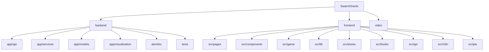

# SwarmOracle

> 群体预言机 -- AI "What-If" Prediction Playground
> 一个基于 FastAPI + React + Phaser 的 AI 驱动互动叙事游戏平台。

## 项目愿景

SwarmOracle 允许用户提出 "如果...会怎样" 的假设性问题，由 AI 代理群体模拟多分支叙事推演，支持辩论竞技场、神谕密室、世界线圆桌等多种互动模式，最终生成可分享的预测结果。

## 架构总览

| 层级 | 技术栈 | 端口 |
|------|--------|------|
| 前端 | Vite + React 19 + TypeScript + Phaser 3 + Zustand | 18928 |
| 后端 | FastAPI + SQLModel + Alembic + ChromaDB | 18927 |
| LLM  | MiniMax-M2.5 (可配置任意 OpenAI 兼容 API) | 可配置 |
| 数据库 | SQLite + ChromaDB (向量检索) | 本地文件 |
| 部署 | Docker Compose (backend + frontend) | 18927/18928 |

## 模块结构图



## 模块索引

| 模块 | 路径 | 语言 | 职责 | 文件数 | 测试数 |
|------|------|------|------|--------|--------|
| backend | `backend/` | Python 3.11+ | FastAPI 后端，LLM 编排，模拟引擎，Web 搜索增强 | ~70 | 67+ 文件 / 2328 tests |
| frontend | `frontend/` | TypeScript | React SPA，Phaser 游戏引擎，实时 WS | ~140+ | 152 文件 / 1577 tests |
| video | `video/` | Markdown | 宣传视频脚本与分镜稿 | 10 | -- |

## 运行与开发

### 环境准备

```bash
# 后端
cd backend
python -m venv .venv && source .venv/bin/activate
pip install -e ".[dev]"
cp .env.example .env  # 配置 LLM_API_KEY 等

# 前端
cd frontend
npm install
```

### 开发服务器

```bash
# 后端 (端口 18927)
cd backend && uvicorn app.main:app --host 0.0.0.0 --port 18927 --reload

# 前端 (端口 18928)
cd frontend && npm run dev
```

### Docker 部署

```bash
docker compose up --build
```

### 数据库迁移

```bash
cd backend && alembic upgrade head
```

## 测试策略

| 层级 | 工具 | 命令 |
|------|------|------|
| 后端单元/集成 | pytest + pytest-asyncio | `cd backend && pytest` |
| 前端单元/组件 | vitest + @testing-library/react | `cd frontend && npm test` |
| 前端 E2E | Playwright + 自定义脚本 | `cd frontend && npm run e2e:full` |
| E2E 子集 | -- | `npm run e2e:ending-room:full` / `npm run e2e:roundtable:full` / `npm run e2e:debate:full` |
| Lint (后端) | ruff | `cd backend && ruff check .` |
| Lint (前端) | eslint | `cd frontend && npm run lint` |
| 构建校验 | tsc + vite | `cd frontend && npm run build` |

## 编码规范

- **后端**: Python, ruff (line-length=100, target py311), select E/F/I/W
- **前端**: TypeScript strict, eslint + react-hooks + react-refresh
- **i18n**: 双语 (zh/en)，通过 `i18next` + `react-i18next`
- **状态管理**: Zustand (前端全局状态)
- **路由**: React Router v7 (前端), FastAPI APIRouter (后端)

## AI 使用指引

- 后端核心服务 `ending_room_service` 已拆分为子模块包 (`_utils`, `_participants`, `_threads`, `_content`)，修改时注意 re-export 兼容性
- `frontend/src/stores/worldlineRoundtableStore.ts` 是 `endingRoomStore` 的 re-export，不是 stub
- 大文件注意：`EndingChatModal.tsx` (~1509 行)，`WorldlineRoundtableView.tsx` (~1848 行)
- LLM 客户端支持 BYOK (Bring Your Own Key)，前端通过 `LlmProviderRequestOptions` 传递
- WebSocket 用于实时模拟推送，每个场景最多 50 个连接
- Web 搜索增强：用户可在 InputView 开启搜索增强，推演前自动搜索真实世界背景注入 Agent 提示词（CORE/IMPORTANT/CROWD 三层），结果在 ResultView 展示来源卡片
- `GET /api/capabilities` 是轻量配置端点（无 LLM 调用），前端 mount 时用它检测服务端功能开关
- BYOK 安全：业务入口 (scenario/debate/predictions/social) 统一要求 `base_url` 必须同时带 `api_key`，前移 400 拒绝；`/api/health/test` 是连通性探测，不做前移拒绝，返回 `200 + llm.status=error`。allowlist 校验 hostname + http(s) scheme
- 不可信文本（搜索结果、用户输入）通过 `format_untrusted_text_block()` 包装进 fenced block，三反引号已做转义防 fence-breakout
- WS 认证已从 query string `?token=` 迁移到首帧 auth 协议（`{"type":"auth","token":"..."}` → `{"type":"auth_ok"}`），token 不再出现在 URL 中。前端对 4001/4404 不自动重连
- WS 连接上限 `MAX_WS_PER_SCENARIO=50` 同时计入已认证连接和 pending_auth 连接，防止未认证 socket 绕过限制
- Oracle 角色化词汇 13 种 voice variant（imperial / field / finance / market / faith / industry / frontier / survival / scholar / civic / diplomat / advisor / science），基于 role_hint + bio_hint 子串匹配分类
- campaign / ending-room REST 路由的 session gate 以 router 级 `dependencies` 统一注入，不再逐端点声明
- Phase 3 六大功能增强 (F1-F6)：Agent 身份+跨场景记忆、世界线因果图谱、用户自建 Agent、蝴蝶效应回溯、涌现阵营系统、辩论论证图谱
- 13 个新 ORM 模型分布在 `agent_identity.py`、`graph.py`、`checkpoint.py`，3 个 Alembic 迁移 (014-016)
- 6 个新后端服务：`persona_workshop`、`agent_identity`、`causal_graph`、`replay`、`factions`、`debate_argument_map`
- 2 个新 API router：`/api/agents/*`、`/api/graphs/*`；`/api/capabilities` 当前是 11-key 通用 capability registry（`web_search` + 10 个功能开关）
- 5 个新前端页面：`AgentWorkshopView`、`AgentLibrary`、`CausalReviewView`、`CompareDigestView`、`WorkbenchView`（图谱工作台，Causal/Split/KG 三种布局，compact 自动降级）
- 9 个新前端组件：`AgentAttachPanel`、`ArgumentMap`（已 i18n 化，P2 新增搜索/过滤/拖拽控件）、`CounterfactualPanel`、`FactionTimeline`、`ReturningBadge`（已集成到 ResultView + capability gate）、`FactionForceGraph`（G6 力导向图 + sr-only 回退）、`HookSummaryPanel`（5 hook 状态卡片）、`GraphWorkbenchShell`（工作台分屏容器）、`LayoutSwitcher`（tab 切换栏）
- 2 个新前端 hook：`useScenarioGraph`（共享图谱 fetch + requestId 防竞态）、`useHookSummary`（聚合 hook 状态，需 branchId）
- `simulator.py` 新增 4 个非阻塞 hook：因果图谱、阵营检测+WS 事件发射、检查点写入、身份生命周期（场景结束时写入 growth_event + identity_memory，`asyncio.to_thread` 包装），均受 `FEATURE_*` 环境变量控制
- `debate.py` 新增论证抽取 hook (每 turn 后) + verdict linking (finalize 后)，受 `FEATURE_ARGUMENT_MAP` 控制
- `helpers.py` parse 后自动调 `resolve_identity()` 回填 `agent_identity_id`，自建 Agent 替换 CROWD 槽位并同步 `parsed_context`；自建 Agent 注入需通过 ownership 校验（`user_id is not None` + `identity.user_id == user_id`）
- 当前 Phase 3 / graph-playability 相关 `FEATURE_*` 以 `config.py` 为准：常用项包括 `FEATURE_CUSTOM_AGENTS`、`FEATURE_AGENT_IDENTITY`、`FEATURE_CAUSAL_GRAPH`、`FEATURE_GRAPH_ANALYSIS`、`FEATURE_COUNTERFACTUAL_REPLAY`、`FEATURE_FACTIONS`、`FEATURE_ARGUMENT_MAP`、`FEATURE_REPLAY_TRACE`、`FEATURE_AGENT_CONVERSATION`、`FEATURE_KG_EXPLORER`、`FEATURE_IDENTITY_COMPACTION`。多数默认 `false`，`FEATURE_COUNTERFACTUAL_REPLAY` 默认 `true`；`graph_analysis` capability 还要求 `FEATURE_CAUSAL_GRAPH=true`
- 前端 4 个新页面均通过 `useCapabilityCheck` hook 做 capability gate；当前会复用 `/api/capabilities` 结果，并把 `loading / enabled / error` 暴露给 consumer。capability probe 失败时，前端不再默认伪装成 disabled
- `InputView` 集成 `AgentAttachPanel`，`ResultView` 集成因果图谱链接 + `CounterfactualPanel` + `FactionTimeline`，`DebateResultView` 集成 `ArgumentMap`，均受 capabilities 控制
- ChromaDB 双层 memory：scenario-scoped (不变) + identity-scoped (`identity_{user_id}` collection，200 条 FIFO，写入经 `identity:{user_id}` 粒度串行化锁保护)
- Agent continuity key：SHA-256(role+persona[:30])[:16]，跨场景身份匹配
- 自定义 Agent persona 通过 `format_untrusted_text_block()` 防注入
- `ScenarioResponse` 新增 3 个 additive 字段，`custom_agent_identity_ids` 最多 5 个
- `Scenario.user_id` 在创建时持久化（`scenarios.py`），场景结束 hook 优先读取该列，旧数据兜底从 `parsed_context["user_id"]` 取值
- `EventBridge` 新增 `viz:faction_cluster` / `viz:faction_event` 事件类型，`WorldScene` 消费这两个事件驱动阵营聚拢动画（对象池 + 命名常量 + `spriteH` 一致性 + `prefers-reduced-motion` snap）
- P1-3 Graph 导出：`ExportPanel` 组件（PNG via html2canvas + SVG via clone+inline computed styles+foreignObject），集成到 `CausalReviewView` + `ArgumentMap`
- P1-4 Graph 节点点击：`NodeDetailPanel` 组件（type/round/payload/unit details），`onNodeClick` 绑定到两个 ReactFlow 实例，selectedNode 在 re-fetch 时自动清空
- P1-12 Identity memory compaction：`FEATURE_IDENTITY_COMPACTION` 控制，阈值超过 50 条未压缩文档时异步 LLM 摘要（fire-and-forget），压缩文档带 `source_ids_hash` 幂等指纹，FIFO eviction raw 优先于 compacted，`get_identity_memories` 过滤压缩文档（只参与语义检索不进 timeline），prompt 经 `format_untrusted_text_block` 防注入
- P1-9 resume_from_round：`POST /api/scenario/{id}/resume` 从指定轮次续跑（clone+restore+`run_sim_background`），`Blackboard.export_snapshot()`/`from_snapshot()` 完整状态持久化，checkpoint bug fix（`get_global_summary()` → `export_snapshot()`），agent stance/emotion 仅内存恢复不改 DB，`Branch.replay_kind` 新增 `"resume"` 值，与 counterfactual 共享 3 条分支上限，resume 前先预占 runtime lock，后台任务续租 lease 到结束，避免丢锁和 orphan branch
- Identity compaction 由 `FEATURE_IDENTITY_COMPACTION` 控制，另有 3 个调参变量 (`IDENTITY_COMPACT_THRESHOLD`/`BATCH_SIZE`/`GROUP_SIZE`)
- P2 WorkbenchView KG 模式要求同时启用 `FEATURE_KG_EXPLORER` + `FEATURE_CAUSAL_GRAPH`（`KGGraphBoard` 内部调用 causal-graph 端点）
- `useHookSummary` hook 接受 `branchId` 参数，faction-timeline 端点必须携带 `branch_id` 查询参数
- `getFactionRelations` 在 `client.ts` 中路径为 `/scenario/{id}/faction-relations`（与其他 graphs router 端点一致，无 `/graphs/` 前缀）
- `FactionForceGraph` 和 `LayoutSwitcher` 均有 `prefers-reduced-motion` guard；`FactionForceGraph` 另有 sr-only 列表回退供屏幕阅读器使用
- `factions.py` 新增 `faction-relations` 端点，查询参数 `branch_id`(必填) / `round_max` / `threshold` / `top_k` 均在 router 层校验
- `graphs.py` faction-timeline 端点会先校验 `branch_id` 是否存在 + 是否属于当前 scenario，缺失或跨 scenario 返回 404 `BRANCH_NOT_FOUND`
- KG 工作台 G6 配置抽到 `frontend/src/lib/kgGraphConfig.ts`（`buildKgG6Options` + `toKgG6Data`），`KGGraphBoard` 和 `KGExplorerView` 都复用同一份工厂；`toKgG6Data` 在 mobile + 节点数 > `KG_DEGRADE_THRESHOLDS.mobileNodes`(200) 时截断并通过 `truncatedFromCount` 把原始数量回传给上层渲染 aria-live 提示
- `useReducedMotion` 抽到 `frontend/src/hooks/useReducedMotion.ts`，`ArgumentMap` 和 `CausalReviewView` 共享同一份实现
- `CausalReviewView` 在 `layoutDagre` 内会按 source/target 配对计算平行边偏移（`buildParallelEdgeIndex`），`reducedMotion` 或 `nodes/edges > PERF_ANIMATION_LIMIT` 时禁用动画；节点点击会聚合相邻边的非空 evidence，作为 `evidenceList` 传给 `NodeDetailPanel`
- `NodeDetailPanel` 现在能渲染边级 evidence（`confidence_tier` 徽章、`source_ref`、`source_round_number`、`detail`），detail 文本按码点（`Array.from`）截断 200，避免劈开 surrogate pair
- `causal_graph.py` SQLModel 列属性访问统一用 `from sqlmodel import col` 包装（`col(Column).in_(...)` / `.desc()`），pyright SQLModel 类型告警全部清零

## 变更记录 (Changelog)

| 日期 | 操作 | 说明 |
|------|------|------|
| 2026-04-25 | KG 工作台收口 + 边级 evidence + 类型告警清零 | KGGraphBoard 抽 `frontend/src/lib/kgGraphConfig.ts` 工厂（`buildKgG6Options` + `toKgG6Data` + `computeNodeSize` + `getKGNodeStyle/getKGEdgeStyle`），UI 补完整搜索/类型 chips/缩放控件/小地图/SR fallback 表/移动 200 节点 aria-live 截断提示；KGExplorerView 重构复用同一工厂；`useG6Graph` 新增 5 个事件 handler（onNodeHover/onNodeLeave/onEdgeClick/onEdgeHover/onEdgeLeave）；抽 `useReducedMotion` 共享 hook（ArgumentMap + CausalReviewView 复用）；NodeDetailPanel 新增边级 evidence 渲染（confidence_tier 徽章 + source_ref + source_round_number + detail，detail 按码点截断 200，支持 evidence 单条 / evidenceList 多条）；CausalReviewView 加平行边 offset + reducedMotion 控制 + 节点点击聚合相邻边 evidence；后端 faction-timeline 端点加 branch 存在 + cross-scenario 校验（404 `BRANCH_NOT_FOUND`，+4 测试）；causal_graph.py SQLModel 类型告警全清零（`col()` 包装 10 处 desc/in_ + dict 不变性显式标注 4 处 + Sequence 1 处 + Optional member access assert 3 处），test_causal_graph.py 加 `source_round_number=0` 回归测试 + MockMessage 6 处 None 默认值类型注解；i18n 新增 18 keys（`kg_graph_board.*` 10 + `node_detail.evidence_*` 8），en/zh parity `1308 = 1308`；fresh baseline: backend `2328 passed, 2 skipped` / frontend `152 files, 1577 tests, 0 failed`；tsc + build + ruff + pyright（14 errors → 0）全部通过 |
| 2026-04-25 | P2 深度审查 + 修复 | P2-1 WorkbenchView (Causal/Split/KG 三 tab + compact 降级)、P2-2 FactionForceGraph (G6 力导向图)、P2-3 HookSummaryPanel (5 hook 状态卡片)、P2-4 ArgumentMap 搜索/过滤/拖拽控件、useScenarioGraph + useHookSummary 两个新 hook；4-Gate 并行审查修复 8 P1：getFactionRelations URL 404 修复、useHookSummary branchId 透传、WorkbenchView KG gate 加 causal 依赖、LayoutSwitcher prefers-reduced-motion、FactionForceGraph sr-only 回退、HookSummaryPanel retry aria-label、2 个测试质量修复；后端新增 faction-relations 端点 + 306 行测试；fresh baseline: backend `2320 passed, 0 failed, 2 skipped` / frontend `149 files, 1491 tests, 0 failed`；tsc + build + i18n parity 全部通过；Playwright 浏览器实测 ResultView/WorkbenchView/HookSummaryPanel/i18n/mobile 全通过 |
| 2026-04-25 | P0/P1 完成度评估 + 测试修复 | P0 7/7 全部通过 (Playwright 浏览器实测)；P1 全部完成 (21 fixes + 4 功能增强)；修复 `test_fallback_migrations.py` 2 处断言缺少 P1 evidence 字段；fresh baseline: backend `2304 passed, 0 failed, 2 skipped` / frontend `144 files, 1399 tests, 0 failed`；Graphify 核心图谱能力已全面吸收 (Tier B)；MiroFish 流程可见性+探索连续性已超越，工作台感属 P2-1；P2 readiness: 通过 |
| 2026-04-23 | 前端 gated route 状态面收口 | `useCapabilityCheck` 当前会复用 `/api/capabilities` 请求，并把 probe 失败显式暴露给页面；`ReplayView` capability disabled 不再 silent redirect，改成显式 unavailable surface；`KGExplorerView / CompareDigestView / FactionTimeline` 当前把 `disabled / load failed / empty` 分开显示，不再直接泄漏原始错误，也不再把所有异常压成空态；首页 4 个 source family disabled tooltip 已补齐中英 locale。真实验证：frontend focused regression `64 passed`、frontend full vitest `1349 passed`、`npx tsc --noEmit -p tsconfig.app.json` 通过、`npm run build` 通过，local preview 也已确认 Replay unavailable surface、中文 source tooltip 和结果页新的 FactionTimeline 空态文案 |
| 2026-04-20 | WS / capability graph contract 诊断收口 | `useAgentConversationWS` 改回真实 `/ws/agent-conversation/{thread_id}`；`e2e-ws-contract-suite.mjs` 去掉 import 副作用后，这轮又补了两处真实收口：`case1` 改走绝对 URL + 独立 page，不再把 `/sim` `/debate` 静默 skip；raw probe 先于 live fixture 执行，避免 clean-room 下 `scenario` 被 live fixture 污染成假 `1006`。同时恢复并保留 `e2e:capability-matrix / e2e:ws:contract` 两条诊断 npm script。真实验证为 backend `tests/test_evidence_card_flow.py` `5 passed`、`tests/test_session_auth.py -k 'auth_timeout_closes_4001 or oversized_auth_frame_closes_1009 or pending_blocks_new_connections'` `3 passed`；frontend `node --test scripts/e2e-ws-contract-suite.test.mjs` `18 passed`、定向 vitest `32 passed`、clean-room `e2e:ws:contract` `20 passed / 1 skipped / 0 failed`、clean-room `e2e:capability-matrix` `25 passed / 5 skipped / 0 failed` |
| 2026-04-19 | source-family live contract + merge gate 收口 | quota ledger `Retry-After` 改成真实 rolling 24h 语义；`release-signoff` 的 `new_source_ingestion_live` 步骤现在会显式带 `SWARM_E2E_MODE=live`；`POST /api/scenario` 新增 `web_search_families`，backend 会把 live snippets 投影成 `web_search_context.family_context`，`NEW_SOURCES_POLYMARKET_CONFIGURED_HOST=non-us` 时 `Polymarket` 显式走 geo-gated 口径；ResultView 改成按 `family_context` 渲染四张 source family card；fresh 验证为 backend `2264 passed, 2 skipped`、frontend `1336 passed`、typecheck/build/perf 通过、source-ingestion live `us/non-us` 桌面/移动全通过；llmdoc / implement / progress 已同步 |
| 2026-04-18 | graph-playability-upgrade 6-layer delivery | Layer 1 (BE-1/FE-1) migration 022 `agent_conversation` + @antv/g6 依赖+chunk+capability hook `nestedPath`；Layer 2 (BE-2) scenario delete 服务化 + 级联 Phase 3 表；Layer 3 (BE-3/4/5) POST `/conversation` (sequence reservation + CAS finalize + ownership quota + SSE) / GET `/replay-trace` (cursor 分页 + feature gate) / `/web-context` 4-family providers façade (news_deep/wikidata/polymarket/rsshub + shared token bucket + Retry-After)；Layer 4 (BE-6) capabilities 扩展 `agent_conversation`/`kg_explorer`/`replay_trace` + `web_search.providers` 嵌套 schema；Layer 5 (FE-2/3/4/5/3-seq) `KGExplorerView`+`TimelineGalaxy`+3 lazy 路由 (G6 Canvas hook + 100+ 节点 FPS budget)、`NodeConversationSheet` 流式隔离 + aria-live debounce + WS 重连 + 4 trigger sources (ArgumentMap/CausalReviewView/FactionTimeline/KGExplorerView)、`ReplayView` scrubber + agent queue + URL hash + 键盘快捷键、`ResultActionCard` + 4 source 卡片 + MobileSourceSheet + GlobalOfflineBanner + InputView 4 source toggles；Layer 6 (QA) QA-2 4 脚本 Tier 1 live + release-signoff 注册 (node-conversation/kg-explorer/replay-view/new-source-ingestion) + 4 npm scripts；QA-3 i18n 31 新 keys (19 kg_explorer + 2 timeline_galaxy + 10 replay) 全 en/zh parity；QA-4 根+backend+frontend CLAUDE.md + MEMORY.md 同步 |
| 2026-04-10 | P1-9 resume + P1-12 compaction | P1-12 identity memory compaction (LLM 摘要 + 幂等 hash + FIFO raw-first eviction + format_untrusted_text_block 防注入，15 后端测试)；P1-9 resume_from_round (POST /resume + Blackboard export/from_snapshot + checkpoint bug fix + agent in-memory restore + runtime lock guard，16 后端测试) |
| 2026-04-10 | P1-3 graph export + P1-4 node detail | ExportPanel (PNG html2canvas + SVG foreignObject clone) + NodeDetailPanel (type/round/payload/unit)，集成 CausalReviewView + ArgumentMap，i18n 18 新 keys，38 前端测试 |
| 2026-04-10 | Phase 3 Batch 2 — UX 壳 + 修复 | M-2 factions/causal_graph/checkpoint asyncio.to_thread (4 call sites, 20 tests)；M-4 tween budget 全局 getTweens().length；P1-6 ArgumentMap → @xyflow/react DAG + dagre layout + MiniMap；P1-7 ArgumentStrengthMeter (stacked bar)；P1-1 AgentProfileModal (dialog + identity details + memory/growth)；P1-2 MemoryTimeline (vertical timeline grouped by scenario)；P1-5 LiveArgumentMap (DebateArenaView collapsible sidebar, auto-refresh on turn)；P1-8 TranscriptFactionOverlay (FactionBadge + useFactionOverlay hook + RoundtableTranscriptList/EndingChatModal 集成)；新 growth-events backend endpoint (3 tests)；i18n 21 新 keys (argument.* + agent_profile.*)；57 新前端测试 + 20 新后端测试 |
| 2026-04-09 | P0 接线 + 安全修复 | X-5 ownership 校验 (user_id is not None + match) + Scenario.user_id 持久化；P0-2/P0-3 identity lifecycle hooks (asyncio.to_thread + per-agent 异常隔离)；P0-4 faction WS 事件发射 (viz:faction_cluster/event)；P0-5 Phaser 阵营聚拢动画 (对象池 + spriteH 一致性)；P0-1 ReturningBadge 集成 ResultView + capability gate；X-2 i18n keys 补全 (feature_disabled + argument.* + a11y_label)；M-3 identity memory Chroma 串行化锁 (identity:{user_id})；ArgumentMap TYPE_LABELS i18n 化；16 新测试 (test_p0_wiring.py) |
| 2026-04-09 | Phase 3 接线补全 | 11 个 API endpoint 全部加 server-side FEATURE_* gate + 404 测试；simulator 3 hook 接线 (causal+factions+checkpoint)；debate argument map 抽取+verdict linking；helpers.py 身份解析+自建 Agent 合并+parsed_context 同步；前端 capability gate + useCapabilityCheck hook + InputView/ResultView/DebateResultView 集成 |
| 2026-04-09 | Phase 3 六大功能增强 | F1 Agent身份+记忆、F2 因果图谱、F3 自建Agent、F4 蝴蝶效应回溯、F5 涌现阵营、F6 论证图谱；13 新模型、6 新服务、3 迁移、4 新页面、5 新组件、171 新测试 |
| 2026-04-09 | 遗留项收口 + 文档同步 | m1/m2 WS 异常处理加固、s1 session gate 提升 router 级、s2 CSS token 提取、s3 tween guard 测试、s4/s5 a11y + 死代码清理、llmdoc 10→13 variants 同步 |
| 2026-04-08 | WS pending_auth + Track B2 + E4/E5 | pending_auth 计入连接上限 + auth_ok 发送失败释放；voice variant 10→13 (diplomat/advisor/science) + 关键词扩充 + scholar/civic overlap 修复；Codex+Claude 交叉审查 E4 + 签收 E5 PASS |
| 2026-04-08 | WS 首帧 auth + session gate 测试 | WS 认证从 query string 迁移到首帧 auth 协议，4001/4404 不重连，15 backend + 3 frontend 测试，auth_ok 类型定义 |
| 2026-04-07 | Web 搜索增强 + 安全加固 | web_context 服务、搜索增强 toggle、ResultView 来源卡片、`/api/capabilities`、BYOK 业务入口校验统一、fence-breakout 修复、累计 21 条边界回归测试 |
| 2026-04-02 | 初始生成 | 全仓扫描，生成根级 + 模块级 CLAUDE.md 及 index.json |
