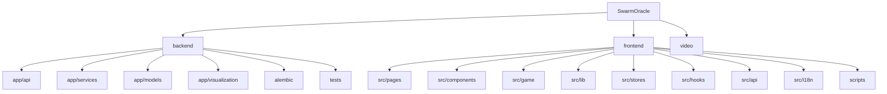

# SwarmOracle

> 群体预言机 -- AI "What-If" Prediction Playground
> 一个基于 FastAPI + React + Phaser 的 AI 驱动互动叙事游戏平台。

## 项目愿景

SwarmOracle 允许用户提出 "如果...会怎样" 的假设性问题，由 AI 代理群体模拟多分支叙事推演，支持辩论竞技场、神谕密室、世界线圆桌等多种互动模式，最终生成可分享的预测结果。

## 架构总览

| 层级 | 技术栈 | 端口 |
|------|--------|------|
| 前端 | Vite + React 19 + TypeScript + Phaser 3 + Zustand | 18928 |
| 后端 | FastAPI + SQLModel + Alembic + ChromaDB | 18927 |
| LLM  | MiniMax-M2.5 (可配置任意 OpenAI 兼容 API) | 可配置 |
| 数据库 | SQLite + ChromaDB (向量检索) | 本地文件 |
| 部署 | Docker Compose (backend + frontend) | 18927/18928 |

## 模块结构图



## 模块索引

| 模块 | 路径 | 语言 | 职责 | 文件数 | 测试数 |
|------|------|------|------|--------|--------|
| backend | `backend/` | Python 3.11+ | FastAPI 后端，LLM 编排，模拟引擎，Web 搜索增强 | ~55 | 46 |
| frontend | `frontend/` | TypeScript | React SPA，Phaser 游戏引擎，实时 WS | ~120+ | 71 |
| video | `video/` | Markdown | 宣传视频脚本与分镜稿 | 10 | -- |

## 运行与开发

### 环境准备

```bash
# 后端
cd backend
python -m venv .venv && source .venv/bin/activate
pip install -e ".[dev]"
cp .env.example .env  # 配置 LLM_API_KEY 等

# 前端
cd frontend
npm install
```

### 开发服务器

```bash
# 后端 (端口 18927)
cd backend && uvicorn app.main:app --host 0.0.0.0 --port 18927 --reload

# 前端 (端口 18928)
cd frontend && npm run dev
```

### Docker 部署

```bash
docker compose up --build
```

### 数据库迁移

```bash
cd backend && alembic upgrade head
```

## 测试策略

| 层级 | 工具 | 命令 |
|------|------|------|
| 后端单元/集成 | pytest + pytest-asyncio | `cd backend && pytest` |
| 前端单元/组件 | vitest + @testing-library/react | `cd frontend && npm test` |
| 前端 E2E | Playwright + 自定义脚本 | `cd frontend && npm run e2e:full` |
| E2E 子集 | -- | `npm run e2e:ending-room:full` / `npm run e2e:roundtable:full` / `npm run e2e:debate:full` |
| Lint (后端) | ruff | `cd backend && ruff check .` |
| Lint (前端) | eslint | `cd frontend && npm run lint` |
| 构建校验 | tsc + vite | `cd frontend && npm run build` |

## 编码规范

- **后端**: Python, ruff (line-length=100, target py311), select E/F/I/W
- **前端**: TypeScript strict, eslint + react-hooks + react-refresh
- **i18n**: 双语 (zh/en)，通过 `i18next` + `react-i18next`
- **状态管理**: Zustand (前端全局状态)
- **路由**: React Router v7 (前端), FastAPI APIRouter (后端)

## AI 使用指引

- 后端核心服务 `ending_room_service` 已拆分为子模块包 (`_utils`, `_participants`, `_threads`, `_content`)，修改时注意 re-export 兼容性
- `frontend/src/stores/worldlineRoundtableStore.ts` 是 `endingRoomStore` 的 re-export，不是 stub
- 大文件注意：`EndingChatModal.tsx` (~1509 行)，`WorldlineRoundtableView.tsx` (~1848 行)
- LLM 客户端支持 BYOK (Bring Your Own Key)，前端通过 `LlmProviderRequestOptions` 传递
- WebSocket 用于实时模拟推送，每个场景最多 50 个连接
- Web 搜索增强：用户可在 InputView 开启搜索增强，推演前自动搜索真实世界背景注入 Agent 提示词，结果在 ResultView 展示来源卡片
- `GET /api/capabilities` 是轻量配置端点（无 LLM 调用），前端 mount 时用它检测服务端功能开关

## 变更记录 (Changelog)

| 日期 | 操作 | 说明 |
|------|------|------|
| 2026-04-07 | Web 搜索增强 | 新增 web_context 服务、搜索增强 toggle、ResultView 来源卡片、`/api/capabilities` 端点 |
| 2026-04-02 | 初始生成 | 全仓扫描，生成根级 + 模块级 CLAUDE.md 及 index.json |
