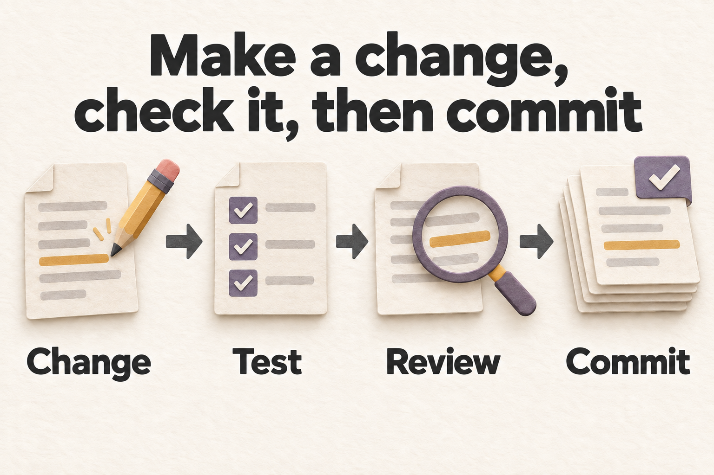

# 贡献指南 / Contributing

每个改动解决一个可说明的问题。提交前写清用户会看到的变化、改动依据和实际验证，并保护工作区里他人的未提交改动。

Keep each change focused on a problem you can explain. Describe the user-visible result, evidence, and checks you ran. Preserve other contributors' uncommitted work.


*先复现，再做小范围改动，最后验证受影响行为。*

<details>
<summary>English illustration / 英文配图</summary>



*Reproduce the problem, make a focused change, then verify the affected behavior.*

</details>

## 准备环境 / Set up development

按[后端说明](backend/README.md)安装 Python 3.11+、隔离工具环境中的 uv 0.12.7，并使用共享 `backend/uv.lock` 与 `--locked --extra dev --no-build`。按[前端说明](frontend/README.md)使用锁文件和 npm 11.12.1；CI/镜像的 Node 基线为 22.23.2。

Follow the [backend guide](backend/README.md) for Python 3.11+, uv 0.12.7 in a separate tooling environment, and the shared `backend/uv.lock` with `--locked --extra dev --no-build`. Follow the [frontend guide](frontend/README.md) for the lockfile and npm 11.12.1. CI and images use Node 22.23.2.

安装命令保留已有 `.env`。先用官方样例浏览保存内容，再按[配置说明](docs/CONFIGURATION.md)连接模型。不要把真实密钥写进命令历史、报告、截图、样例或 PR。

The setup commands preserve an existing `.env`. Start with official samples, then connect a model using [Configuration](docs/CONFIGURATION.en.md). Keep real keys out of command history, reports, screenshots, samples, and pull requests.

## 选择相关检查 / Choose relevant checks

先运行相关检查，跨模块时再扩大范围。同一工作区最多运行一个 pytest 进程。以下命令说明复验方式，不代表当前提交已经通过。

Start with relevant checks and expand when a change crosses modules. Run at most one pytest process per workspace. These commands describe reproduction steps, not a pass claim for the current commit.

后端：在 `backend` 中运行，替换目标文件。

Backend: run from `backend` and replace the target file.

```bash
.venv/bin/python -m pytest -q tests/test_preflight_cli.py
.venv/bin/ruff check app/ tests/test_preflight_cli.py
```

PowerShell 使用 `.\.venv\Scripts\python.exe` 和 `.\.venv\Scripts\ruff.exe`，并检查 `$LASTEXITCODE`。

On PowerShell, use `.\.venv\Scripts\python.exe` and `.\.venv\Scripts\ruff.exe`, and check `$LASTEXITCODE`.

前端：在 `frontend` 中运行。PowerShell 可使用 `npx.cmd`。

Frontend: run from `frontend`. PowerShell may use `npx.cmd`.

```bash
npx --yes npm@11.12.1 test -- --run src/game/PhaserGame.test.ts
npx --yes npm@11.12.1 run lint
npx --yes npm@11.12.1 exec -- tsc -b
npx --yes npm@11.12.1 run build
```

`tsc -b` 是本仓类型门禁。样例改动还需从根目录运行 `backend/.venv/bin/python scripts/validate_samples.py`；资产改动还需在 `frontend` 运行 `npx --yes npm@11.12.1 run assets:provenance:check`。

`tsc -b` is the repository type gate. For sample changes, also run `backend/.venv/bin/python scripts/validate_samples.py` from the root. For asset changes, run `npx --yes npm@11.12.1 run assets:provenance:check` from `frontend`.

界面改动要验证正常路径、空态、错误、取消和共享状态；布局变化还要看桌面和手机。官方样例保留 synthetic provenance，不要把生成器内容标成真实用户或模型实验。

For UI changes, verify the normal path, empty states, errors, cancellation, and shared state. Check desktop and mobile after layout changes. Preserve synthetic provenance in official samples; do not label generated fixtures as real user or provider experiments.

## 模型测试与发布 / Model tests and releases

真实模型测试和预检可能发送问题、角色及上下文并产生费用。运行前确认 provider、模型、调用规模、预算和数据范围。HTTP 200、模型目录和配置就绪都不证明真实生成成功。

Live model tests and preflight may send questions, characters, and context and incur charges. Confirm the provider, model, call volume, budget, and data scope first. HTTP 200, a model catalog, and configuration readiness do not prove successful generation.

发布签收需要后端和生产预览已启动。下面从 `frontend` 运行，可能调用模型；使用新的输出目录并保存证据。

Release signoff needs a running backend and production preview. Run this from `frontend`; it may call models. Use a new output directory and retain the evidence.

```bash
npx --yes npm@11.12.1 run release:signoff -- --url http://127.0.0.1:18930 --headless --output-root output/e2e/release-new-run
```

Windows 上涉及多行 npx 参数的发布检查需要 Git for Windows 自带的 Git Bash；已有自定义 script-shell 时会停止，而不是默默改用其它 shell。

Windows release checks that pass multiline npx arguments need the Bash bundled with Git for Windows. A custom script-shell stops the check instead of being silently replaced.

检查会逐字核对 LF、CRLF、路径和空参数；当前 npm 的转义入口不兼容时会明确报错。

The check compares LF, CRLF, paths, and empty arguments exactly. An incompatible quoting helper in the current npm installation causes an explicit error.

`--dry-run` 只生成计划。源码测试、浏览器签收、最终容器和模型质量各有证明范围。发布前核对相同提交的真实 CI 结论与镜像 digest，见[部署说明](deploy/README.md)。

`--dry-run` produces a plan only. Source tests, browser signoff, final containers, and model quality have different evidence boundaries. Check actual CI conclusions and image digests for the same commit before release; see [Deployment](deploy/README.md).

## 提交 Pull Request / Submit a pull request

- 说明问题、最终行为、实际命令和未验证部分。 / Explain the problem, final behavior, commands you ran, and validation gaps.
- 行为变化补相关回归测试；文案和链接使用相应静态检查。 / Add relevant regression tests for behavior changes; use suitable static checks for copy and links.
- 改共享文件前协调，保留他人工作，不夹带无关重构。 / Coordinate on shared files, preserve others' work, and keep unrelated refactors out.
- 不提交 `.env`、API key、token、数据库、缓存和无关生成工件。 / Do not commit `.env`, API keys, tokens, databases, caches, or unrelated generated artifacts.
- 行为或架构变化时，同步相关使用与开发说明，写清接口约定和限制。 / Update the relevant user and developer guides when behavior or architecture changes. Explain interface contracts and limitations.
- 内部工作记录、实施计划、测试报告、临时数据和生成物只保存在本地，并加入 `.gitignore`。自动化测试源码、必要的测试夹具和 CI 配置继续保留在仓库，方便他人复验。 / Keep internal work notes, implementation plans, test reports, temporary data, and generated output local and ignored by Git. Keep automated test source, required fixtures, and CI configuration in the repository so others can reproduce the checks.

## 内容与漏洞报告 / Content and vulnerability reports

SwarmOracle 用于假设性 AI 推演。请使用虚构或标明假设的场景，不提交诽谤、骚扰、冒充真实个人、个人数据或凭据，也不要把生成内容包装成事实报道或专业意见。

SwarmOracle supports hypothetical AI simulations. Use fictional or clearly labeled hypothetical scenarios. Do not contribute defamation, harassment, impersonation of real people, personal data, or credentials, or present generated content as factual reporting or professional advice.

漏洞请按[安全说明](SECURITY.md)通过私密渠道报告。普通缺陷和建议可使用仓库 issue 模板。

Report vulnerabilities privately using [Security](SECURITY.md). Use the repository's issue templates for ordinary bugs and suggestions.
