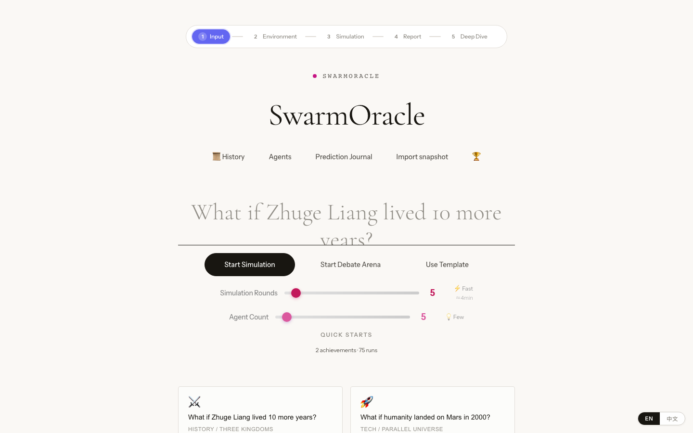
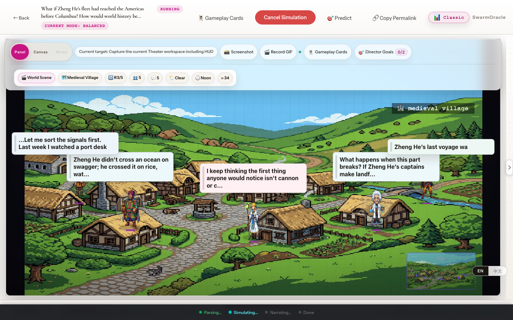
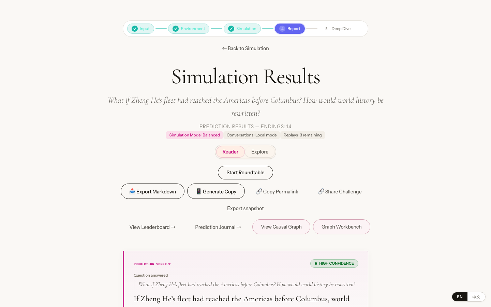
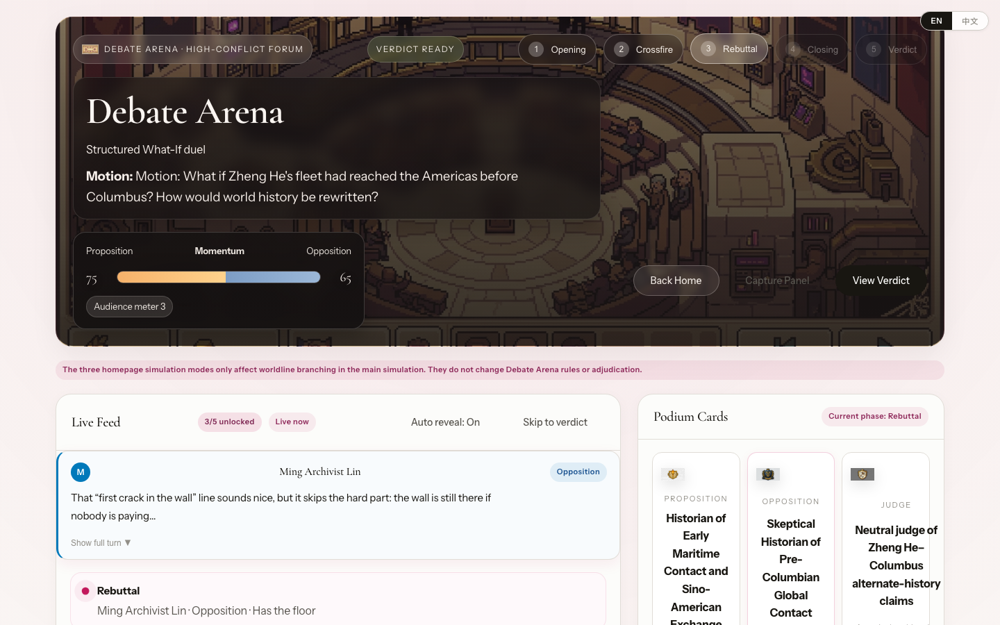
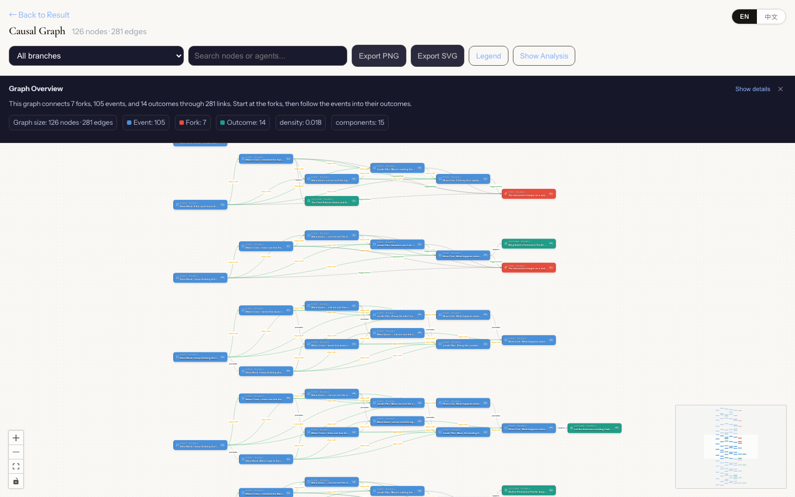

English | [中文](README.md)

# 🔮 SwarmOracle

> AI "What-If" Prediction Playground - SwarmOracle

SwarmOracle lets you ask hypothetical questions ("What if...?"). A group of AI agents simulates multiple storylines and shows different possible outcomes.



## Live demo

Open it for the full screenshots and a short intro video: **https://agi-is-going-to-arrive.github.io/Swarm-Oracle/**

Chinese intro video on Bilibili: **https://www.bilibili.com/video/BV1Xh7168ECc**

## Features

- **Multi-branch simulation**: One question, multiple storylines, different endings.
- **Debate Arena**: AI affirmative and opposing sides debate so you can see both sides of an issue.
- **Oracle Chambers**: Talk in depth with AI characters from the current worldline and ask follow-up questions.
- **Worldline Roundtable**: Representatives from multiple sides discuss around a table. After it finishes, you can return to the saved result and continue Deep Dive.
- **Counterfactual comparison**: "If that sentence had been said differently, how would the worldline change?"
- **Causal graph + knowledge graph**: Enter the graph workbench, knowledge graph explorer, and timeline galaxy from the result page.
- **Custom Agents**: Create, import, and export your own characters in the Agent Workshop.
- **Prediction journal and leaderboard**: Record predictions, review calibration, and view the global leaderboard.
- **Snapshot import / export**: Package one simulation run, save it, and import it later for review.
- **Bring your own LLM**: Compatible with any OpenAI-format API.

> For concrete usage of each mode, see **[Usage Guide docs/USAGE.en.md](docs/USAGE.en.md)**; for the per-feature catalog, see **[FEATURES.en.md](docs/FEATURES.en.md)**. Most default features work out of the box. Search enhancement and source checkboxes require extra configuration. See **[Configuration docs/CONFIGURATION.en.md](docs/CONFIGURATION.en.md)**.

## What it looks like

Ask a question, watch a group of AI agents simulate several storylines, get a verdict, then walk into the rooms to dig deeper.

| Simulating: branches grow live | Result: it answers your question |
|:---:|:---:|
|  |  |
| **Debate Arena: two sides argue** | **Causal Graph: see how it got there** |
|  |  |

## Quick Start

### Requirements

Minimum browser: Chrome/Edge >= 111, Firefox >= 113, Safari/iOS >= 16.2 (modern browsers that support oklch / color-mix).

### One-command Docker deployment (recommended)

1. Edit `.env.docker` and fill in your LLM API information:
   ```bash
   # Defaults to a host-machine local OpenAI-compatible gateway:
   # LLM_RESPONSES_URL=http://host.docker.internal:8317/v1
   #
   # If using the official OpenAI API, change it to:
   # LLM_RESPONSES_URL=https://api.openai.com/v1
   # LLM_API_KEY=your real API key
   # LLM_MODEL_NAME=your model name
   ```
   If the deployment is reachable beyond your own machine, also set `SESSION_SECRET` and `ADMIN_TOKEN`. `SESSION_SECRET` protects normal REST / WebSocket access, and `ADMIN_TOKEN` protects `/api/admin/*` diagnostics through the `X-Admin-Token` header.

2. Start:
   ```bash
   docker compose up --build -d
   ```

3. Open http://localhost:18928 in your browser.

Docker maps the frontend to `18928` and the backend to `18927` by default.

### Local development

Backend (Python 3.11+, macOS/Linux):
```bash
cd backend
python -m venv .venv && source .venv/bin/activate
pip install -e ".[dev]"
cp ../.env.example .env   # Edit .env and fill in your LLM configuration
uvicorn app.main:app --host 127.0.0.1 --port 18927 --reload
```

Windows PowerShell commands:
```powershell
cd backend
python -m venv .venv
.\.venv\Scripts\Activate.ps1
pip install -e ".[dev]"
Copy-Item ..\.env.example .env
uvicorn app.main:app --host 127.0.0.1 --port 18927 --reload
```

The `your-api-key-here` value in `.env.example` is only a placeholder. If `LLM_RESPONSES_URL`
is not a local address, the backend refuses to keep using the placeholder key.

Frontend (Node.js 20+):
```bash
cd frontend
npm install
npm run dev
```

Open http://localhost:18928 to use it.

> Prerequisite: during local development, make sure the backend is already running on 18927 first. The frontend forwards `/api` and `/ws` requests to it. Otherwise, the page will keep waiting or show errors.

## Configuration

Core configuration lives in `.env.example` for local development or `.env.docker` for Docker deployment:

| Configuration item | Description | Example |
|--------|------|------|
| `LLM_RESPONSES_URL` | LLM service URL | `https://api.openai.com/v1` |
| `LLM_API_KEY` | API key | `sk-...` |
| `LLM_MODEL_NAME` | Model name | `gpt-5.5` / `deepseek-v4-pro` / `gemini-3.5-flash` / `claude-opus-4-8` |
| `ENABLE_WEB_SEARCH` | Search enhancement (optional) | `false` |
| `WEB_SEARCH_PROVIDER` | Search provider (when search is enabled) | `tavily` / `exa` / `firecrawl` / `xai` / `searxng` / `native` |

For the full configuration list, feature flags, and search enhancement notes, see **[Configuration docs/CONFIGURATION.en.md](docs/CONFIGURATION.en.md)**. Custom Agents, cross-scenario identity, causal graph, graph analysis, faction relations, argument map, knowledge graph explorer, timeline galaxy, replay trace, Roundtable Deep Dive, snapshot, prediction journal, education templates, persona backup, and the deep-read report are enabled by default in the template. `ENABLE_WEB_SEARCH`, `FEATURE_NEW_SOURCES`, and `FEATURE_FAMILY_QUERY_OPTIMIZATION` are disabled by default because they require a search provider and matching configuration.

Docker Compose reads `.env.docker` and stores the database and Chroma data in the
`/data` volume. Standard local development reads `backend/.env`.

## Project Structure

```
SwarmOracle/
├── backend/          # FastAPI backend (Python)
├── frontend/         # React + Phaser frontend (TypeScript)
├── docker-compose.yml
├── .env.example      # Local development configuration template
└── .env.docker       # Docker deployment configuration template
```

## Tech Stack

- **Backend**: FastAPI + SQLite + ChromaDB
- **Frontend**: React 19 + TypeScript + Phaser 3
- **Deployment**: Docker Compose

## Acknowledgements

Thanks to the [Linux.do](https://linux.do/) community for feedback and support.

## License

AGPL-3.0
