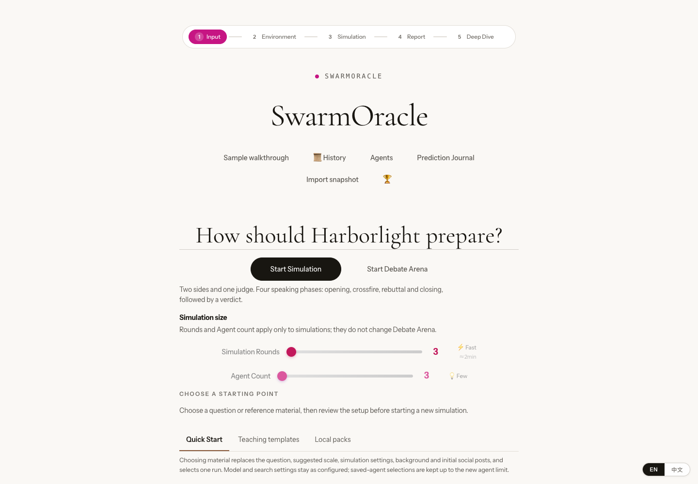
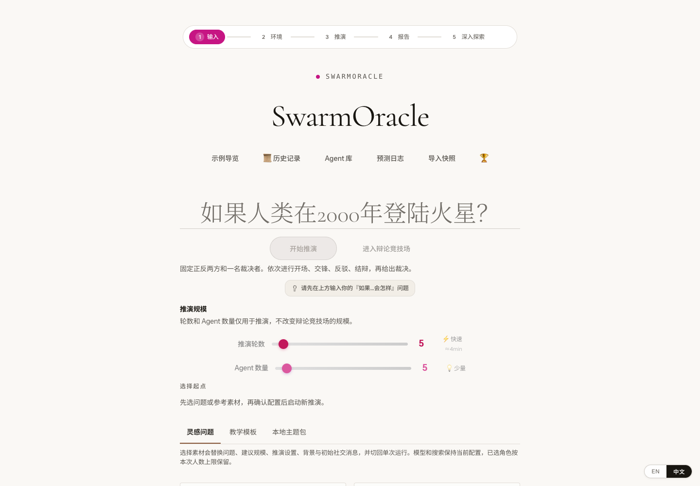
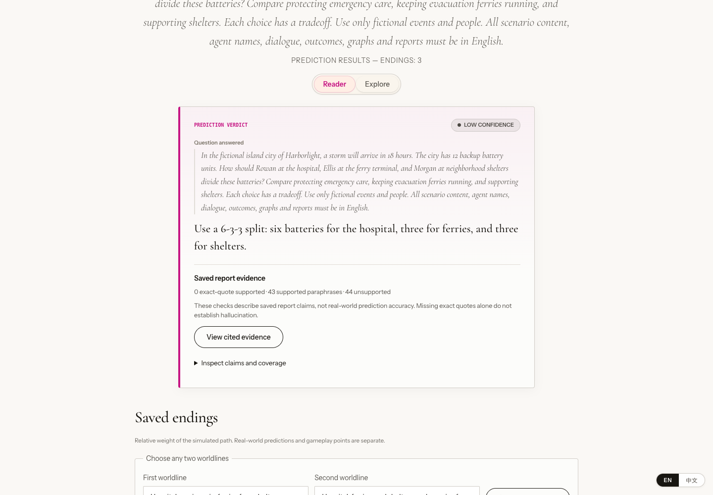
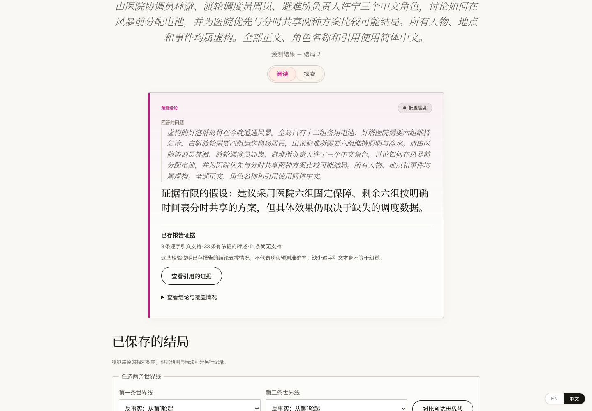
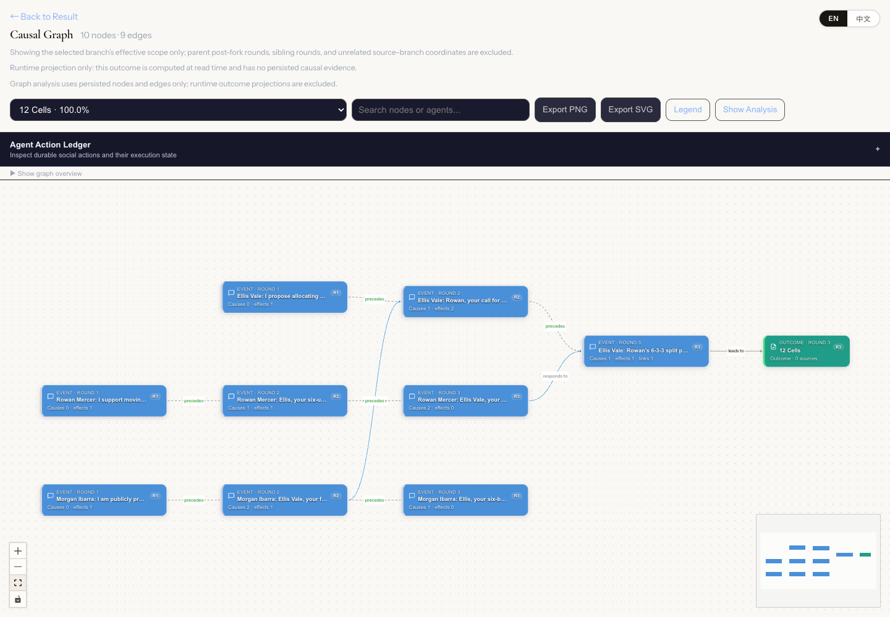
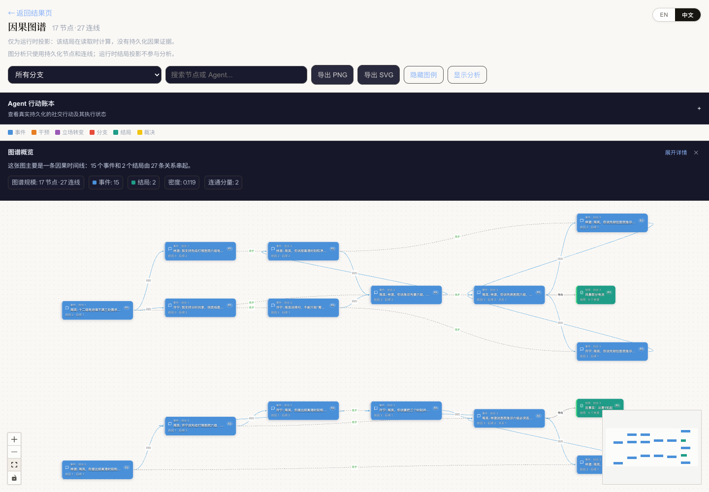
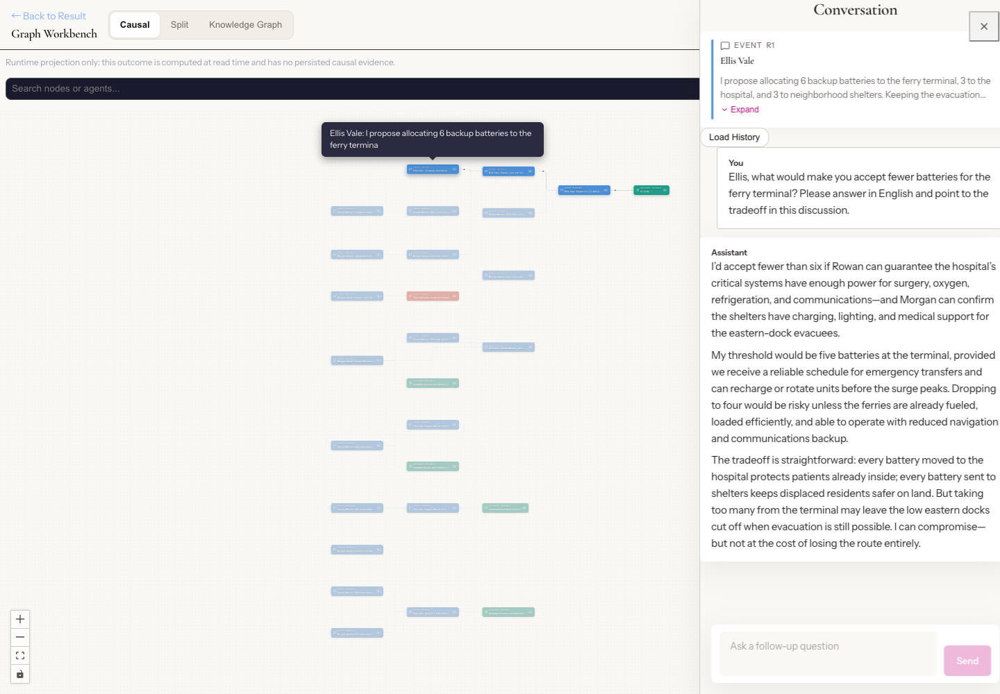
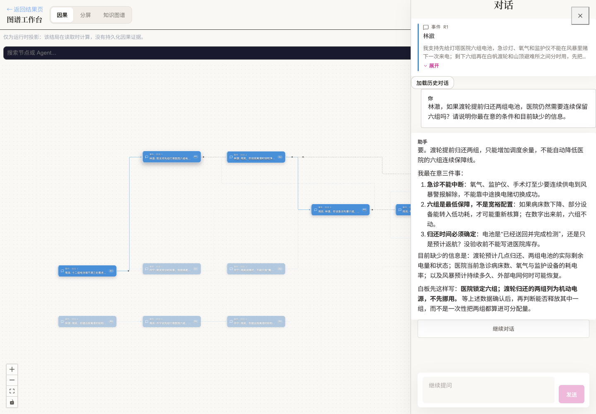

[English first / 英文在前](README.en.md) · [中文在前 / Chinese first](README.md)

# SwarmOracle

Explore “What if...?” with AI characters. Read different endings, check the statements behind them, then ask a follow-up or change a decision. SwarmOracle is open source and runs on your computer or your own server.

用 AI 角色探索“如果……会怎样”。你可以阅读不同结局、核对发言依据，再追问角色或改写一次决定。SwarmOracle 开源，适合在本机或自己的服务器运行。


*AI-generated conceptual illustration: each line represents a possible path within a simulation. This is not a product screenshot.*

*AI 生成概念插画：每条线代表一次模拟中的可能走向，并非产品截图。*

<details>
<summary>中文配图 / Chinese illustration</summary>


</details>

The screenshots show the app on 2026-09-19 using fictional battery-allocation material set in the island city of Harborlight. Conceptual illustrations have separate labels. See the full [screenshot tour](docs/SCREENSHOTS.en.md).

以下实拍展示 2026-09-19 的真实应用界面，以虚构的灯港群岛电池分配问题为例。概念插画另有标注。完整界面见[截图导览](docs/SCREENSHOTS.md)。

<a id="built-in-official-samples-and-snapshot-demo"></a>
<a id="内置官方样例与-snapshot-演示"></a>

## Open a sample first / 先打开一个样例

After starting the backend and frontend, open http://127.0.0.1:18928 and choose an official sample on the home page. The three bundled samples need no API key and make no model calls. Start by reading an ending, comparing existing branches, and checking saved evidence.

启动前后端后，打开 http://127.0.0.1:18928 ，在首页选择一个官方样例。随附的 3 个样例无需 API Key，也不会调用模型；你可以先读结局、比较已有分支，再检查保存的证据。

You can also import a saved run, called a Snapshot, as a `.swarm` file from the home page. Samples and snapshots let you explore saved runs; generating new content requires a configured model. Follow the [usage guide](docs/USAGE.en.md) for the steps.

已有的推演文件（Snapshot，扩展名为 `.swarm`）也可从首页导入。样例和快照让你浏览已有推演；生成新内容需要配置模型。逐步操作见[使用指南](docs/USAGE.md)。

### Home / 首页

Start with a question, or open an official sample to read a saved result.

从问题输入区开始，或打开官方样例先阅读已有结果。



<details>
<summary>中文实拍 / Chinese screenshot</summary>



</details>

<a id="quick-start"></a>
<a id="快速开始"></a>
<a id="docker-compose"></a>

## Run locally / 在本机启动

Download and extract this repository, or clone it with Git below. Run the remaining commands inside the downloaded `Swarm-Oracle` folder.

先下载并解压本仓库，或用下面的 Git 命令取得源码。后续命令都在下载后的 `Swarm-Oracle` 目录中运行。

```bash
git clone https://github.com/AGI-is-going-to-arrive/Swarm-Oracle.git
cd Swarm-Oracle
```

For a first Docker Compose start, run the commands below from the repository root. Use Docker Desktop in Linux-container mode on Windows/macOS, or Docker Engine with the Compose plugin on Linux.

首次用 Docker Compose 启动时，在仓库根目录执行下面的命令。Windows/macOS 使用 Docker Desktop 的 Linux 容器模式；Linux 使用 Docker Engine 与 Compose 插件。

macOS / Linux:

macOS / Linux：

```bash
test -f .env.docker || cp .env.docker.example .env.docker
docker compose config --quiet
docker compose up -d
```

Windows PowerShell:

Windows PowerShell：

```powershell
if (-not (Test-Path .env.docker)) { Copy-Item .env.docker.example .env.docker }
docker compose config --quiet
docker compose up -d
```

Open http://127.0.0.1:18928. By default, only your computer can reach the frontend on port `18928` and backend on `18927`. To build images from the current source, replace the last line with `docker compose up --build -d`.

打开 http://127.0.0.1:18928 。默认只允许本机访问：前端端口 `18928`，后端端口 `18927`。需要使用当前源码构建镜像时，把最后一行换为 `docker compose up --build -d`。

<a id="local-development"></a>
<a id="本地开发"></a>
<a id="public-deployment"></a>
<a id="公开部署"></a>

For native development, follow the [backend setup](backend/README.md) and [frontend setup](frontend/README.md) for Python, uv, Node, and npm. Before upgrading an old Docker volume, read the [backup and volume-upgrade steps](deploy/README.md#legacy-data-volume-upgrade). For LAN or public access, configure sessions, admin credentials, and network exposure using the [deployment guide](deploy/README.md).

原生开发请按[后端启动说明](backend/README.md)和[前端启动说明](frontend/README.md)配置 Python、uv、Node 与 npm。升级旧 Docker 数据卷前，先阅读[备份与卷升级步骤](deploy/README.md#legacy-data-volume-upgrade)。公网或局域网部署请按[部署说明](deploy/README.md)设置会话、管理凭据与网络访问。

<a id="live-llm-runs"></a>
<a id="实时-llm-推演"></a>

## Try your own question / 再试自己的问题

1. Open `/admin/setup`, enter a model connection, test it, and save it. You can also use the server default or enter a connection for one run in the home page’s **BYOK** (bring your own model connection) section.<br>
   打开 `/admin/setup`，填写模型连接，测试后保存。也可使用服务端默认模型，或首页的 **BYOK**（本次自带模型连接）区为本次运行填写连接。

2. Enter a question, choose the number of characters and rounds, then select **Start Simulation** and review the launch summary. Debate uses its own fixed format and launch review.<br>
   输入问题，设置角色数量和轮数，点“开始推演”后核对启动摘要。辩论有单独的固定规模和启动确认。

3. On the result page, continue through **Check the evidence**, **Ask the characters**, or **Try a different decision**. **Compare existing branches** reads saved results; **Rewrite a turn and replay** uses a model to create a new branch.<br>
   在结果页按“核对依据”“追问角色”“尝试改变”继续。**比较已有分支**读取现有结果；**改写一轮并重演**会用模型创建新分支。

Browsing official samples and read-only replay makes no model calls. New simulations, follow-ups, reruns, prediction scoring, and full analyses may incur model costs. See [usage](docs/USAGE.en.md) for scoring recovery and [configuration](docs/CONFIGURATION.en.md) for model connections and reasoning effort.

浏览官方样例和只读回放不会发起模型调用。新推演、追问、重演、预测评分和完整分析可能产生模型费用。评分恢复行为见[使用指南](docs/USAGE.md)，模型连接和推理力度见[配置说明](docs/CONFIGURATION.md)。

### Result / 结果页

Expand an ending, read its status and simulation weight, then choose evidence, questions, or a different decision.

展开结局卡，先读完成状态和模拟权重，再选择核对、追问或改变。



<details>
<summary>中文实拍 / Chinese screenshot</summary>



</details>

<a id="w21-visibility-and-truth-boundaries"></a>
<a id="w21-可见性与真值边界"></a>

## How to read the result / 怎样理解结果

Branch shares are simulation weights, not probabilities of real events. A proposal, its adoption, and its execution are different states. Reports retain labels for limited evidence, partial output, and static fallback. You still need to check whether the narrative matches the simulation state.

分支占比是模拟权重，不是真实事件的概率。角色提出方案、各方采纳方案、方案得到执行是不同状态；报告会保留证据不足、部分完成和静态回退等标签。模型叙述与模拟状态是否一致，仍需核对。

Use the output to explore assumptions; it does not establish facts. Read the [feature guide](docs/FEATURES.en.md) for scope and the [security guide](SECURITY.md) for data and credential boundaries.

把输出用于探索假设，它不构成事实证明。功能范围见[功能指南](docs/FEATURES.md)，数据与凭据边界见[安全说明](SECURITY.md)。

### Causal map / 因果图

Select an event or action and inspect its evidence, rules, and state details.

点开事件或动作，检查相关证据、规则和状态详情。



<details>
<summary>中文实拍 / Chinese screenshot</summary>



</details>

### Ask about a node / 节点追问

Check the target and context, then ask a follow-up and read the completed reply in the same panel.

核对对象与上下文，在同一面板发送追问并阅读已完成的回复。



<details>
<summary>中文实拍 / Chinese screenshot</summary>



</details>

<a id="documentation"></a>
<a id="文档"></a>
<a id="stack-and-license"></a>
<a id="技术栈与许可证"></a>

## Read more / 继续阅读

| English / 英文 | 中文 / Chinese |
| --- | --- |
| [Usage guide](docs/USAGE.en.md): samples, follow-ups, comparison, and sharing. | [使用指南](docs/USAGE.md)：从样例到追问、比较和分享。 |
| [Feature guide](docs/FEATURES.en.md): find a tool by the task you want to do. | [功能指南](docs/FEATURES.md)：根据你想做的事找入口。 |
| [Screenshot tour](docs/SCREENSHOTS.en.md): current screens grouped by task. | [截图导览](docs/SCREENSHOTS.md)：按任务查看当前界面。 |
| [Configuration](docs/CONFIGURATION.en.md) · [Deployment and backups](deploy/README.md) | [配置说明](docs/CONFIGURATION.md) · [部署与备份](deploy/README.md) |
| [Contributing](CONTRIBUTING.md) · [Security](SECURITY.md) · [Changelog](CHANGELOG.md) | [贡献指南](CONTRIBUTING.md) · [安全说明](SECURITY.md) · [变更记录](CHANGELOG.md) |
| [Showcase](https://agi-is-going-to-arrive.github.io/Swarm-Oracle/) · [Earlier-version demo video](https://www.bilibili.com/video/BV1Xh7168ECc) | [介绍页](https://agi-is-going-to-arrive.github.io/Swarm-Oracle/) · [较早版本演示视频](https://www.bilibili.com/video/BV1Xh7168ECc) |

The video shows an earlier version. Use the screenshots here or the screenshot tour for the interface captured on 2026-09-19.

视频记录较早版本；查看 2026-09-19 的界面请使用本页实拍或截图导览。


The backend uses FastAPI, SQLModel, SQLite, and ChromaDB; the frontend uses React, TypeScript, Phaser, and Vite. License: [GNU AGPL-3.0](LICENSE).

后端使用 FastAPI、SQLModel、SQLite 和 ChromaDB；前端使用 React、TypeScript、Phaser 和 Vite。许可证：[GNU AGPL-3.0](LICENSE)。
