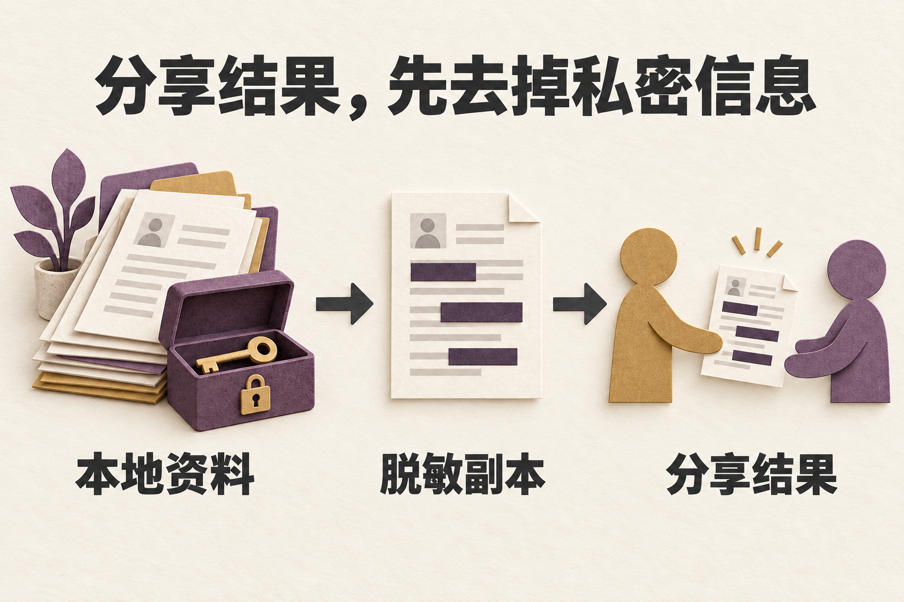

# 安全与隐私 / Security and privacy



*本地保存、发送给模型和对外分享是三个不同动作。*

<details>
<summary>English illustration / 英文配图</summary>


*Local storage, sending data to a model, and public sharing are separate actions.*

</details>

## 私密报告漏洞 / Report vulnerabilities privately

请勿在公开 issue、discussion 或 PR 披露漏洞。使用仓库 **Security → Report a vulnerability** 的私密报告入口，提供受影响版本、复现步骤与已脱敏证据。维护者目标是在 7 天内确认收到。

Do not disclose vulnerabilities in public issues, discussions, or pull requests. Use the repository's **Security → Report a vulnerability** private reporting entry, with the affected version, reproduction steps, and redacted evidence. Maintainers aim to acknowledge reports within 7 days.

## 部署前设置鉴权 / Configure authentication before exposure

Compose 默认只把前端 `18928` 和后端 `18927` 发布到 `127.0.0.1`。本地开发可留空鉴权密钥，但仅适用于可信机器；同机的其它进程仍可访问这些端口。

Compose publishes frontend `18928` and backend `18927` only on `127.0.0.1` by default. Empty authentication secrets are suitable only for development on a trusted machine; other processes on that machine can still access the ports.

开放 LAN 或公网前完成以下设置：

Before LAN or public exposure:

1. 设置精确值 `ENV=production`。`production/prod` 启动检查都要求两个鉴权密钥非空；部分管理端点对精确值 `production` 还有额外限制。 / Set the exact value `ENV=production`. Startup checks require both secrets for `production/prod`; some admin endpoints apply an additional restriction to the exact value `production`.
2. 为 `SESSION_SECRET` 和 `ADMIN_TOKEN` 分别生成唯一值，不复用公开示例。 / Generate separate, unique values for `SESSION_SECRET` and `ADMIN_TOKEN`; do not reuse public examples.
3. 明确选择端口绑定、TLS、反向代理、CORS 和访问控制。 / Choose port bindings, TLS, reverse proxy, CORS, and access controls explicitly.
4. 设置 `LLM_ALLOW_LOCAL_BYOK_HOSTS=false`，保持 `LLM_ALLOW_PRIVATE_BYOK_HOSTS=false`。 / Set `LLM_ALLOW_LOCAL_BYOK_HOSTS=false` and keep `LLM_ALLOW_PRIVATE_BYOK_HOSTS=false`.

为每个密钥分别执行一次，结果仅存入私有配置：

Run this once per secret and store each result only in private configuration:

```bash
openssl rand -hex 32
```

## 会话、身份与管理接口 / Sessions, identity, and admin APIs

| 设置或接口 / Setting or endpoint | 边界 / Boundary |
| --- | --- |
| `SESSION_SECRET` 为空 / Empty `SESSION_SECRET` | 跳过本地会话门禁，不提供多用户隔离。 / Skips the local session gate; provides no multi-user isolation. |
| `SESSION_SECRET` 非空 / Nonempty `SESSION_SECRET` | REST 使用 `X-Session-Token`，WebSocket 使用首帧 auth。 / REST uses `X-Session-Token`; WebSocket uses an auth first frame. |
| 资源 owner / Resource owner | owner-sensitive 路径需要带 `sub` 的签名 principal；裸 secret 只通过粗粒度门禁。 / Owner-sensitive paths need a signed principal with `sub`; the raw secret passes only the coarse gate. |
| `/api/admin/*` | 配置 `ADMIN_TOKEN` 后需匹配的 `X-Admin-Token`；正常 session 门禁也生效。 / Requires matching `X-Admin-Token` when configured; the normal session gate also applies. |
| `/metrics` | 接受配置的 admin token，或会话门禁启用时的有效 session token。 / Accepts the configured admin token, or a valid session token when the session gate is enabled. |
| `/` | 公开服务响应检查，不证明 LLM 可用。 / Public service-response check; does not establish LLM availability. |

签名身份与请求中的 `user_id` 不一致会被拒绝；跨 owner 和不存在的资源使用相同 404。生产签名 token 需要有效签发与过期时间。该机制仍不提供完整的账号、组织和多租户权限管理；公网部署者需要补齐外部身份、授权、日志、备份和密钥管理。

Requests with a `user_id` that disagrees with the signed identity are rejected. Cross-owner and missing resources share the same 404 response. Production signed tokens require valid issue and expiry times. This mechanism does not provide complete account, organization, or tenant administration; public operators must supply external identity, authorization, logging, backups, and secret management.

## 模型与 BYOK 信任边界 / Model and BYOK trust boundary

部署级 `LLM_RESPONSES_URL` 由管理员控制。请求级 `llm_base_url` 属于用户输入，要经过 host 白名单、scheme 和 URL 形状校验。远端覆盖使用完整 `key + Base URL + model` 绑定，避免新端点借用旧 profile 的凭据。

The operator controls deployment-level `LLM_RESPONSES_URL`. Request-level `llm_base_url` is user input and passes host-allowlist, scheme, and URL-shape checks. Remote overrides use a complete `key + Base URL + model` binding so a new endpoint cannot borrow credentials from an old profile.

- 凭据不得放入 URL；userinfo、query、fragment 和 path params 会被拒绝。 / Keep credentials out of URLs; userinfo, queries, fragments, and path parameters are rejected.
- 托管请求级端点必须使用 HTTPS。HTTP 仅适用于启用的精确本地 host，或明确允许的自托管边界。 / Hosted request-level endpoints require HTTPS. HTTP is limited to enabled exact-local hosts or an explicitly allowed self-hosted boundary.
- `LLM_EXTRA_ALLOWED_HOSTS` 只填写精确 host，不填写完整 URL。 / Put exact hosts in `LLM_EXTRA_ALLOWED_HOSTS`, not full URLs.
- 精确本地免 key 请求不发送 `Authorization`，也不回退到服务器默认 key。精确 host 名单见[配置说明](docs/CONFIGURATION.md)。 / Exact-local keyless requests omit `Authorization` and do not fall back to the server default key. See [Configuration](docs/CONFIGURATION.en.md) for the exact host list.
- 管理连接测试在 `ENV=production` 时拒绝本地 URL。不要假设其它入口有同一规则，也不要用 `prod` 绕过部署建议。 / Admin connection tests reject local URLs when `ENV=production`. Do not assume all entry points share this rule or use `prod` to bypass the deployment guidance.

并行 probe，以及会注入工具的 live native-search probe，要求调用方提供非占位 key、精确本地目标，或匹配已配置 `ADMIN_TOKEN` 的 `X-Admin-Token`。普通会话门禁仍生效。并行 probe 宽度上限为 4，health call 之后最多再发 10 次 provider 请求；运行前确认费用和发送的数据。

Parallel probes and live native-search probes that inject tools require a caller-supplied non-placeholder key, an exact-local target, or an `X-Admin-Token` matching the configured `ADMIN_TOKEN`. The normal session gate still applies. Parallel probes are capped at width 4 and up to 10 additional provider requests after the health call. Confirm costs and transmitted data before running them.

## 本地数据、输出与分享 / Local data, output, and sharing

Model profile 的 API key 以明文保存在本地 SQLite，适用于单用户 self-hosted 场景；返回给网页的密钥状态为 `has_api_key`。请限制数据库和配置文件的访问权限，并把 `.env`、`.env.docker`、日志与实例备份保存在私有位置。发送给远端模型或搜索服务的内容适用该服务自己的数据政策。

Model-profile API keys are stored in plaintext in local SQLite for single-user self-hosting; the web app receives key presence as `has_api_key`. Restrict access to the database and configuration files, and keep `.env`, `.env.docker`, logs, and instance backups private. Content sent to remote models or search services is subject to those services' data policies.

Snapshot 与公开 artifact 会移除已知凭据字段，但问题、角色和结果仍可能包含你输入的个人或商业信息。发布前逐项检查，不把自动脱敏当作任意秘密检测器。脱敏 Snapshot 也不能代替完整实例备份；恢复流程见[部署说明](deploy/README.md)。

Snapshots and public artifacts remove known credential fields, but questions, characters, and results may still contain personal or business information you entered. Review content before publishing; automatic redaction is not a detector for every possible secret. A redacted Snapshot also cannot replace an instance backup; see [Deployment](deploy/README.md) for recovery.

客户端 LLM 错误使用安全短码，禁止返回原始 provider 正文和堆栈。维护代码时可记录已清洗的诊断片段，但不得让原始凭据、Authorization header、含密钥 URL 或未脱敏 provider 内容进入响应和日志。

Client-facing LLM errors use safe short codes and must not expose raw provider bodies or stack traces. Maintainers may log scrubbed diagnostic snippets, but raw credentials, Authorization headers, credential-bearing URLs, and unredacted provider content must not reach responses or logs.
