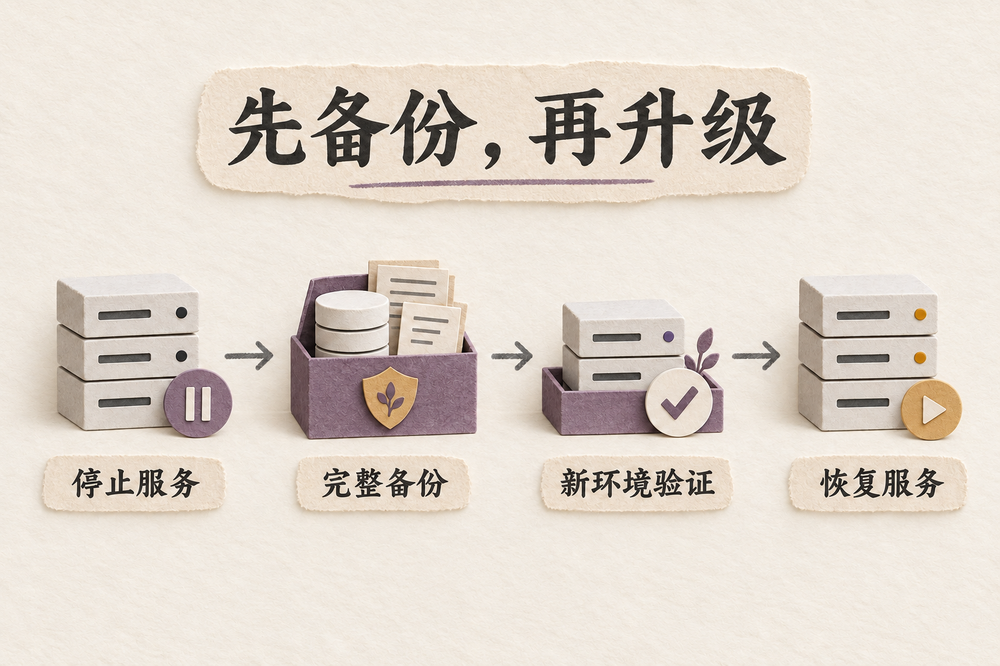
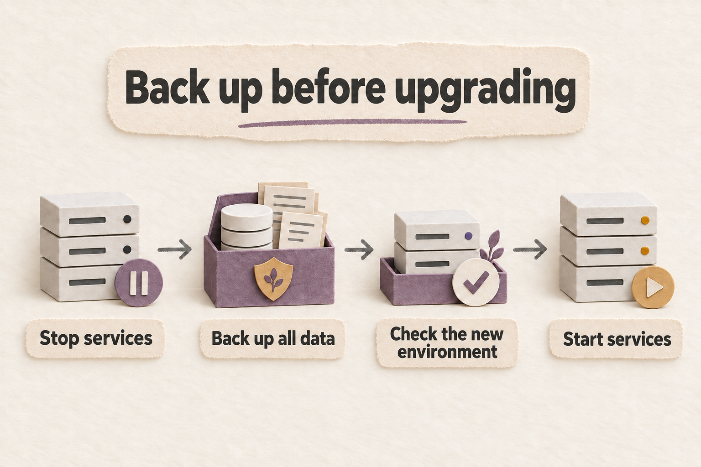

# 部署、备份与恢复 / Deployment, backup, and recovery

从本机 Compose 开始；需要升级已有实例时，先停写并验证备份。下面的维护命令会停止服务、创建数据副本，部分步骤会修改卷的所有权。先确认实例与数据卷，再按对应流程执行。

Start with local Compose. Before upgrading an existing instance, stop writers and verify a backup. The maintenance commands below stop services and create data copies; some change volume ownership. Identify the instance and volume before following the relevant procedure.



*保留旧镜像与升级前备份，先在新目标恢复并检查。*

<details>
<summary>English illustration / 英文配图</summary>



*Keep the old images and pre-upgrade backup, then restore and inspect a new target.*

</details>

## 本机 Compose / Local Compose

Windows/macOS 使用 Docker Desktop 的 Linux 容器模式；Linux 使用 Docker Engine 和 Compose 插件。以下命令从仓库根目录运行。已有 `.env.docker` 不要覆盖，按[配置说明](../docs/CONFIGURATION.md)编辑。

On Windows/macOS, use Docker Desktop in Linux-container mode. On Linux, use Docker Engine and the Compose plugin. Run commands from the repository root. Preserve an existing `.env.docker` and edit it using [Configuration](../docs/CONFIGURATION.en.md).

```bash
(
set -eu
test -f .env.docker || cp .env.docker.example .env.docker
docker compose config --quiet
docker compose pull
docker compose up -d --wait
)
```

```powershell
if (-not (Test-Path .env.docker)) { Copy-Item .env.docker.example .env.docker }
docker compose config --quiet
if ($LASTEXITCODE -ne 0) { throw 'Compose configuration failed' }
docker compose pull
if ($LASTEXITCODE -ne 0) { throw 'Image pull failed' }
docker compose up -d --wait
if ($LASTEXITCODE -ne 0) { throw 'Compose startup failed' }
```

打开 `http://127.0.0.1:18928`。默认前端 `18928` 与后端 `18927` 只发布到宿主 loopback。后端镜像包含 `packs/` 和 `samples/`，可直接浏览官方样例。新模型调用还需真实连接；容器健康不代表模型可用。

Open `http://127.0.0.1:18928`. Frontend `18928` and backend `18927` publish only on host loopback by default. The backend image includes `packs/` and `samples/` for browsing official samples. New model calls need a working connection; container health does not establish model availability.

从源码构建使用 `docker compose up --build -d --wait`。已有数据的升级先完成本页备份流程；后端启动会由 `init_db()` 执行迁移。生产或 LAN/公网开放前，设置 `ENV=production`、独立的 `SESSION_SECRET` 和 `ADMIN_TOKEN`，再配置端口、TLS、访问控制和 CORS，见[安全说明](../SECURITY.md)。

To build from source, use `docker compose up --build -d --wait`. Back up existing data first using this guide; backend startup runs migrations through `init_db()`. Before production or LAN/public exposure, set `ENV=production` and distinct `SESSION_SECRET` and `ADMIN_TOKEN`, then configure ports, TLS, access controls, and CORS. See [Security](../SECURITY.md).

## 锁定运行环境 / Locked runtimes

`backend/uv.lock` 是唯一 Python 依赖解析。开发/CI 使用 uv 0.12.7 与 `uv sync --locked --extra dev --no-build`；Docker 消费同一锁，不安装 dev extra。目标平台缺少 wheel 时明确失败，不临时安装未锁定构建依赖。锁包含 Windows 与 POSIX 的平台标记。

`backend/uv.lock` is the single Python dependency resolution. Development and CI use uv 0.12.7 with `uv sync --locked --extra dev --no-build`; Docker consumes the same lock without the dev extra. A missing platform wheel fails installation without resolving unpinned build dependencies. The lock includes Windows and POSIX markers.

uv 工具环境与应用环境分开，完整跨平台命令见[后端开发](../backend/README.md)。保留 `--locked`，不要换成跳过过期检查的 `--frozen` 或在部署时执行宽范围 `pip install .`。依赖升级单独评审、重锁与验证。

Keep the uv tooling and application environments separate; see [Backend development](../backend/README.md) for cross-platform commands. Keep `--locked`; do not substitute `--frozen`, which skips stale-lock checks, or run a broad `pip install .` during deployment. Review, relock, and validate dependency upgrades separately.

Docker 基础镜像按多平台 manifest digest 固定：Python 3.13.12、Node 22.23.2、Nginx 1.27.5 与 builder uv 0.12.7。npm 11.12.1 通过 `npx --yes npm@11.12.1` 运行，不升级宿主全局 npm。Python 基础镜像已提供锁定 wheel 需要的共享库，构建不解析浮动 apt 包。精确 digest 见各 Dockerfile。

Docker bases are pinned by multi-platform manifest digest: Python 3.13.12, Node 22.23.2, Nginx 1.27.5, and builder uv 0.12.7. npm 11.12.1 runs through `npx --yes npm@11.12.1` without upgrading global npm. The Python base provides shared libraries needed by the locked wheels, so builds do not resolve floating apt packages. See the Dockerfiles for exact digests.

## 验证覆盖与证明范围 / Verification coverage and evidence limits

下表描述仓库配置的门禁，不代表任何尚未查看的 CI 运行已经通过。发布前查看同一提交的 job 结论、实际 OS/架构日志与工件。声明兼容范围和编译目标也不等于逐个版本的测试结果。

The table describes configured gates, not a claim that an unobserved CI run passed. Before release, inspect job conclusions, actual OS/architecture logs, and artifacts for the same commit. Compatibility declarations and build targets are not per-version test results.

| 范围 / Surface | 已配置门禁 / Configured gate | 证明边界 / Evidence boundary |
| --- | --- | --- |
| Linux 原生 / Linux native | Ubuntu、Python 3.11 后端全量；Python 3.13.12 兼容 smoke / Ubuntu full backend suite on Python 3.11; portability smoke on Python 3.13.12 | 不代表其它发行版或版本 / Does not imply other distributions or versions |
| Windows 原生 / Windows native | `windows-latest`、Python 3.11、前端脚本、离线备份恢复 / `windows-latest`, Python 3.11, frontend scripts, offline backup/recovery | 未验证 Windows ARM64 / Windows ARM64 is not validated |
| macOS 原生 / macOS native | `macos-latest`、Python 3.11、前端脚本、离线备份恢复 / `macos-latest`, Python 3.11, frontend scripts, offline backup/recovery | 以实际 runner 架构为准，不概括 Intel/ARM 全部通过 / Use the logged runner architecture; no blanket Intel/ARM claim |
| Docker | 原生 `linux/amd64` 与 `linux/arm64` 最终镜像作业 / Native `linux/amd64` and `linux/arm64` final-image jobs | 验证精确前后端 manifest digest，不用 Vite preview 代替 / Tests exact backend/frontend manifest digests, not a Vite-preview substitute |
| 前端运行环境 / Frontend runtime | CI 与镜像：Node 22.23.2 / npm 11.12.1 / CI and images: Node 22.23.2 / npm 11.12.1 | 声明兼容 Node 20.x 的 20.19+ 或 Node ≥22.12 / Declared Node range: 20.19+ in 20.x or ≥22.12 |
| 浏览器 / Browser | 发布签收安装 Chromium、Firefox、WebKit / Release signoff installs Chromium, Firefox, and WebKit | Linux WebKit 不等于原生 Safari；构建 target 不是最低版本实测 / Linux WebKit is not native Safari; build targets are not minimum-version test results |

## 最终镜像与晋升 / Final images and promotion

GHCR 先构建 SHA 标记的候选镜像。每个平台拉取已经记录的 manifest digest，在新内部网络和新数据卷中执行 `scripts/container_smoke.py`，检查镜像内的 Nginx 与应用。

GHCR first builds SHA-tagged candidates. Each platform pulls the recorded manifest digests and runs `scripts/container_smoke.py` on a new internal network and new data volumes, checking the Nginx and application delivered in the images.

检查包含官方样例导入、Snapshot 导出/导入、真实后端 WebSocket 心跳、无代理缓冲的报告 SSE、非 root 写入、重启读回、停机卷备份、新卷恢复与恢复后的应用读取。Chroma 使用固定 embedding，不下载模型；隔离 provider 延迟失败只验证流传输和失败终态，不证明模型质量。

Checks cover official sample import, Snapshot export/import, real backend WebSocket heartbeats, unbuffered report SSE, non-root writes, restart readback, stopped-volume backup, restore into a new volume, and restored-application readback. Chroma uses fixed embeddings without downloading a model. The isolated provider fails after a delay to test streaming and failure termination; it does not establish model quality.

晋升等待 amd64、arm64 镜像门禁，并复制已测试的 digest，不重新解析可能移动的 SHA 标签。版本标签还需同一 SHA 的已执行发布签收。前后端作为一对晋升与回退；失败回退也必须报告结果。源码测试和旧截图不能代替这些门禁。

Promotion waits for the amd64 and arm64 image gates and copies the tested digests without re-resolving movable SHA tags. Version tags also require an executed release signoff for the same SHA. Backend and frontend promote and roll back as a pair, with rollback failures reported. Source tests and old screenshots cannot replace these gates.

需要复验时，将占位值替换为 `docker image inspect` 获得的实际镜像 ID，或 `repository@sha256:...` registry 引用；选择实际平台，使用新的或空的输出目录：

To reproduce, replace placeholders with actual image IDs from `docker image inspect` or `repository@sha256:...` registry references. Select the actual platform and a new or empty output directory:

```bash
python3 scripts/container_smoke.py run \
  --backend-image 'sha256:BACKEND_IMAGE_ID_64_HEX' \
  --frontend-image 'sha256:FRONTEND_IMAGE_ID_64_HEX' \
  --platform linux/arm64 --output output/container-smoke-new-run
```

JSON 证据记录输入 digest、平台实际镜像 ID、检查和清理。脚本只按 ID 清理自己带归属标签的 `swarm-impl-*` 资源，不调用 Docker prune，也不拆除用户的 Compose 服务。无法创建隔离资源时应停止，不能改用正在运行的实例。

JSON evidence records input digests, actual platform image IDs, checks, and cleanup. The script deletes only its own labeled `swarm-impl-*` resources by ID; it does not run Docker prune or tear down a user's Compose services. Stop if isolated resources cannot be created rather than reusing a running instance.

## 停机备份的前提 / Before an offline backup

`scripts/backup_restore.py` 需要 Python 3.11+。先停止所有可能写入所选数据的进程或容器。POSIX 通过 `lsof` 检查打开文件，无法核实时拒绝继续；Windows 保持排他 Win32 文件句柄；卷备份拒绝仍被运行容器挂载的来源。复制期间来源变化也会失败。

`scripts/backup_restore.py` requires Python 3.11+. Stop every process or container that can write the selected data. POSIX checks open files with `lsof` and refuses unverifiable sources. Windows retains exclusive Win32 file handles. Volume backup rejects a source mounted by any running container. Source changes during copying also fail the backup.

备份包含选定 SQLite 的原始 WAL/SHM 和全部选定 Chroma 状态，只在临时恢复副本中打开 SQLite，不对原数据做恢复写入。检查实际 `DATABASE_URL`、`CHROMA_PERSIST_DIR` 和其它状态目录，Snapshot 不能代替实例备份。

Backup includes the selected SQLite database's original WAL/SHM files and all selected Chroma state. SQLite opens only in temporary restored copies, avoiding recovery writes to the source. Check the actual `DATABASE_URL`, `CHROMA_PERSIST_DIR`, and any other state directories. Snapshots cannot replace instance backups.

仅执行 `tar -tzf` 只能证明归档可读。脚本在真正展开临时副本并检查文件 hash、SQLite 完整性、Alembic 版本、表计数和 Chroma collection/embedding 标记后，才报告 `backup_and_restore_verified`。缺少 Chroma 标记会明确显示；完整应用读回由最终镜像门禁另外验证。

`tar -tzf` proves only that the archive can be read. The helper reports `backup_and_restore_verified` after extracting a temporary copy and checking file hashes, SQLite integrity, Alembic versions, table counts, and Chroma collection/embedding markers. Missing Chroma markers are explicit. The final-image gate separately checks full application readback.

备份可能包含私人推演和凭据，存放在受限位置。暂存与校验通常需要约三倍数据大小的空闲空间。每次使用新归档路径，保留旧备份；不要把原数据路径作为恢复目标。

Backups may contain private runs and credentials; keep them in restricted storage. Allow roughly three times the data size as free space for staging and validation. Use a new archive path each time, retain old backups, and never restore over the source.

### 原生目录 / Native directories

停止后端后，从仓库根目录运行。下面适用于默认布局，`--include` 排除源码和虚拟环境，并自动包含所选数据库的 `-wal`、`-shm`。将 `NEW` 替换为本次唯一名称。

After stopping the backend, run from the repository root. This example uses the default layout. `--include` excludes source and virtual environments and automatically includes the selected database's `-wal` and `-shm` files. Replace `NEW` with a unique name for this operation.

```bash
(
set -eu
python3 scripts/backup_restore.py backup --source backend \
  --include swarmoracle.db --include chroma_data \
  --archive output/backups/native-NEW.tar.gz
python3 scripts/backup_restore.py verify --archive output/backups/native-NEW.tar.gz
python3 scripts/backup_restore.py restore --archive output/backups/native-NEW.tar.gz \
  --destination /absolute/path/to/NEW-swarmoracle-data
)
```

PowerShell 使用同一脚本，并检查退出码：

PowerShell uses the same helper, with exit-code checks:

```powershell
python scripts/backup_restore.py backup --source backend --include swarmoracle.db --include chroma_data --archive output/backups/native-NEW.tar.gz
if ($LASTEXITCODE -ne 0) { throw 'Backup or restore verification failed' }
python scripts/backup_restore.py restore --archive output/backups/native-NEW.tar.gz --destination 'C:\SwarmOracle-restore-new'
if ($LASTEXITCODE -ne 0) { throw 'Restore verification failed' }
```

自定义路径使用实际数据库与 Chroma 路径；独立公共数据目录可用 `--source /path/to/data` 备份整目录。选择了不存在的组件会报错；从未创建的 Chroma 可在确认后省略。数据目录外的真实环境文件要另行私密备份。

Use actual database and Chroma paths for customized layouts. For a dedicated common data directory, `--source /path/to/data` copies the whole directory. Selecting a missing component is an error; omit a never-created Chroma store only after checking. Back up actual environment files outside the data directory separately and privately.

恢复后，让一个已停止的实例指向新数据库和 Chroma 路径，启动并检查历史运行后再切换。脚本拒绝路径穿越、链接/junction、重复或大小写冲突成员、意外文件与 hash 不一致。失败提取可能留下新建的部分目标；保留供检查，再换另一个新目录重试。

After restore, point a stopped instance at the new database and Chroma paths, then start it and inspect historical runs before cutover. The helper rejects traversal, links/junctions, duplicate or case-colliding members, unexpected files, and hash mismatches. Failed extraction may leave a new partial destination; retain it for inspection and retry into another new directory.

### Docker 数据卷 / Docker volumes

使用原部署相同的 Compose project name 和 `-f` 参数。先保留原 backend 容器，用它确认精确旧镜像 ID 与 `/data` 命名卷。备份工具使用这个包含 Python 的旧镜像，不拉取浮动工具镜像。下列流程会停止 backend；其它挂载同卷的写入服务也必须先停止。

Use the original deployment's Compose project name and `-f` arguments. Keep the original backend container while identifying its exact old image ID and named `/data` volume. The helper uses that Python-containing old image instead of pulling a floating utility image. These steps stop the backend; stop other writers mounting the same volume as well.

macOS / Linux：

macOS / Linux:

```bash
(
set -eu
SwarmBackendId=$(docker compose ps --all --quiet backend)
test -n "$SwarmBackendId"
SwarmVolume=$(docker inspect --format '{{range .Mounts}}{{if and (eq .Destination "/data") (eq .Type "volume")}}{{.Name}}{{end}}{{end}}' "$SwarmBackendId")
test -n "$SwarmVolume"
SwarmBackupImage=$(docker inspect --format '{{.Image}}' "$SwarmBackendId")
docker compose stop backend
SwarmArchive="$(pwd)/output/backups/backend-data-$(date -u +%Y%m%dT%H%M%SZ).tar.gz"
python3 scripts/backup_restore.py backup-volume --volume "$SwarmVolume" --image "$SwarmBackupImage" --archive "$SwarmArchive"
printf 'Restore-tested backup: %s\n' "$SwarmArchive"
)
```

Windows PowerShell：

Windows PowerShell:

```powershell
& {
  $ErrorActionPreference = 'Stop'
  function Invoke-SwarmDocker {
    & docker @args
    if ($LASTEXITCODE -ne 0) { throw "docker failed: $LASTEXITCODE" }
  }
  $SwarmBackendId = Invoke-SwarmDocker compose ps --all --quiet backend
  if (@($SwarmBackendId).Count -ne 1 -or [string]::IsNullOrWhiteSpace($SwarmBackendId)) { throw 'Expected one backend container' }
  $SwarmContainer = (Invoke-SwarmDocker inspect $SwarmBackendId | ConvertFrom-Json)[0]
  $SwarmMounts = @($SwarmContainer.Mounts | Where-Object { $_.Destination -eq '/data' -and $_.Type -eq 'volume' })
  if ($SwarmMounts.Count -ne 1) { throw 'Expected one named /data volume' }
  $SwarmVolume = $SwarmMounts[0].Name
  $SwarmBackupImage = $SwarmContainer.Image
  Invoke-SwarmDocker compose stop backend
  $SwarmArchive = Join-Path (Get-Location) ('output/backups/backend-data-' + [DateTime]::UtcNow.ToString('yyyyMMddTHHmmssZ') + '.tar.gz')
  python scripts/backup_restore.py backup-volume --volume $SwarmVolume --image $SwarmBackupImage --archive $SwarmArchive
  if ($LASTEXITCODE -ne 0) { throw 'Backup/restore verification failed; keep backend stopped' }
  Write-Output "Restore-tested backup: $SwarmArchive"
}
```

恢复使用一个尚不存在的卷名。将镜像占位值替换为备份对应的精确旧 backend ID；PowerShell 使用 `python`，其余参数相同：

Restore into a volume name that does not exist. Replace the image placeholder with the exact old backend ID associated with the backup. On PowerShell use `python`; the remaining arguments are the same:

```bash
python3 scripts/backup_restore.py restore-volume --archive /absolute/path/backup.tar.gz \
  --volume swarmoracle-restored-NEW --image 'sha256:EXACT_OLD_BACKEND_IMAGE_ID'
```

恢复文件归属变为当前非 root 运行所需的 UID/GID 1000。先用匹配镜像对挂载独立新卷，检查健康和历史记录，再明确修改部署的卷选择。原卷保持完整，不能用 `docker compose down -v` 回滚。任意旧 tar 没有此脚本的 manifest 会被拒绝，列出文件不等于恢复验证。

Restored files receive UID/GID 1000 for the current non-root runtime. Start the matching image pair against the separate new volume, check health and historical records, then explicitly change the deployment's volume selection. Preserve the original volume; do not use `docker compose down -v` as rollback. Arbitrary older tar archives lack this helper's manifest and are rejected; listing files is not restore verification.

<a id="legacy-data-volume-upgrade"></a>

## 旧 root 数据卷的一次性升级 / One-time upgrade of a root-owned volume

当前 backend 镜像使用 UID 1000，旧卷会保留原所有权。只有旧 root-owned 卷需要以下维护；新卷无需修复。流程先停机、创建并恢复验证完整备份，然后才递归修改原卷所有权，再启动并检查写入。它不删除原文件内容，但会修改权限归属；确认卷名后再执行。

Current backend images use UID 1000, while old volumes retain their ownership. Only old root-owned volumes need this maintenance; fresh volumes do not. The sequence stops the service, creates and restore-tests a full backup, then recursively changes source-volume ownership before startup and write checks. It preserves file contents but changes ownership; confirm the volume name before running it.

macOS / Linux：

macOS / Linux:

```bash
(
set -eu
SwarmBackendId=$(docker compose ps --all --quiet backend)
test -n "$SwarmBackendId"
SwarmVolume=$(docker inspect --format '{{range .Mounts}}{{if and (eq .Destination "/data") (eq .Type "volume")}}{{.Name}}{{end}}{{end}}' "$SwarmBackendId")
test -n "$SwarmVolume"
SwarmBackupImage=$(docker inspect --format '{{.Image}}' "$SwarmBackendId")
docker compose stop backend
SwarmArchive="$(pwd)/output/backups/legacy-upgrade-$(date -u +%Y%m%dT%H%M%SZ).tar.gz"
python3 scripts/backup_restore.py backup-volume --volume "$SwarmVolume" --image "$SwarmBackupImage" --archive "$SwarmArchive"
docker run --rm --network none --user 0 --entrypoint chown \
  --mount "type=volume,src=$SwarmVolume,dst=/data" \
  "$SwarmBackupImage" -hR 1000:1000 /data
docker compose up -d --wait
docker compose exec -T backend python -c "import os,tempfile; assert os.getuid()==1000; [tempfile.TemporaryFile(dir=p).close() for p in ('/data','/data/chroma_data')]; print('Data paths writable as UID 1000')"
)
```

Windows PowerShell：

Windows PowerShell:

```powershell
& {
  $ErrorActionPreference = 'Stop'
  function Invoke-SwarmDocker {
    & docker @args
    if ($LASTEXITCODE -ne 0) { throw "docker failed: $LASTEXITCODE" }
  }
  $SwarmBackendId = Invoke-SwarmDocker compose ps --all --quiet backend
  if (@($SwarmBackendId).Count -ne 1 -or [string]::IsNullOrWhiteSpace($SwarmBackendId)) { throw 'Expected one backend container' }
  $SwarmContainer = (Invoke-SwarmDocker inspect $SwarmBackendId | ConvertFrom-Json)[0]
  $SwarmMounts = @($SwarmContainer.Mounts | Where-Object { $_.Destination -eq '/data' -and $_.Type -eq 'volume' })
  if ($SwarmMounts.Count -ne 1) { throw 'Expected one named /data volume' }
  $SwarmVolume = $SwarmMounts[0].Name
  $SwarmBackupImage = $SwarmContainer.Image
  Invoke-SwarmDocker compose stop backend
  $SwarmArchive = Join-Path (Get-Location) ('output/backups/legacy-upgrade-' + [DateTime]::UtcNow.ToString('yyyyMMddTHHmmssZ') + '.tar.gz')
  python scripts/backup_restore.py backup-volume --volume $SwarmVolume --image $SwarmBackupImage --archive $SwarmArchive
  if ($LASTEXITCODE -ne 0) { throw 'Backup/restore verification failed; keep backend stopped' }
  Invoke-SwarmDocker run --rm --network none --user 0 --entrypoint chown --mount "type=volume,src=$SwarmVolume,dst=/data" $SwarmBackupImage -hR 1000:1000 /data
  Invoke-SwarmDocker compose up -d --wait
  Invoke-SwarmDocker compose exec -T backend python -c "import os,tempfile; assert os.getuid()==1000; [tempfile.TemporaryFile(dir=p).close() for p in ('/data','/data/chroma_data')]; print('Data paths writable as UID 1000')"
}
```

任一步失败，保持 backend 停止并保留已验证归档。启动后核对健康与历史记录。回滚时用匹配旧镜像和独立恢复卷，不覆盖原卷，不使用 `docker compose down -v`。

If a step fails, keep the backend stopped and retain the verified archive. After startup, check health and historical records. Roll back with the matching old images and a separate restored volume, without overwriting the original or using `docker compose down -v`.

## 回滚必须匹配升级前数据 / Match rollback code with pre-upgrade data

把升级前完整备份与旧 backend/frontend 的确切 digest 一起保存。除非已经证明旧程序能读取新数据，回滚旧代码时必须恢复升级前备份。枚举值或报告 schema 变化即使没有数据库迁移，也可能使旧程序读不懂新数据。

Keep the full pre-upgrade backup with the exact old backend/frontend digests. Unless old-code compatibility with new data has been proved, restore the pre-upgrade backup when rolling back code. Enum values and report schemas can break old readers even without a database migration.

同版本容器恢复门禁只证明该版本能恢复数据，不能证明旧镜像能读取新版本写入后的状态。

A same-version container recovery gate proves restoration with that version; it does not prove old images can read state written by a newer version.

## 原生 Linux 上的宿主模型地址 / Host model endpoints on native Linux

`host.docker.internal:host-gateway` 只提供名称/地址映射。原生 Linux 上仅监听 `127.0.0.1` 的宿主服务，通常不能从 Docker bridge gateway 访问。DNS 成功不证明 TCP 可达，更不证明模型和认证可用。

`host.docker.internal:host-gateway` provides DNS/address mapping only. On native Linux, a host service bound solely to `127.0.0.1` is generally unreachable through the Docker bridge gateway. DNS success does not establish TCP reachability, model support, or authentication.

在 `.env.docker` 中把 `LLM_RESPONSES_URL` 设为 Base URL，例如 `http://host.docker.internal:YOUR_LLM_PORT/v1`，端口必须替换为你实际配置的服务。下列命令只查 DNS/TCP，不发送模型请求；先替换端口占位值：

Set `LLM_RESPONSES_URL` in `.env.docker` to a Base URL such as `http://host.docker.internal:YOUR_LLM_PORT/v1`; replace the port with your actual service setting. This command checks DNS/TCP without sending a model request. Replace the port placeholder first:

```bash
SwarmLlmPort=YOUR_LLM_PORT
docker compose exec -T -e SWARM_LLM_PORT="$SwarmLlmPort" backend python -c "import os,socket; print(socket.gethostbyname('host.docker.internal')); c=socket.create_connection(('host.docker.internal',int(os.environ['SWARM_LLM_PORT'])),3); c.close(); print('TCP reachable; model/auth not tested')"
```

Docker Desktop 使用自己的宿主访问机制。原生 Linux 可明确配置可达的 host gateway 接口与访问控制，或让 loopback-only 模型与原生 backend 一起运行。使用宿主实际 IP 时，非本地分类的端点仍需要真实 key。不要只加一行 `network_mode: host`：它会同时改变端口发布、监听与前端 `backend` DNS 关系。

Docker Desktop provides its own host-access mechanism. On native Linux, configure a reachable host-gateway interface and access controls, or run the native backend alongside a loopback-only model. An endpoint using the host's actual IP still needs a real key when classified as non-local. Do not apply a standalone `network_mode: host` override: it changes port publishing, binding, and the frontend's `backend` DNS relationship together.
