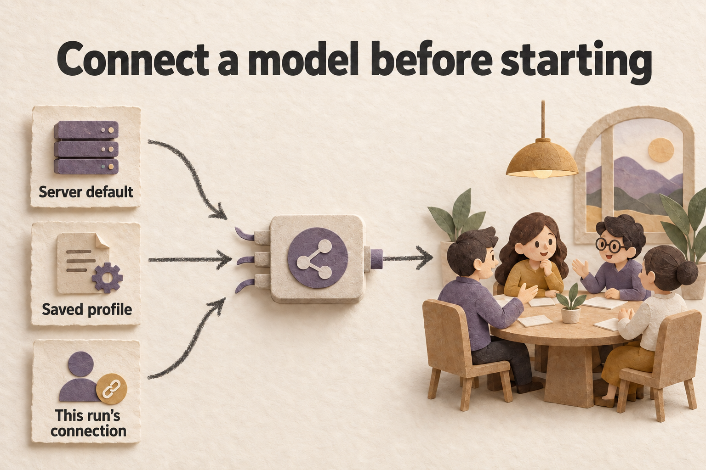

[中文优先 / Chinese first](CONFIGURATION.md) | English first / 英文优先

# Configuration / 配置说明



*Browse a sample first, then connect a model for actions that generate new content.*

<details>
<summary>中文配图 / Chinese illustration</summary>


*先浏览样例，再为需要生成的操作连接模型。*

</details>

## Choose how you will use the app / 先选你的使用方式

With prediction scoring enabled, reopening a result may call the model to finish scoring when some predictions are scored and others remain unscored. Use read-only replay when you only want to view the run.

启用预测评分时，如果同一推演里有些预测已评分、有些还未评分，重新打开结果页可能继续调用模型评分。只想阅读时，可以使用只读回放。

You do not need an API key to read official samples, import `.swarm` files, or view saved results and Replay. New runs, character questions, and report generation or translation call a model. Starting these new actions from a sample also needs a working connection.

只读官方样例、导入 `.swarm` 并查看已保存的结果与 Replay，不需要 API key。新建推演、追问角色、生成或翻译报告会调用模型；从样例发起这些新操作也需要可用连接。

| Goal / 目标 | What you need / 准备 |
| --- | --- |
| Browse samples / 浏览样例 | Start both services and open a homepage sample / 启动前后端，打开首页样例 |
| Use your model / 使用自己的模型 | Save a connection in Setup, or supply BYOK for the current request / 在 Setup 保存连接，或为当前请求填写 BYOK |
| Set a local default / 配置本机默认模型 | Edit `backend/.env` and restart the backend / 编辑 `backend/.env` 并重启后端 |
| Docker / public deployment / Docker / 公网部署 | Use `.env.docker`; public exposure also requires production authentication and access controls / 使用 `.env.docker`；公网还需生产鉴权与访问控制 |

## Where settings live / 配置放在哪里

For native development, copy the root `.env.example` to `backend/.env` only if the destination does not exist. For Docker, use `.env.docker.example` → `.env.docker`. Preserve existing settings. See [Backend development](../backend/README.md) and [Deployment](../deploy/README.md) for setup commands.

本地开发仅在目标不存在时把根目录 `.env.example` 复制到 `backend/.env`；Docker 对应 `.env.docker.example` → `.env.docker`。不要覆盖已有配置。完整安装命令见[后端开发](../backend/README.md)和[部署说明](../deploy/README.md)。

The templates define public defaults; [`backend/app/config.py`](../backend/app/config.py) defines field validation. Process environment variables can override `.env`. Restart the backend after changes; the frontend reads enabled features from `/api/capabilities`. A personal `.env` is not a project default and should not be committed.

公开默认值以模板为准，字段校验以 [`backend/app/config.py`](../backend/app/config.py) 为准。进程环境变量可覆盖 `.env`。修改后重启后端；前端从 `/api/capabilities` 读取启用的功能。个人 `.env` 不是项目默认，也不应提交。

## Connect a model / 连接模型

Test and save a connection at `/admin/setup`, and manage profiles at `/model-profiles`. The Base URL, key, and model ID must belong to one provider. Use a model ID that the service supports. Setup requires a successful test of the current combination or your explicit acceptance of saving it unverified. Recheck the connection after editing its fields.

在 `/admin/setup` 测试并保存连接，在 `/model-profiles` 管理已有配置。Base URL、key 与模型 ID 必须属于同一个 provider；模型 ID 填服务实际支持的值。Setup 要求当前组合测试成功，或由你明确接受未验证保存。修改连接字段后需要重新核对。

| Variable / 变量 | Public template value / 公开模板值 | Purpose / 用途 |
| --- | --- | --- |
| `LLM_RESPONSES_URL` | `http://127.0.0.1:8317/v1` | Local unconfigured sentinel; replace with the real Base URL / 本机未配置哨兵；替换成实际 Base URL |
| `LLM_API_KEY` | `your-api-key-here` | Placeholder; remote services need a real key / 占位值；远端服务必须换成真实 key |
| `LLM_MODEL_NAME` | `gpt-5.4-mini` | Model ID supported by your service / 服务实际支持的模型 ID |
| `LLM_REASONING_EFFORT` | `none` | `none / low / medium / high`, subject to model support / `none / low / medium / high`，需与模型能力匹配 |
| `LLM_REQUESTS_PER_MINUTE` / `LLM_TOKENS_PER_MINUTE` | `0` / `0` | RPM / TPM; 0 disables the corresponding limit / RPM / TPM；0 关闭各自这一层限制 |
| `LLM_CONCURRENCY` | `5` | Global concurrency; 0 disables this cap and its derived purpose lanes / 全局并发；0 关闭此上限及其派生 purpose lane |
| `LLM_MAX_PENDING` / `LLM_USER_MAX_PENDING` | `24` / `4` | Global / per-user pending caps; 0 disables the corresponding guard / 全局 / 单用户等待上限；0 关闭对应保护 |

The Docker template uses `http://host.docker.internal:8317/v1` and an empty key. The shipped `127.0.0.1:8317`, `localhost:8317`, and `host.docker.internal:8317` endpoints with an empty or placeholder key still mean unconfigured. Supply the actual service address or save the connection explicitly through Setup.

Docker 模板使用 `http://host.docker.internal:8317/v1` 和空 key。随附的 `127.0.0.1:8317`、`localhost:8317` 或 `host.docker.internal:8317` 与空值/占位 key 的组合，都仍表示未配置。请填实际服务地址，或通过 Setup 明确保存连接。

Exact-local hosts are `localhost`, `127.0.0.1`, `0.0.0.0`, `host.docker.internal`, and `::1`; write IPv6 URLs with `[::1]`. Keyless calls to these hosts omit `Authorization` and do not borrow the server's default key. Similar subdomains and numeric or hexadecimal loopback spellings do not qualify.

精确本地 host 仅包括 `localhost`、`127.0.0.1`、`0.0.0.0`、`host.docker.internal` 和 `::1`，IPv6 URL 使用 `[::1]`。这些地址的免 key 请求不发送 `Authorization`，也不借用服务器默认 key。相似子域名、数字或十六进制 loopback 写法不享有这个例外。

Reasoning effort is saved with a run and carried into its child calls. The bound run policy takes priority over a child call's default, so a run set to `low` does not silently switch effort in a child call. Later operations may override it where their API permits; otherwise they inherit the saved value, then the server default. `none` omits the native effort parameter; it does not guarantee that the provider disables reasoning.

reasoning effort 会随运行保存，并传给同一运行中的后续子调用；已绑定的运行策略优先于子调用的默认值。例如选择 `low` 后，子调用不会自行改回其它 effort。后续操作可按入口合同显式覆盖，否则继承已保存值，再回退服务器默认。`none` 表示不发送原生 effort 参数，不保证 provider 自身关闭推理。

## Distinguish configuration, connection tests, and real results / 区分已配置、连接测试和真实结果

`llm_static_configured` describes the server default; `llm_configured` also considers profiles available to the current user. Profiles with a key and keyless profiles with an exact-local Base URL plus model ID can both qualify. These zero-cost hints do not test the network, quota, or output quality.

`llm_static_configured` 只描述服务器默认配置；`llm_configured` 还考虑当前用户可用的 profile。带 key 的 profile 和“精确本地 Base URL + 模型 ID”的免 key profile 都可计入。这些零费用状态不验证网络、额度或输出质量。

`GET /` checks only backend response. A connection test calls the provider; success does not establish a complete run or parallelism probe. Homepage manual tests with a real key or exact-local URL can request a parallel probe, capped at width 4 and up to 10 additional requests across the ramp. Automatic launch checks do not fan out. Failed probes clear old recommendations.

`GET /` 只检查后端响应。连接测试会调用 provider；它成功仍不代表完整推演或并行探测通过。首页手动测试在提供真实 key 或精确本地地址时可请求并行 probe，宽度上限 4，完整递增最多产生 10 个附加请求。启动前的自动检查不做 fanout；probe 失败会清除旧推荐。

## Profiles and request-level BYOK / Profile 与当前请求 BYOK

Homepage advanced settings control the run, display, packs, and search. BYOK applies to the current request. Reports, questions, scoring, and continuation of a profile-backed run can restore the original profile or use a complete new binding. Remote overrides require `key + Base URL + model`; exact-local overrides require `Base URL + model`. Partial overrides are rejected to avoid mixing a new address with old credentials.

首页的高级设置管理推演、显示、主题包和搜索；BYOK 只覆盖当前请求。Profile-backed 运行的报告、追问、评分和续跑可恢复原 profile，或使用完整的新绑定。远端覆盖需同时提供 `key + Base URL + model`；精确本地覆盖需 `Base URL + model`。部分覆盖会被拒绝，以免混用新地址和旧凭据。

Changing the endpoint or model detaches the old profile and clears its RPM/TPM, concurrency, structured-output, and native-search policies. Switching a Debate role profile also clears old explicit overrides. Later operations resolve the currently saved profile again; a historical model label does not prove that the connection remains recoverable.

更换端点或模型会解除旧 profile 绑定，并清除旧 RPM/TPM、并发、结构化输出和原生搜索策略。切换 Debate 角色 profile 同样清除旧显式覆盖。后续操作会重新读取当前保存的 profile；历史模型标签不证明今天仍可恢复该连接。

| Variable / 变量 | Default / 默认 | Boundary / 边界 |
| --- | --- | --- |
| `LLM_EXTRA_ALLOWED_HOSTS` | Empty / 空 | Additional exact-host allowlist, not full URLs / 额外精确 host 白名单，不填完整 URL |
| `LLM_ALLOW_PRIVATE_BYOK_HOSTS` | `false` | Whether allowlisted private/LAN hosts are allowed; does not control built-in local aliases / 是否允许白名单中的 private/LAN host；不控制内置本地别名 |
| `LLM_ALLOW_LOCAL_BYOK_HOSTS` | `true` | Controls exact-local hosts; set false for LAN, public, or multi-user deployments / 控制精确本地 host；LAN、公网或多用户部署设为 false |

URLs must not contain credentials, userinfo, queries, fragments, or path parameters. Use HTTPS for hosted services. See [Security](../SECURITY.md) for URL, SSRF, and probe-authorization boundaries.

URL 不得包含凭据、userinfo、query、fragment 或 path params；托管服务使用 HTTPS。完整 URL、SSRF 和探测鉴权边界见[安全说明](../SECURITY.md)。

## Search and feature switches / 搜索与功能开关

| Variable / 变量 | Default / 默认 | Purpose / 用途 |
| --- | --- | --- |
| `ENABLE_WEB_SEARCH` | `false` | Application-layer search switch / 应用层搜索总开关 |
| `WEB_SEARCH_PROVIDER` | `tavily` | `tavily / exa / firecrawl / xai / searxng` |
| `WEB_SEARCH_API_KEY` | Empty / 空 | Hosted search-service key / 托管搜索服务的 key |
| `SEARXNG_URL` | `http://localhost:8888` | Self-hosted SearXNG URL / 自建 SearXNG 地址 |
| `FEATURE_NEW_SOURCES` / `FEATURE_FAMILY_QUERY_OPTIMIZATION` | `false` / `false` | Source-family filters / query optimization / 来源家族筛选 / 查询词优化 |

Configure model-native search through the profile and Responses adapter; `WEB_SEARCH_PROVIDER=native` does not enable it. Pages show citations actually returned by the provider. Application-layer search failures degrade without blocking the run.

模型原生搜索通过 profile 与 Responses adapter 配置，不能用 `WEB_SEARCH_PROVIDER=native` 开启。页面只展示 provider 实际返回的 citations。应用层搜索失败会降级，不应阻断推演。

The public templates enable the main user features, including Agents, graphs, Replay, reports, roundtables, Snapshots, Journal, Local Packs, and model profiles. See the [feature index](FEATURES.en.md). Disabled features generally return 404, and the frontend hides or disables their entry points using capabilities.

主要用户功能在公开模板中默认开启，包括 Agent、图谱、Replay、报告、圆桌、Snapshot、Journal、Local Packs 和 model profiles。入口详见[功能索引](FEATURES.md)。关闭功能后，相应接口通常返回 404，前端按 capabilities 隐藏或禁用入口。

`FEATURE_MEMORY_PROMOTION` is a default-off backend capability that also requires `FEATURE_AGENT_IDENTITY=true`. It has no public capability, REST, or UI activation surface and is absent from public env templates. Existing identity-memory screens do not mean this capability is enabled.

`FEATURE_MEMORY_PROMOTION` 是默认关闭的后端能力，还依赖 `FEATURE_AGENT_IDENTITY=true`。它没有公开 capability、REST 或 UI 激活入口，公开 env 模板也未列出；不要把现有身份记忆入口当作该能力已经开放。

## Services, data, and production authentication / 服务、数据和生产鉴权

| Variable / 变量 | Native template default / 原生模板默认 | Purpose / 用途 |
| --- | --- | --- |
| `ENV` | `development` | Use `production` for production deployments / 生产部署使用 `production` |
| `HOST` / `PORT` | `127.0.0.1` / `18927` | Backend bind address / 后端监听地址 |
| `DATABASE_URL` | `sqlite:///./swarmoracle.db` | SQLite location / SQLite 位置 |
| `CHROMA_PERSIST_DIR` | `./chroma_data` | Vector-data directory / 向量数据目录 |
| `CORS_ORIGINS` | Origin list in the template / 模板中的来源列表 | Allowed web origins / 允许访问的网页来源 |
| `SESSION_SECRET` / `ADMIN_TOKEN` | Empty / empty / 空 / 空 | May be empty for local development; generate separately before public exposure / 本地开发可留空；公网前分别生成 |

Frontend dev uses port `18928` and proxies `/api` and `/ws` to the backend; `SWARM_BACKEND_URL` overrides that target. Docker listens on container interfaces but publishes ports only to host `127.0.0.1` by default, with SQLite and Chroma in the `/data` volume.

前端 dev 默认使用 `18928`，经 `/api`、`/ws` 代理到后端；`SWARM_BACKEND_URL` 可覆盖目标。Docker 在容器内监听所有接口，但默认只向宿主 `127.0.0.1` 发布端口，并把 SQLite 与 Chroma 放入 `/data` volume。

Before LAN or public exposure, use `ENV=production`, generate distinct unique values for `SESSION_SECRET` and `ADMIN_TOKEN`, and configure TLS, access controls, and correct CORS. Startup rejects `production/prod` without either secret; use the exact value `production` for deployment. See [Security](../SECURITY.md) for authentication and `/metrics` rules.

在 LAN 或公网开放前，使用 `ENV=production`，为 `SESSION_SECRET` 和 `ADMIN_TOKEN` 分别生成唯一值，并配置 TLS、访问控制和正确 CORS。`production/prod` 缺少任一密钥会拒绝启动；部署建议使用精确值 `production`。鉴权边界和 `/metrics` 规则见[安全说明](../SECURITY.md)。

Run this separately for each secret and keep the values in private configuration, out of documentation, URLs, logs, and public artifacts.

分别执行下列命令生成两个值，只存入私有配置，不粘贴到文档、URL、日志或公开工件。

```bash
openssl rand -hex 32
```

## Advanced tuning and preflight / 高级调优与预检

See the templates and `config.py` for run limits, memory, lock leases, stall timeouts, speech and metadata timeouts, and report budgets. Do not copy temporary settings from another machine. Identify the timeout, rate-limit, or resource problem before tuning.

推演上限、记忆、锁租期、stall timeout、角色发言与元数据超时、报告预算等参数见模板和 `config.py`，不要复制某台机器的临时值。修改前先明确要解决的超时、限流或资源问题。

`make preflight` or the backend preflight script probes exact-local LLM URLs, omitting `Authorization` for an empty key. Remote empty or placeholder keys produce `warn` without a network request. Failed requests or missing visible text produce `fail` and a nonzero exit. Confirm live calls are allowed before running it. See the [backend guide](../backend/README.md) for setup and preflight commands.

`make preflight` 或后端预检脚本会实测精确本地 LLM URL，空 key 不发送 `Authorization`；远端空值或占位 key 只给出 `warn` 并跳过网络。请求失败或没有可见正文会得到 `fail`，进程返回非零。运行前确认允许真实调用。安装与预检命令见[后端说明](../backend/README.md)。
