[English first / 英文在前](FEATURES.en.md) · [中文在前 / Chinese first](FEATURES.md)

# Feature guide / 功能指南

Find an entry by the task you want to complete. Follow the [usage guide](USAGE.en.md) for the steps and [configuration](CONFIGURATION.en.md) for models and feature flags. Server settings, available data, and read-only replay mode affect which actions you can use.

按你想完成的任务找入口。具体操作见[使用指南](USAGE.md)，模型与功能开关见[配置说明](CONFIGURATION.md)。服务器设置、现有数据和只读回放模式会影响按钮是否可用。

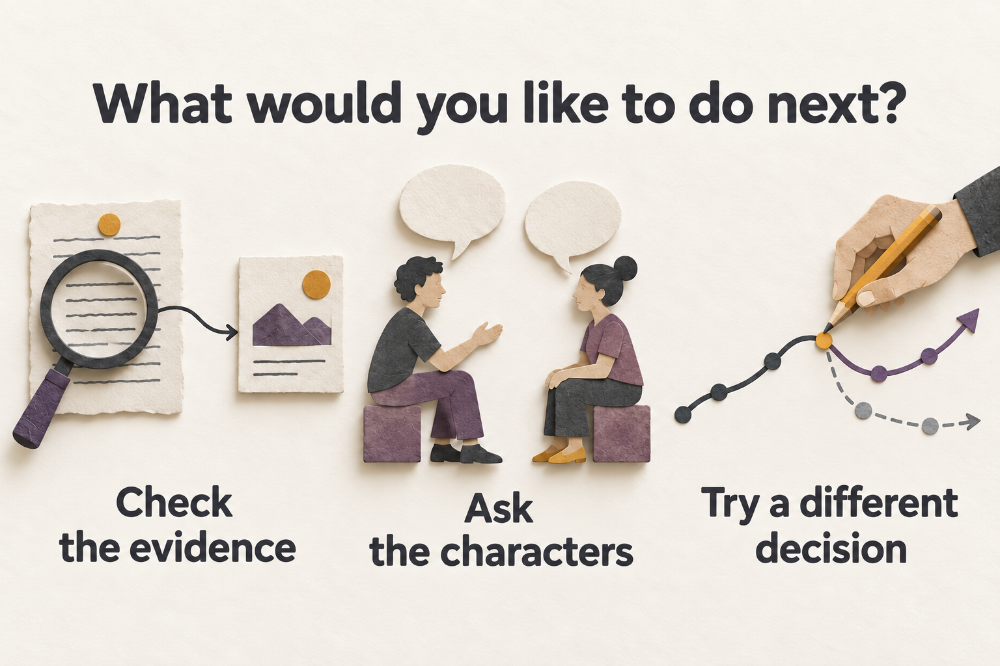

*AI-generated conceptual illustration: choose the next step around a result. This is not a product screenshot.*

*AI 生成概念插画：围绕一个结果选择下一步，并非产品截图。*

中文配图 / Chinese illustration

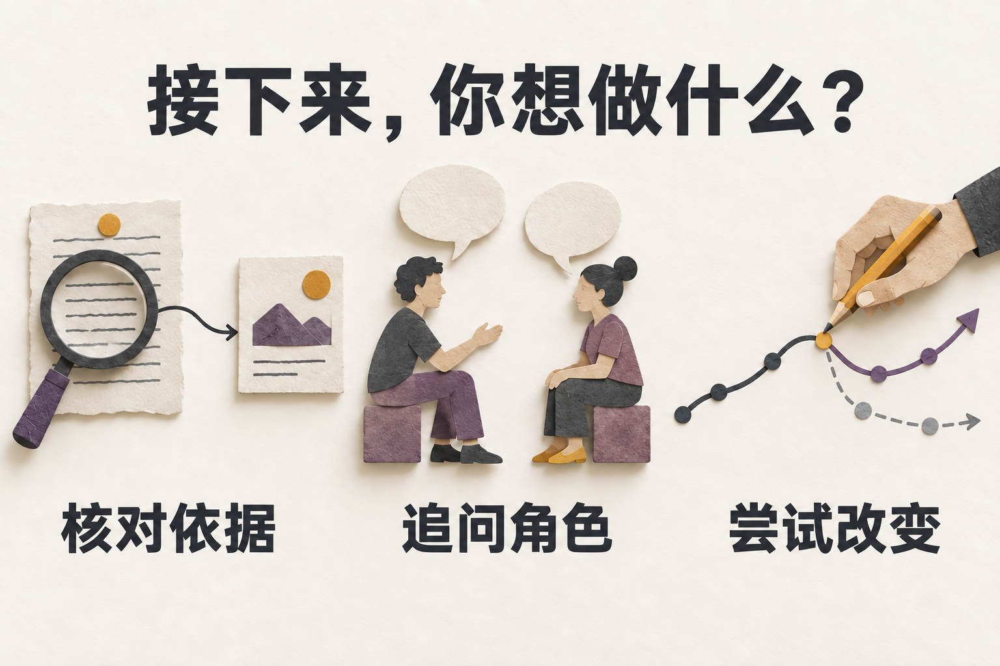

The screenshots show the app on 2026-09-19 using fictional battery-allocation material set in the island city of Harborlight. Conceptual illustrations have separate labels. See the full [screenshot tour](SCREENSHOTS.en.md).

以下实拍展示 2026-09-19 的真实应用界面，以虚构的灯港群岛电池分配问题为例。概念插画另有标注。完整界面见[截图导览](SCREENSHOTS.md)。

## Explore before generating / 先浏览，再决定要不要生成

| English / 英文 | 中文 / Chinese |
| --- | --- |
| **Browse an official sample.** The home page offers three complete samples. Opening one needs no API key or file selection and makes no model calls. You can also import a `.swarm` snapshot. | **浏览官方样例。** 首页有 3 个完整样例，打开时无需 API Key、无需选文件、不会调用模型。你也可导入 `.swarm` 快照。 |
| **Read saved results.** Inspect endings, the brief result, saved reports, evidence, and replay. New simulations, follow-ups, reruns, and full analyses start explicitly; prediction-scoring recovery has an exception described in the usage guide. | **读已有结果。** 查看结局、简报、已保存报告、证据和回放。新推演、追问、重演和完整分析需要主动启动；预测评分恢复有例外，见使用指南。 |
| **Connect a model.** Use `/admin/setup` to test and save a connection, `/model-profiles` to manage profiles, and home-page **BYOK** for a per-run override. | **连接模型。** `/admin/setup` 用于测试和保存连接，`/model-profiles` 用于管理配置，首页 **BYOK** 用于本次覆盖。 |
| **Choose reasoning effort.** The home page offers Server default, Light, Balanced, and Deep. The app saves the choice for later operations to inherit; parameter support depends on the provider. | **选推理力度。** 首页提供服务端默认、轻量、均衡和深入。应用会保存本次选择，后续操作按继承规则使用；模型是否支持该参数取决于提供方。 |

## Turn a question into worldlines / 把问题变成多条世界线

- **Prepare a question.** Write one or use a Quick Start, education template, challenge, or Local Pack to fill the form. A pack’s cast preview provides context for the run without creating library identities. 
  **准备问题。** 自己输入，或用快速开始、教学模板、挑战和本地主题包填入问题与建议设置。主题包的角色预览只是本次背景，不会创建资料库身份。

- **Add context.** A document upload can add background and a cast preview; you still enter the question. The initial world-event Feed accepts up to 20 events with sources, text, times, and tags. 
  **补充背景。** 上传文档可添加背景与角色预览，你仍需填写问题。初始世界事件 Feed 最多接受 20 条事件，可填来源、正文、时间和标签。

- **Choose size and view.** Set Agent count, rounds, and conservative, balanced, or exploratory mode; you can also run a batch. Classic shows branch structure. Pixel Theater shows a character stage, speech bubbles, and progress. 
  **选规模和视图。** 调整 Agent 数、轮数与谨慎／均衡／探索模式；可做多次推演。Classic 看分支结构，Pixel Theater 看角色舞台、发言气泡和时间进度。

- **Take part during a run.** Supported live runs offer interventions, gameplay cards, prediction bets, and worldline commitments. Finished results retain the records; read-only replays do not offer these writes. 
  **在运行中参与。** 支持的实时推演可使用干预、玩法卡、预测押注和世界线承诺。完成后的结果保留记录，只读回放不提供这些写入操作。

Entries: `/` and `/sim/:id`. Packs, uploaded documents, and Feed events are simulation material. Keep keys and sensitive personal information out of them.

入口：`/` 和 `/sim/:id`。主题包、上传资料和 Feed 都属于推演材料；不要在其中放入密钥或个人敏感信息。

## Read the conclusion and check its basis / 读结论，也查它的依据

- **Result page.** Read the question and completed endings, then choose **Check the evidence**, **Ask the characters**, or **Try a different decision**. Expand the additional tools for graphs, replay, and other views. 
  **结果页。** 先看原问题与完成的结局，再按“核对依据”“追问角色”“尝试改变”继续；图谱、回放等额外工具收在扩展入口中。

- **Brief result and full report.** The brief result reuses saved data without another model call. You request full analysis and body translation explicitly. An older report is labeled historical and does not replace the current brief result. 
  **简报与完整报告。** 简报复用保存的结果，不额外调用模型。完整分析和正文翻译需要你主动发起；旧报告会标为历史内容，不覆盖当前简报。

- **Evidence and status.** Reports provide sources for statements, branches, rounds, and available actions. They distinguish partial, failed, cancelled, and truncated output, and label each section as generated, rewritten, or static fallback. 
  **证据与状态。** 报告提供发言、分支、轮次及可用动作的来源。你可看到部分完成、失败、取消、截断等状态，以及各章的生成稿、重写稿或静态回退标签。

- **Review the run.** The causal archive puts cards, bets, commitments, and settlement together. Full reports may include failure scenarios, warning signs, uncertainty, and their evidence. Missing items remain marked as missing. 
  **复盘。** 因果档案对照玩法卡、押注、承诺与结算。完整报告还可显示失败情景、预警信号、不确定性和各自的证据；缺失项保留缺失状态。

Entries: `/result/:id` and `/result/:id/report`. Report confidence and branch weights come from this simulation. They are not real-world probabilities. A `complete` report does not mean every section came from a successful model call or every statement passed semantic verification.

入口：`/result/:id` 和 `/result/:id/report`。报告里的分析置信度与分支权重都来自本次模拟。它们不是现实概率；`complete` 也不表示每一章都由模型成功生成，或全部叙述已获语义验证。

## Ask from a graph or try a different choice / 从图谱追问，或试一次不同选择

| English / 英文 | 中文 / Chinese |
| --- | --- |
| **Graph detail → Ask.** Select a node in Graph Workbench or Knowledge Graph, check its character, round, and sources, then choose **Ask about this node**. Continue with follow-ups, load history, or stop the current reply. | **图谱详情 → 追问。** 在图谱工作台或知识图谱点节点，先检查人物、轮次和来源，再点“询问这个节点”。可连续追问、加载历史和停止当前回答。 |
| **Compare existing branches.** Pick two saved branches to inspect statements, state, and domain-variable differences. This creates no new branch. Original/counterfactual labels appear only when provenance supports them. | **比较已有分支。** 选两条已存在的分支，查看发言、状态和领域变量的差异。这一步不生成新分支。只有来源关系可核实时，才标注“原始／反事实”。 |
| **Rewrite a turn and replay.** In a completed run, choose an actual saved statement, replace it, and create a branch that continues generating. You can also resume from an available checkpoint. These operations need a model and the matching feature. | **改写一轮并重演。** 在完成的推演中选择一条已保存的真实发言，改写后创建新分支并继续生成。也可从可用 checkpoint 续跑。需要模型和对应功能。 |
| **Replay and timeline.** Review rounds and branch origins. Branch analysis includes shared history before the fork and excludes sibling branches and content after the selected cutoff. | **回放与时间线。** 按轮查看过程和分支来源。分支分析会包含分叉前的共同历史，并排除兄弟分支及截点之后的内容。 |

Entries: `/workbench/:id`, `/kg-explorer/:id`, `/timeline-galaxy/:id`, `/replay/:id`, and `/result/:id/compare`. Read-only replay does not offer new conversations, reruns, or report generation.

入口：`/workbench/:id`、`/kg-explorer/:id`、`/timeline-galaxy/:id`、`/replay/:id` 和 `/result/:id/compare`。只读 replay 不提供新的对话、重演或报告生成。

### Graph Workbench / 图谱工作台

Select a node, inspect its text, character, and sources, then ask a question from its details.

点开节点，查看正文、角色和来源，再从详情进入追问。

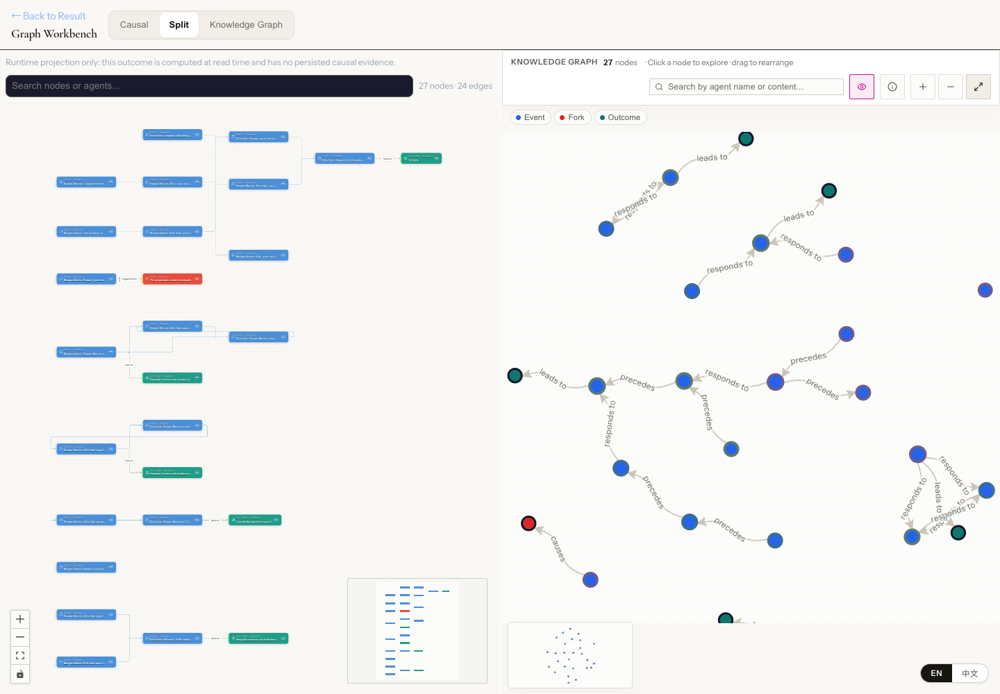

中文实拍 / Chinese screenshot

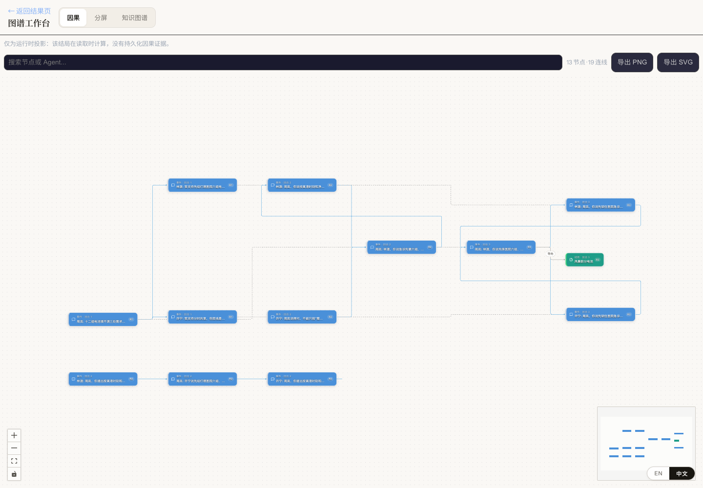

### Knowledge Graph / 知识图谱

Select an entity and follow its relationships to related content and available questions.

选择实体节点，沿关系查看相关内容和可用的追问入口。

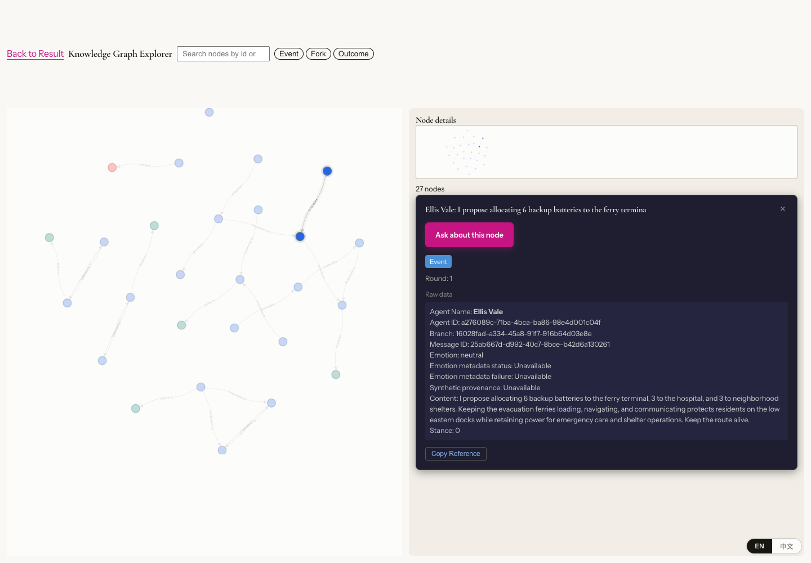

中文实拍 / Chinese screenshot

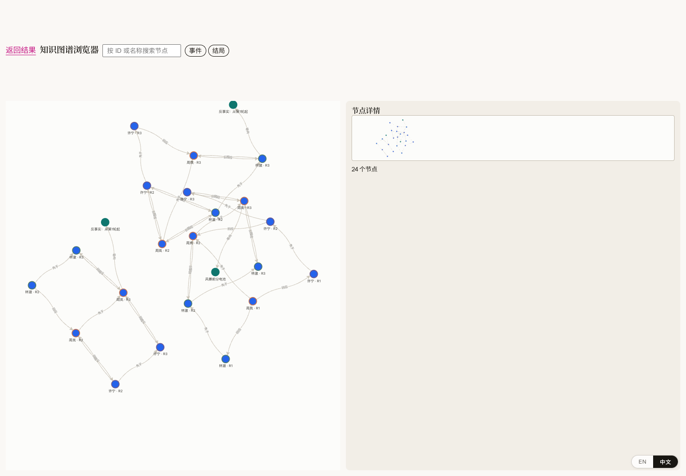

### Ask about a node / 节点追问

Check the target and context, then ask a follow-up and read the completed reply in the same panel.

核对对象与上下文，在同一面板发送追问并阅读已完成的回复。

中文实拍 / Chinese screenshot

### Rewrite a turn / 改写一轮

This view is before submission. Check the source statement and enter a replacement before creating a rewrite branch.

此图停在提交前：核对来源发言并填写替代内容，确认后才创建改写分支。

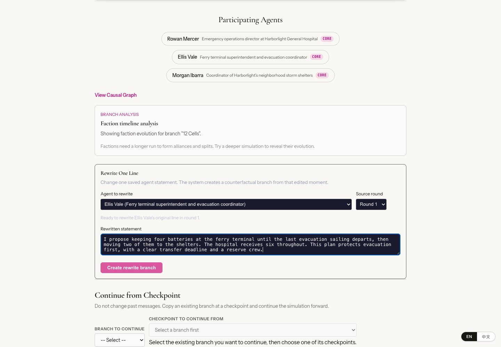

中文实拍 / Chinese screenshot

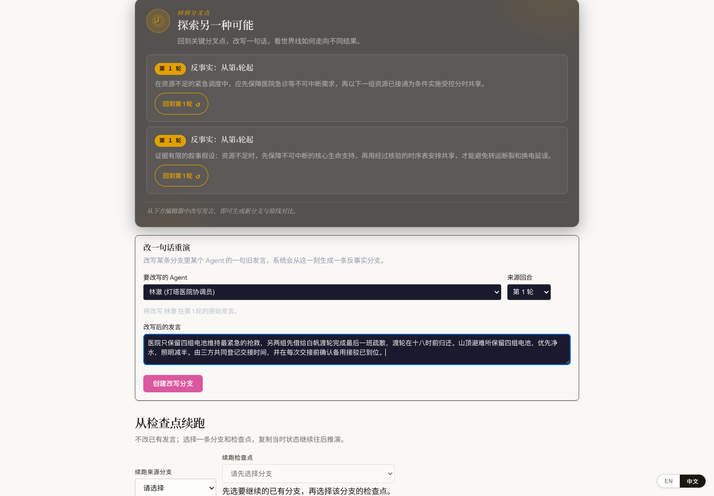

## Separate proposal, adoption, and execution / 分清提议、采纳和执行

*AI-generated conceptual illustration: proposals must meet the run’s rules before changing simulation state; adoption alone does not prove execution. This is not a product screenshot.*

*AI 生成概念插画：提议需要符合本局规则才会改变模拟状态；采纳本身不证明执行。并非产品截图。*

中文配图 / Chinese illustration

In each round, a character can post, comment, react, follow, mute, search, inspect trends, refresh, or explain why it takes no action. It can use only the opportunities present in the simulation. These social actions do not post to real social platforms.

角色每轮可以发帖、评论、回应、关注、静音、搜索、查看趋势、刷新，或说明为何暂不行动。它只能使用当前模拟提供的机会；这些社交动作不会发到真实社交平台。

When a run includes rules for budgets, capacity, or commitments, its state strip and Action Ledger can show rules, before/after values, and failure reasons. A shared commitment under the unanimous-round rule requires every participant to choose the same target in a complete round. Competing proposals do not add up to an adopted commitment, and adoption does not mean execution.

若本局有预算、容量或承诺等规则，状态条与动作账本可显示规则、变更前后数值和失败原因。对于采用全轮一致规则的共同承诺，参与者必须在完整轮次中明确同意同一目标才会采纳。不同提议不会相加成共同承诺，采纳也不等于已执行。

These records show what the simulation processed under its rules. Missing historical data, valid rules, or replayable records produce `unavailable`. Emotion and relationship hints in graphs do not establish real-world views, relationships, or causation.

这些记录只证明模拟内按规则处理了什么。缺少旧数据、合法规则或可重放记录时，你会看到 `unavailable`；图上的情绪或关系提示也不构成现实中的立场、关系或因果证明。

## Debate, chambers, and roundtables / 辩论、会客厅与圆桌

- **Debate Arena.** Two sides and one judge follow opening, crossfire, rebuttal, closing, and a verdict. Review each role’s model and reasoning effort before launch. Home-page Agent and round sliders do not change this format. 
  **辩论竞技场。** 固定正反两方和一名裁决者，依次开场、交锋、反驳、结辩，再裁决。启动前核对各角色的模型与推理力度；首页的 Agent 数和轮数不改变辩论规模。

- **Ending Chamber.** Continue from an ending with questions, One Move Only, evidence cards, and follow-up discussion. The chamber has its own model-profile selector in Advanced settings. 
  **结局会客厅。** 从一条结局继续追问，可用“只改一步”、证据投牌和后续讨论。会客厅的高级设置有自己的模型配置选择。

- **Worldline Roundtable.** With multiple endings, choose a format and representatives to discuss across worldlines. After completion, use a one-to-one interview, research analysis, or cross-examination, and save supported analysis notes. 
  **世界线圆桌。** 有多个结局时，选择讨论形式和代表，让不同世界线的角色一起讨论。完成后可进行一对一访谈、研究分析或交叉质询，并保存支持的分析笔记。

Entries: `/debate/:id`, `/debate/:id/result`, chambers on the result page, and `/roundtable/:id`. Role preparation, summaries, optional analysis, and retries can add requests and costs. A fixed debate format does not imply a fixed request count.

入口：`/debate/:id`、`/debate/:id/result`、结果页会客厅和 `/roundtable/:id`。模型准备、总结、可选分析与重试可能增加请求和费用，固定辩论规模不等于固定调用次数。

### Saved debate statements / 已保存的辩论发言

Review the saved statements from both sides by stage, then open the result page for the verdict.

按阶段查看已保存的正反双方发言，再打开结果页阅读裁决。

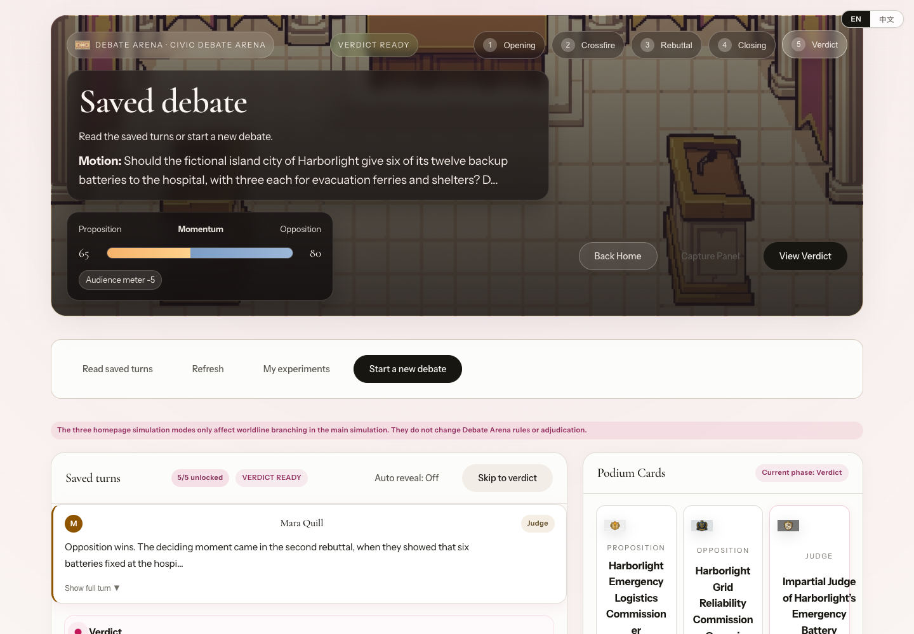

中文实拍 / Chinese screenshot

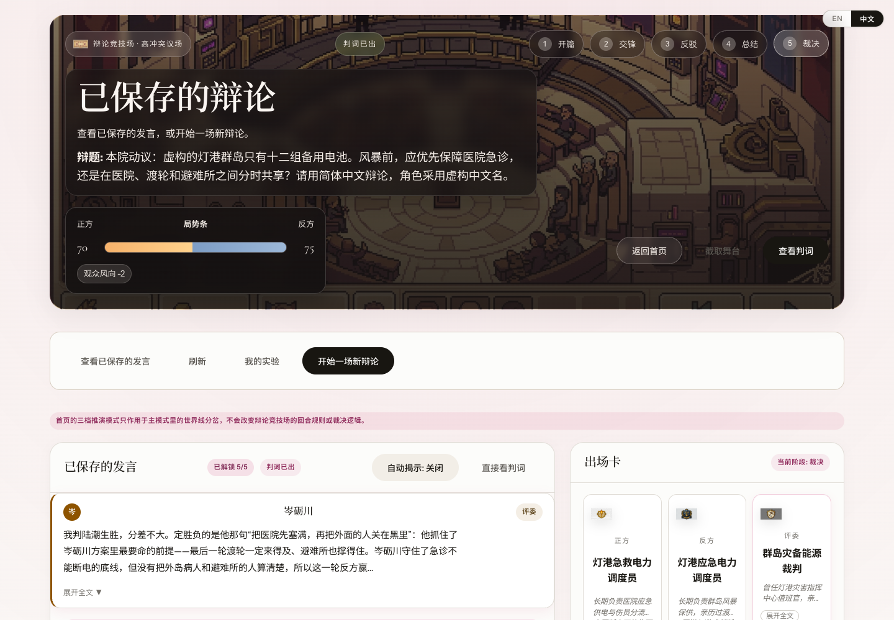

### Debate result / 辩论结果

Read the verdict and scoring rationale, then expand the arguments as needed.

查看裁决与评分依据，再按需要展开论点。

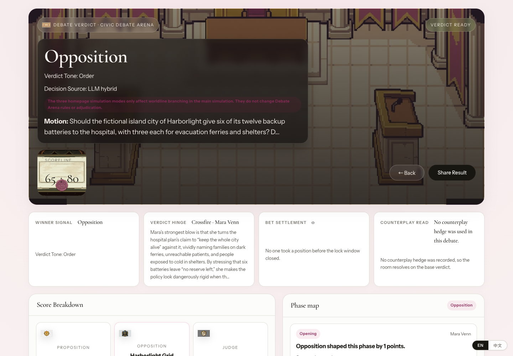

中文实拍 / Chinese screenshot

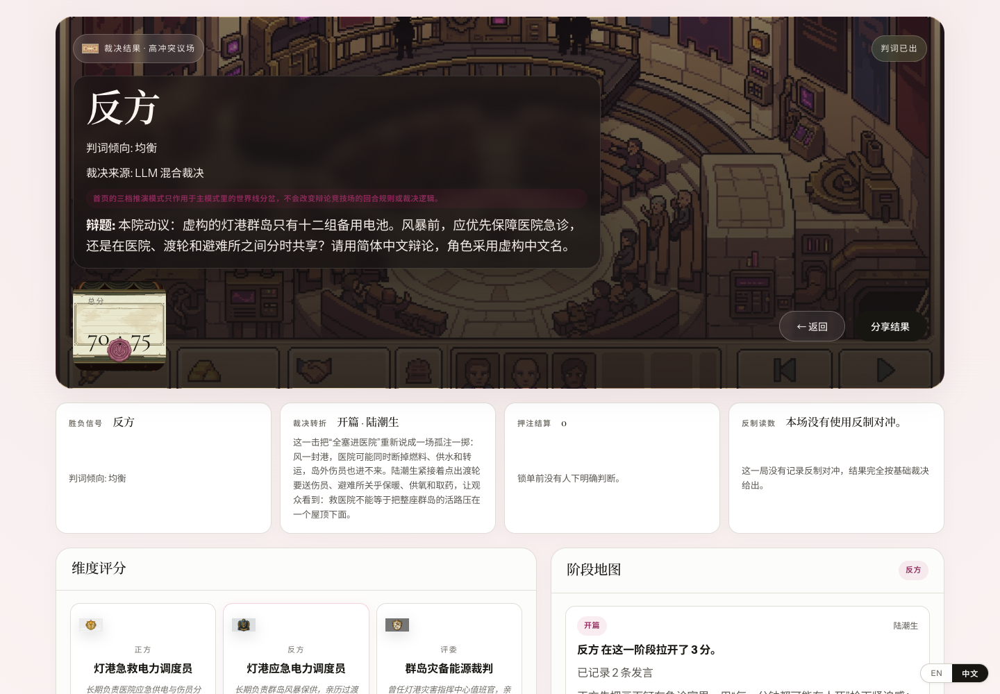

Inspect the links between accepted arguments and the verdict in the [debate argument map](SCREENSHOTS.en.md#debate-argument-map).

查看[辩论论点地图](SCREENSHOTS.md#debate-argument-map)，沿连线核对已采纳论点与裁决。

## Manage characters, save, and share / 管理角色、保存与分享

| English / 英文 | 中文 / Chinese |
| --- | --- |
| **Agent Library.** Create, favorite, and inspect Agents at `/agents`. Custom Agent cards offer **Edit**; `/agents/new` also supports generation from PDF. | **角色资料库。** 在 `/agents` 创建、收藏和查看 Agent，自定义 Agent 卡片有“编辑”入口；也可在 `/agents/new` 从 PDF 生成。 |
| **Backups and Agent Packs.** A single-persona backup import creates a new identity. Agent Packs export selected personas in order. Shared packs omit identity IDs, ownership data, memories, growth records, conversations, and credentials; review your own text before sharing. | **备份与 Agent Pack。** 导入单人备份会新建身份；Agent Pack 按选择顺序导出整组人设。分享包不携带身份 ID、归属信息、记忆、成长记录、对话或凭据，仍需检查自填文本。 |
| **Snapshots and sharing.** Export Markdown, a `.swarm` snapshot, a replay link, or a prediction card. Share a redacted Public Artifact as JSON, a single HTML file, or a Gallery hash link. | **快照与分享。** 导出 Markdown、`.swarm` 快照、回放链接或预测卡片。脱敏 Public Artifact 可用 JSON、单文件 HTML 或 Gallery hash 链接分享。 |
| **History and prediction journal.** Use `/history` for runs, `/me/journal` to record predictions, resolve outcomes, and inspect calibration, and `/leaderboard` for scores. Saved analysis is a user note; it does not become a verified fact or Agent memory. | **历史与预测日志。** `/history` 查推演，`/me/journal` 记预测、更新结果并看校准，`/leaderboard` 看预测榜。保存分析是用户笔记，不会自动变成已验证事实或角色记忆。 |

`/gallery.html` opens a local Public Artifact JSON file or hash link without uploading it. It is not an online community or marketplace. Review the question, character text, and endings before sharing.

`/gallery.html` 可打开本地 Public Artifact JSON 或 hash 链接，不会上传内容，也没有在线社区或交易市场。分享前仍要检查问题、角色文本和结局。

## Optional features and boundaries / 可选能力与边界

- **Search.** App-layer search is off by default and needs a provider. Model-native search is a separate capability. Citations appear only when a provider returns sources. 
  **搜索。** 应用层搜索默认关闭，需要配置提供方；模型原生搜索是另一项能力。只有提供方返回真实来源时才显示引用。

- **Feature checks.** The app distinguishes checking, check failure, disabled, and available. Retry a failed check; an administrator must configure disabled features and restart the backend. 
  **功能检查。** 页面区分“检查中”“检查失败”“已禁用”和“可用”。检查失败可重试；禁用项需由部署者配置后重启后端。

- **Memory features.** Existing identity and memory views do not mean every memory feature is available. Verified-memory promotion remains a default-off backend capability with no user-facing UI or REST entry. 
  **记忆能力。** 已有身份与记忆界面不表示所有记忆功能都已开放。Verified-memory promotion 仍是默认关闭的后端能力，没有可操作的界面或 REST 入口。

- **Local use and releases.** The default setup targets local and self-hosted use. Follow the [deployment guide](../deploy/README.md) for public access, backups, image verification, and rollback. 
  **本地与发布。** 默认按本地／自托管使用设计。公开访问、数据备份、镜像验证和旧版恢复按[部署说明](../deploy/README.md)操作。
