English | [中文](FEATURES.md)

# SwarmOracle Feature Catalog

This catalog covers the 48 user-visible features checked for release prep. Entry points and default flags match the current code, usage guide, and configuration docs. The three search-related features are off by default and need configuration first.

## Core Simulation

### F01 Home Question Box and Start Simulation
Type a "What if...?" question on the home page and start the main simulation. You confirm the question and run settings before the multi-Agent run begins. Unfinished IME composition does not open the launch dialog; slow requests or repeated clicks keep a single launch in flight and release the lock after the launch path times out. If the question is empty, LLM access is not configured, or this run is blocked by budget, the start button shows the reason below it.
Entry: `/` home -> question box -> `Start Simulation`

### F02 Debate Arena
The home page can start Debate Arena directly. It creates proposition, opposition, and judge roles, then runs a shorter staged debate. If no usable LLM credential exists or launch fails, the page shows the reason instead of silently stopping.
Entry: `/` home -> `Start Debate Arena`; live page: `/debate/:id`

### F03 Education Templates
Education templates fill the home page with a classroom-style question plus suggested rounds and Agent count. You can still edit the question and settings before launch.
Entry: `/` home -> `Use Template`

### F04 Simulation Mode, Pixel Theater, and Director/Gameplay Cards
Simulation Mode offers Conservative, Balanced, and Exploratory settings for main-simulation branching. Advanced settings can also switch the display between Classic and Pixel Theater; Pixel Theater presents the run as a pixel-stage view with character dialogue, branches, and the director toolbar. The simulation page uses a segmented progress ledger for current round, progress, and ETA; while the first round is warming up, it shows elapsed time and switches to a still-working hint for slow local models. The bottom pipeline bar and Theater replay timeline reserve space for zoom controls, message lists, and the language switcher, including mobile safe areas. If no round progresses for a long time, the page shows an interrupted-run panel and can send you back home to retry with the original question preserved. Intervention entries are available only during a live run and disappear during narration, completion, or replay. The director/gameplay cards come from the shared contract and currently include 14 cards: Civilization Debate, Spy Infiltration, Backchannel Pact, Human Takeover, Space-Time Rift, Mandate Surge, Evacuation Order, Public Hearing, Resource Triage, Forbidden Ritual, Audit Reckoning, Intel Blowback, Mandate Snapback, and Ceasefire Committee. Debate Arena uses its own phase rules and does not follow this setting.
Entry: `/` home -> `Simulation Mode` / display mode; live `/sim/:id` -> Pixel Theater toolbar -> gameplay cards

### F05 Simulation Rounds and Agent Count
The two sliders control run length and how many Agents join the main simulation. The page estimates runtime as you adjust them; once the run starts, the top progress ledger continues to show current round, overall progress, ETA, and the narration stage, and uses elapsed time during first-round warmup to show the model is still being awaited.
Entry: `/` home -> `Simulation Rounds` / `Agent Count`

### F06 Daily Challenge and Weekly Theme
The home page shows today's challenge and the active weekly theme when available. Launching from these cards attaches campaign context, then the result page shows progress from the run.
Entry: `/` home -> daily challenge / weekly theme cards

### F07 Prediction Verdict
The result page tries to answer the original question in one sentence with confidence. If the verdict is missing or the scenario is old, the page keeps the original question and shows the unavailable state.
Entry: `/result/:id` -> page header

### F08 Worldline Cards
Each ending has a title, probability, story summary, and answer to the original question. Probabilities are normalized across terminal leaf worldlines, so fork parents are not treated as final endings; a valid single-ending run can still show 100%. Expanding a card opens the full story and follow-up entries.
Entry: `/result/:id` -> worldline cards

### F09 Next-Step Entries
The result page shows next-step cards based on available data and capability flags, such as graphs, replay, comparison, Agent follow-up, and sharing. Unavailable entries keep a visible reason instead of disappearing silently.
Entry: `/result/:id` -> `What's Next`

## Deep Chat and Roundtable

### F10 Ending Chamber / Oracle Chamber
Enter a chamber from one worldline to ask its participants follow-up questions. They answer from what already happened in that worldline; when model profiles are enabled, you can open the collapsed-by-default Advanced settings and choose a profile for this chamber, or leave it blank for the global default.
Entry: `/result/:id` -> ending card -> `Enter Chamber`
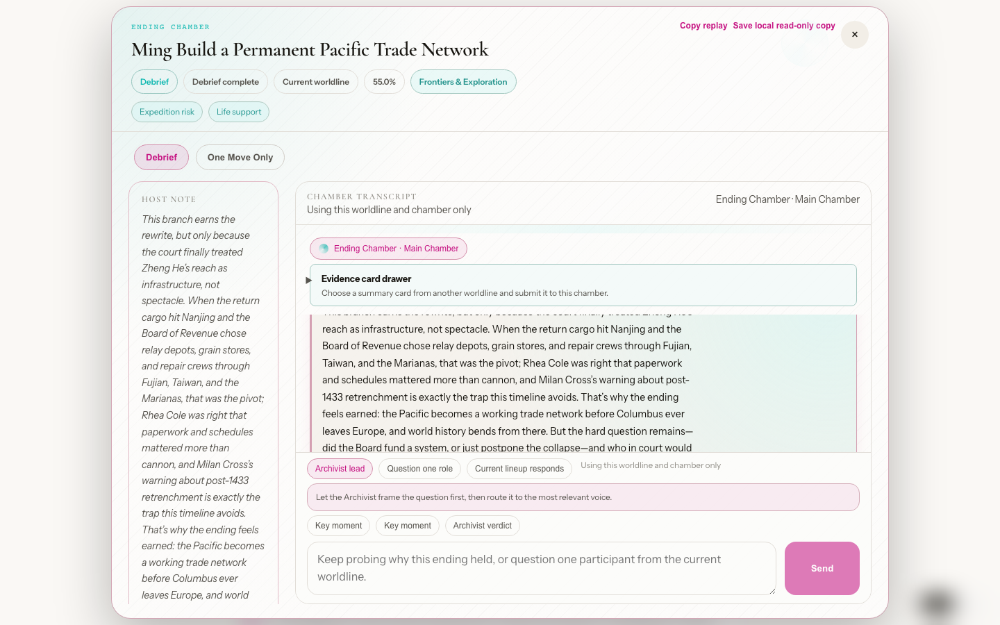

### F11 One Move Only
One Move Only focuses on one turning point without rerunning the whole main simulation. Use it when you want to ask what changes if a single move changes.
Entry: `/result/:id` -> ending card -> `One Move Only`

### F12 Crossline Gallery
Crossline Gallery places another worldline's summary beside the current discussion so you can compare differences. It shows summaries and key quotes, not full transcripts.
Entry: `/result/:id` -> multi-ending result -> `Other Worldline` / `Crossline Gallery`
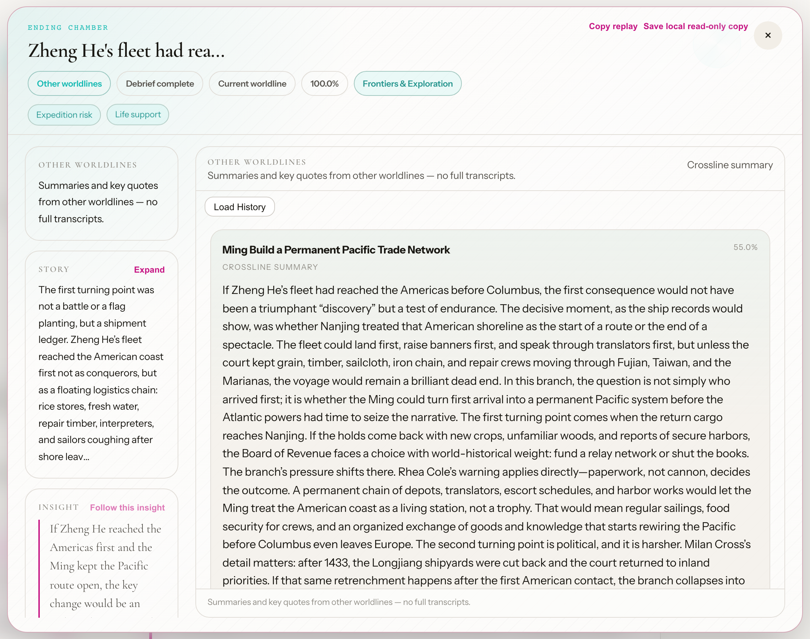

### F13 Worldline Roundtable
When multiple endings exist, Worldline Roundtable seats representatives from different worldlines at one table. A completed table restores its saved discussion and Deep Dive when you revisit it.
Entry: `/result/:id` -> `Start Roundtable`; roundtable page: `/roundtable/:id`
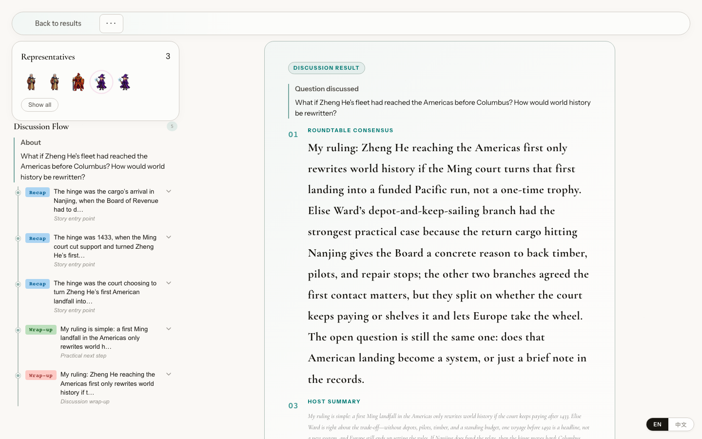

### F14 Format, Cast, and Representatives
Roundtable supports Deep Dive, Quick Review, and Clash Mode, with auto cast or custom cast. The representative list shows which worldline each person comes from, and completed rooms can be reseated and restarted.
Entry: `/roundtable/:id` -> format controls / representative list

### F15 Discussion Thread, Phase Flow, and Synthesis
The main roundtable area shows the discussion thread, phase flow, and final synthesis. Phase content starts collapsed on the timeline, then expands when you need the context.
Entry: `/roundtable/:id` -> discussion / phase flow / discussion result

### F16 Deep Dive: 1-on-1 Interview
After a roundtable finishes, the 1-on-1 Interview tab lets you question one representative. The page carries that representative's worldline, stance, and recent quote into the conversation.
Entry: `/roundtable/:id` -> `Deep Dive` -> `1-on-1 Interview`

### F17 Deep Dive: Research Analyst
Research Analyst can inspect the causal graph, participant memories, and web evidence before answering. You can see which tools it used and the final answer.
Entry: `/roundtable/:id` -> `Deep Dive` -> `Research Analyst`

### F18 Deep Dive: Cross-Examine
Cross-Examine sends the same question to multiple representatives and streams their replies. It works best when you want to compare how different worldlines explain one decision.
Entry: `/roundtable/:id` -> `Deep Dive` -> `Cross-Examine`

### F19 Evidence Card
Evidence Card submits a summary from another worldline into the current chamber or roundtable. The backend verifies it belongs to the same scenario before the host or Archivist explains the difference.
Entry: chamber or roundtable discussion -> `Submit evidence card` / `Submit evidence`
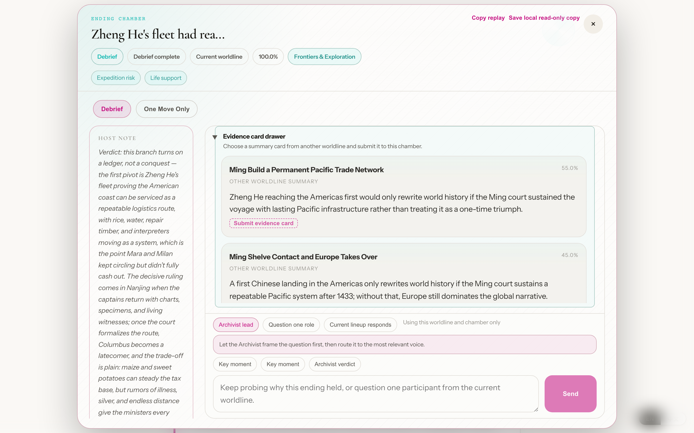

### F20 Epilogue
Epilogue continues the ending discussion for three short narrative turns without restarting the main simulation. Use it for a quick look at what may happen next in that worldline.
Entry: chamber or roundtable discussion -> `Three-turn epilogue` / `Three more rounds`
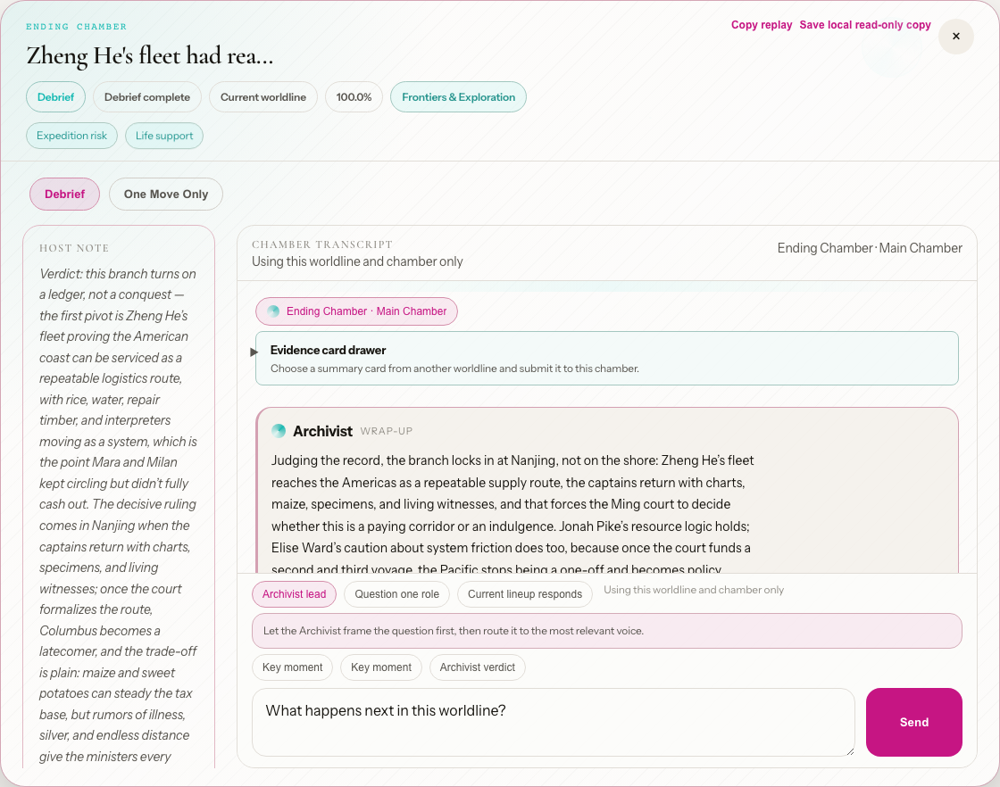

## Graph Visualization

### F21 Causal Graph
Causal Graph connects events, forks, and outcomes into a directed graph. Use it to trace which events triggered later changes.
Entry: `/result/:id` -> `View Causal Graph`; page: `/sim/:id/causal-map`

### F22 Graph Workbench
Graph Workbench groups Causal, Split, and Knowledge Graph views in one place. On narrow screens, Split collapses to a single graph view to avoid horizontal squeeze.
Entry: `/result/:id` -> `Open Graph Workbench`; page: `/workbench/:id`
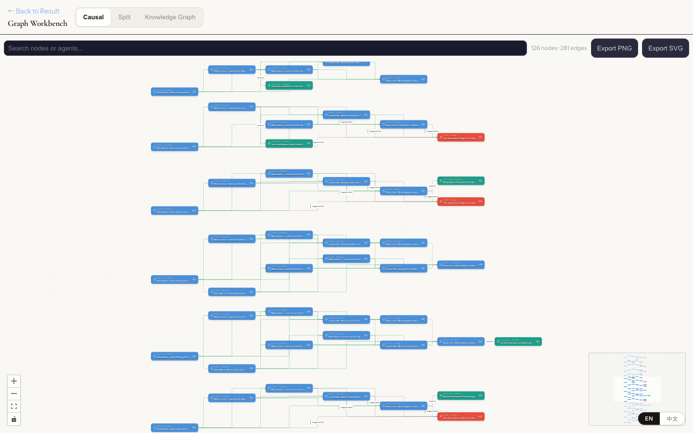

### F23 Knowledge Graph Explorer
Knowledge Graph Explorer organizes result data as entities, events, and claims. You can filter nodes, open details, and ask follow-up questions from a node.
Entry: `/result/:id` -> `Knowledge Graph Explorer`; page: `/kg-explorer/:id`
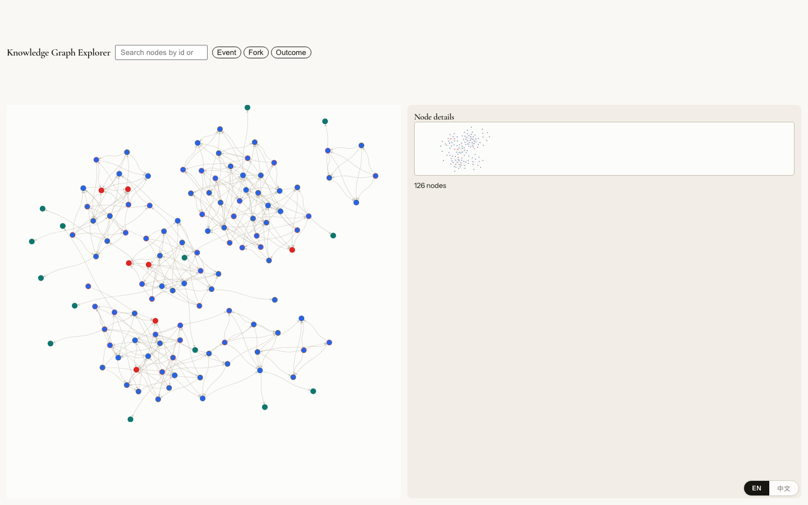

### F24 Timeline Galaxy
Timeline Galaxy places multiple worldlines on one timeline view. It helps you compare which nodes repeat across different outcomes.
Entry: `/result/:id` -> `Timeline Galaxy`; page: `/timeline-galaxy/:id`
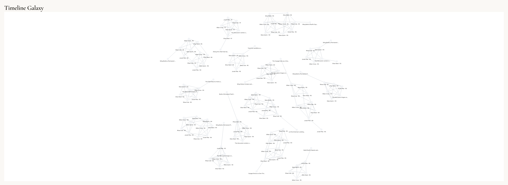

### F25 Counterfactual Compare
Counterfactual Compare shows the original branch beside the rewritten branch. When no comparison data exists yet, the page shows the correct empty state instead of inventing a branch.
Entry: `/result/:id/compare?branch_a=...&branch_b=...`
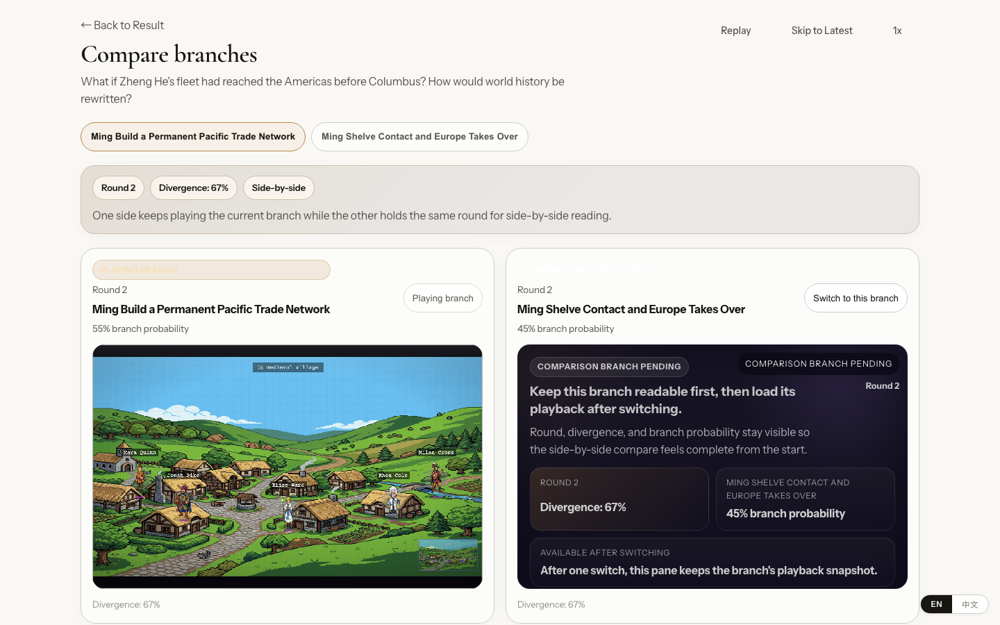

### F26 Replay Trace
Replay Trace shows where counterfactual and continuation branches came from. When a scenario has no replay branch, the page shows the on-demand empty state.
Entry: `/replay/:id`
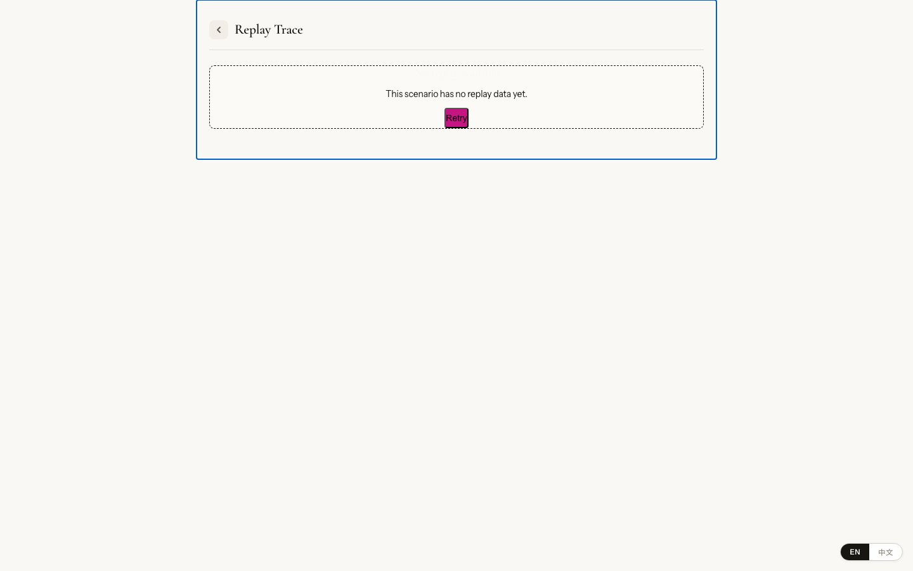

### F27 Debate Result and Argument Map
The debate result page shows scores, personas, and the judge's verdict. Load the argument map when you want to connect claims, evidence, rebuttals, and rulings.
Entry: `/debate/:id/result`
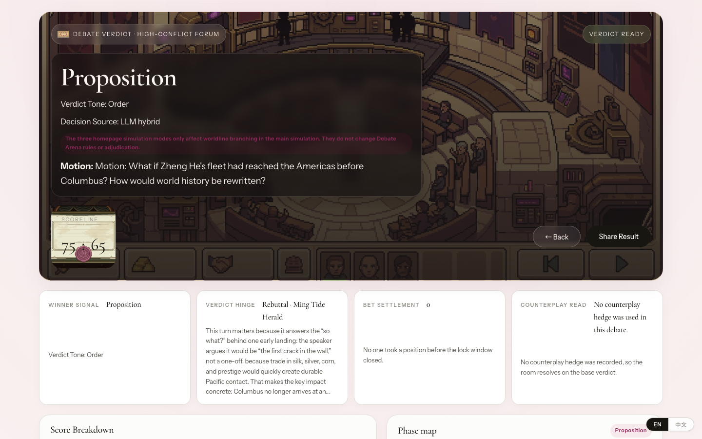

## Agents and Identity

### F28 Agent Identity Library
Agent Identity Library lets you view, favorite, edit, and delete custom Agents. It also opens profiles, exports backups, and creates new Agents from backups.
Entry: `/agents`
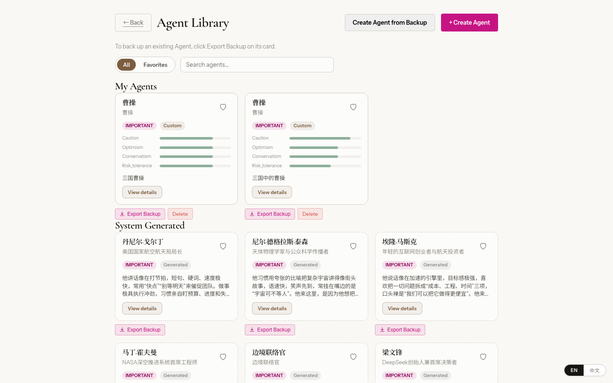

### F29 Custom Agent Workshop
Workshop creates and edits custom Agents manually, and can also generate Agents from a PDF document. For long documents, it keeps successfully created Agents and reports any failed count.
Entry: `/agents/new` or `/agents/edit/:id`
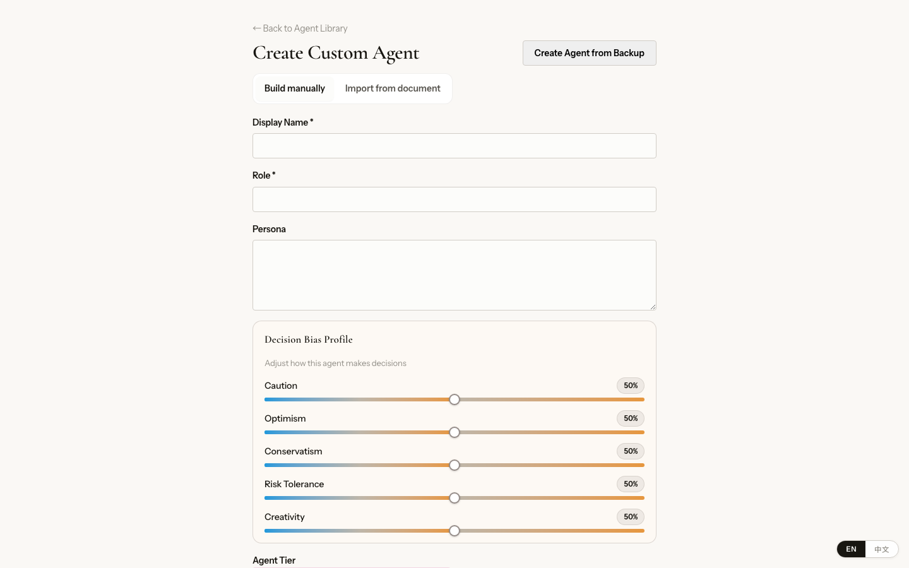

### F30 Agent Profile Card
Agent Profile Card shows persona, memory, growth events, and source type. Generated Agents can continue into conversation from the card; replay Agents stay read-only.
Entry: result-page Agent entry or `/agents#agent_profile=<id>&tab=memory`
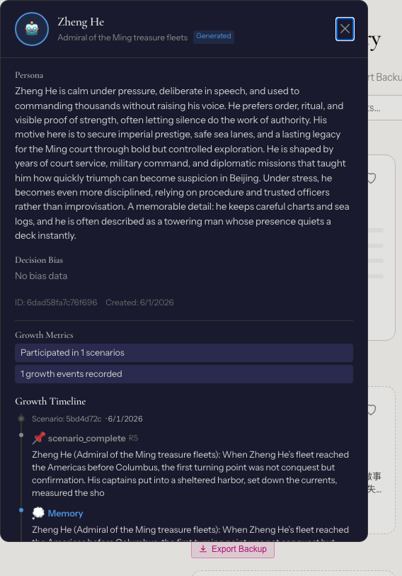

### F31 Custom Agents in Simulations and Debates
The home page shows a quick selector for custom Agents, and selected Agents can join the main simulation. When you create a debate, the first two selected custom Agents can fill the proposition and opposition slots.
Entry: `/` home -> `Agents` / custom Agent selector

### F32 Persona Backup Import / Export
Agent Library and Workshop provide persona backup import and export. Import creates a new custom Agent and does not overwrite an existing identity.
Entry: `/agents` or `/agents/new` -> backup tools

## Review and Sharing

### F33 Prediction Journal
Prediction Journal records your probability forecast, then lets you resolve the outcome and review calibration. When an entry links to a scenario, visibility is checked against the current user.
Entry: `/me/journal`
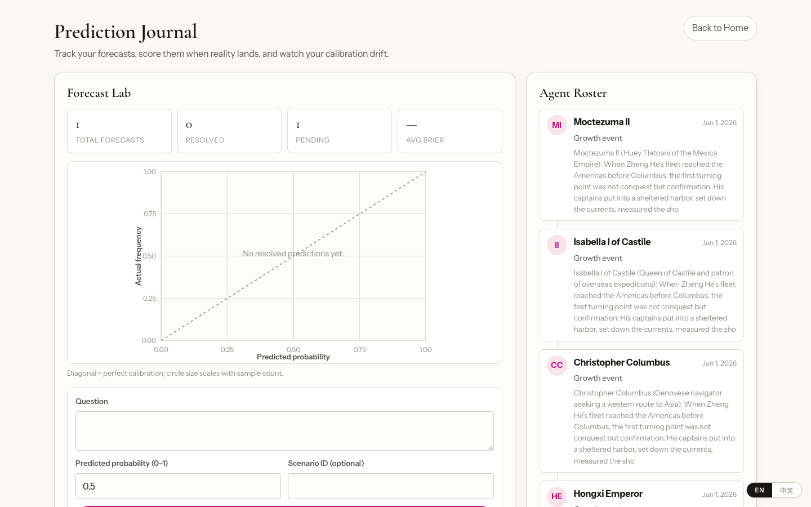

### F34 History
History lists past simulations, with status filters and links back into results. Deleting a scenario does not delete prediction journal history.
Entry: `/history`
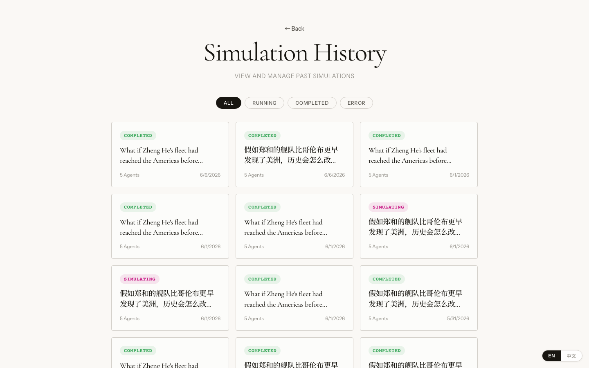

### F35 Leaderboard
Leaderboard shows prediction scores and supports filters by scenario type, date, and Agent count. Filter state syncs to the URL so the current view can be shared.
Entry: `/leaderboard`
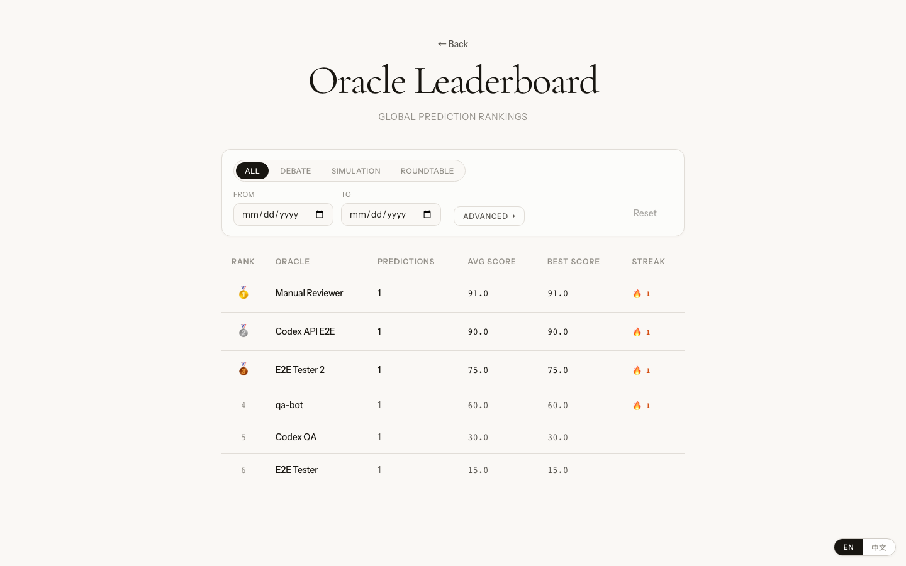

### F36 Snapshot Import / Export
The home page can import a scenario snapshot ZIP, and the result page can export the current scenario. Export removes keys, tokens, and local provider configuration.
Entry: `/` home -> `Import snapshot`; `/result/:id` -> `Export snapshot`

### F37 Sharing and Prediction Card
The result page can generate sharing copy, copy a permalink, and export a 1200x630 prediction card. The card includes the question, dominant ending, visible sources, and the first few Agent names.
Entry: `/result/:id` -> sharing entry

## Advanced Optional

### F38 Search-Augmented Simulation
**Requires configuration, see [CONFIGURATION](CONFIGURATION.en.md).** When enabled, the app searches before simulation and injects relevant snippets into Agent prompts. The recommended path uses configured server search first; the advanced path lets you use your own provider for one run. The result page gathers web snippets, source-family results, and model-native citations into one real-world source feed.
Entry: `/` home -> `Search-Augmented Simulation`

### F39 Source Family Checkboxes
**Requires configuration, see [CONFIGURATION](CONFIGURATION.en.md).** With `FEATURE_NEW_SOURCES` enabled, advanced settings show four source families: prediction markets, finance, academic, and investigative. They only take effect when search is enabled and the provider supports domain filtering; the result page folds the four families into filterable rows in the unified source feed while preserving probabilities, citation counts, publish times, historical markers, and explainable states.
Entry: `/` home -> search settings -> source checkboxes
The screenshot package's home image shows the main search-enhancement entry. Source checkboxes appear only after configuration and expanding advanced settings.

### F40 Family Query Optimization
**Requires configuration, see [CONFIGURATION](CONFIGURATION.en.md).** With `FEATURE_FAMILY_QUERY_OPTIMIZATION` enabled, the system generates better search terms for each selected source family. It has no separate button; it changes the current search run when source checkboxes and the provider are both available.
Entry: configure `FEATURE_FAMILY_QUERY_OPTIMIZATION=true`, then use the home-page source checkboxes
This is backend search behavior and has no separate UI or standalone screenshot.

### F41 Result Full Report
**Enabled by default, see [CONFIGURATION](CONFIGURATION.en.md).** The result page shows a full report entry; complete reports first render a digest, table of contents, and standalone-page CTA so the original result page stays compact. `/result/:id/report` shows the sectioned conclusions, evidence sources, and uncertainty notes. The evidence drawer can jump back to the cited replay message; replay is read-only for existing reports and does not offer a live generation CTA when the payload has no report. If generation fails, finishes partially, or the report runs too long, the page shows a readable notice without blocking the original result page. Report body Markdown supports safe tables and strikethrough; when transcript / Agent data is available, the standalone report shows interview evidence from AI-played roles, and interview failures degrade only that block. When the report provides `probability_bar` / `faction_share` data, it renders probability and faction charts. Missing or malformed chart data shows an unavailable state instead of fabricated conclusions.
Entry: `/result/:id` -> digest / open full report; standalone page `/result/:id/report`
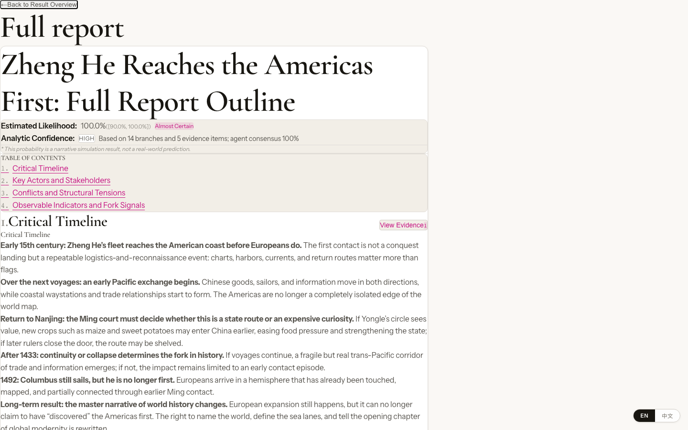

## More to Play With

### F42 Model Profiles
**Enabled by default, see [CONFIGURATION](CONFIGURATION.en.md).** The Model Profiles page lets you save several LLM connections (name, provider, base URL, model, API key, rate limits, concurrency, provider capability overrides, and native-search upstream declarations) and pick one before a simulation, debate, or chamber, instead of retyping them each time. Structured outputs and native search are tri-state settings: auto-detect, force on, or force off; auto-detect follows provider capability, and profile concurrency only tightens that profile's LLM calls without raising the global cap. Automatic launch preflight uses a lightweight LLM connectivity check; Test connection shows ordinary LLM connectivity, the full provider probe, and the model-native search probe separately. That probe checks whether the tested model / upstream would enter the native web-search tool injection path; it is not the server-wide Tavily / Exa-style app-layer search configuration. Bare `/v1` Base URLs on known official providers are handled as the Responses form, but the probe does not echo the full derived URL; local, proxy, or unknown providers return a conservative parallelism recommendation of 1 without extra fan-out probing. If a local or custom Responses proxy forwards to xAI / OpenAI, you still explicitly declare `xai_responses` or `openai_responses` so the system uses the matching official native-search adapter. If the proxy or upstream rejects native tools, that call retries once without native tools instead of letting native-search failure stall the whole simulation. Force-off native search still blocks injection. A profile saved and tested from `/admin/setup` joins the same selection flow: when a profile has a key, the home page treats LLM access as configured and auto-selects an available profile; in profile-only setups, Debate reuses the currently selected profile as the default profile for all three sides, while result-page Oracle Chambers keep profile selection inside a collapsed-by-default Advanced settings disclosure and keep the global default when left blank. The provider dropdown uses the same preset list as the `/admin/setup` wizard: OpenAI, Anthropic, DeepSeek, Google Gemini, Ollama, local LM Studio, and custom endpoint. Changing the preset fills the default Base URL when the field is empty or still contains an old preset URL. The key stays local: neither the list nor the edit form ever shows it back (the key box is empty on edit and only shows a "key is set" badge), and the page states that for local single-user deployments the key is stored as plaintext in local SQLite. Report, replay / branch rerun, fork-title rewriting, social copy, or scoring paths that depend on a saved profile ask you to reselect it or provide a complete provider if they cannot recover the same profile; social headline cards fall back to deterministic cards.
Entry: `/model-profiles`; you can also pick a saved profile from the home page, debate setup, and result-page chamber Advanced settings

### F43 Public Artifacts and Gallery
**Enabled by default, see [CONFIGURATION](CONFIGURATION.en.md).** The result page share modal can export a de-identified public artifact: a JSON with keys and private fields stripped, or a single-file HTML gallery you can open offline. It is meant for sharing a result publicly: the export drops API keys and private fields, while your question and the endings travel with the artifact (that is the part you are sharing).
Entry: `/result/:id` -> Share -> export public artifact / HTML gallery

### F44 Multi-Run Distribution
**Enabled by default, see [CONFIGURATION](CONFIGURATION.en.md).** You can run the same question several times at once, and the waiting panel lists every worldline's progress: the first run is a full simulation with a **Watch simulation** entry into live `/sim`, while later runs use quick verdicts and expose **View results** after they finish. The result page draws the ending distribution and a terminal histogram for that run group, so you can see which endings are stable and which are flukes.
Entry: start a multi-run from the home page -> the distribution / probability-sampling panel on `/result/:id`

### F45 You vs. Oracle
**Enabled by default, see [CONFIGURATION](CONFIGURATION.en.md).** After you submit your own prediction on the result page, the app compares your call against the AI-simulated outcome and shows how you did. When a worldline cannot be judged right or wrong, it shows "not scorable" with the reason instead of forcing a score.
Entry: `/result/:id` -> submit a prediction -> the "You vs. Oracle" card

### F46 Social Feed and Headline Cards
**Enabled by default, see [CONFIGURATION](CONFIGURATION.en.md).** The "Social Feed" on the result page rewrites the outcome into a few social-style headline cards that you can copy as text or download as images to share.
Entry: `/result/:id` -> "Social Feed"

### F47 Document Seed
**Enabled by default, see [CONFIGURATION](CONFIGURATION.en.md).** The home page lets you upload a PDF, TXT, or Markdown file; the app distills it into background context for the simulation, so agents build on your material instead of a one-line question. Unsupported file types are rejected with a message telling you to use PDF, TXT, or Markdown.
Entry: `/` home -> upload a document as background

### F48 Local Packs
**Enabled by default, see [CONFIGURATION](CONFIGURATION.en.md).** "Local Packs" on the home page bundle preset scenarios (bilingual, with prompts, stakes, and materials). The picker now filters with genre segments and a single search box, with tag text folded into search; the current result auto-selects and previews on the right, while active filters show the result count and a clear action. One template click fills the question box with the pack's question and suggested settings, which is handy for getting started or for classroom demos. Packs live in the repo's `packs/` directory, so you can add or remove your own.
Entry: `/` home -> Local Packs -> pick a pack / Manage all
