[English](FEATURES.en.md) | 中文

# SwarmOracle 功能图鉴

这份图鉴覆盖发布前核对的 48 个用户可见功能。入口和默认开关以当前代码、使用指南和配置说明为准；搜索相关的三项功能默认关闭，需要先完成配置。

## 核心推演

### F01 首页提问框与开始推演
在首页输入一个「如果……会怎样？」的问题，然后启动主推演。你会先确认问题和本局设置，再进入多 Agent 推演。
入口：`/` 首页 -> 输入问题 -> `开始推演`
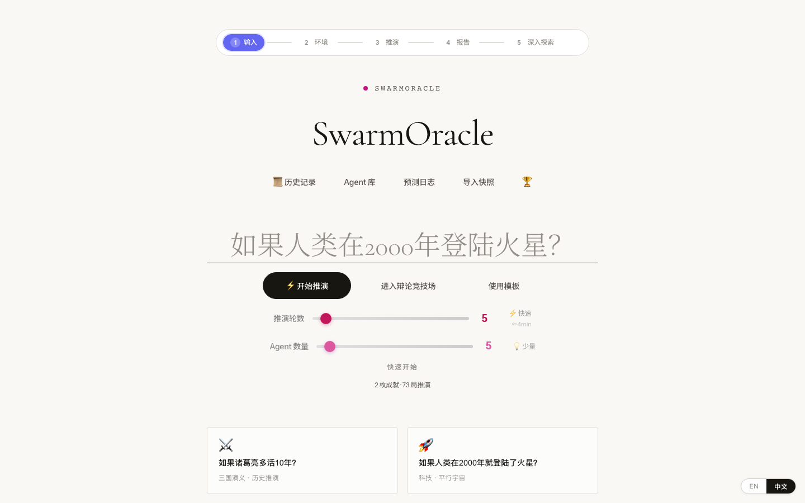

### F02 辩论竞技场
首页可以直接进入辩论竞技场。它会创建正方、反方和评委，按固定阶段推进一局更短的对抗讨论。
入口：`/` 首页 -> `进入辩论竞技场`，运行中页面为 `/debate/:id`
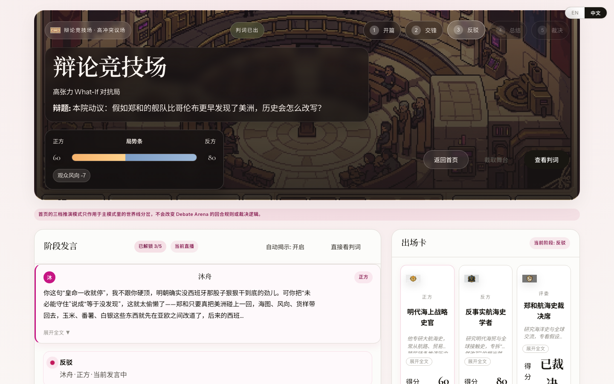

### F03 教学模板
教学模板会把课堂式问题、建议轮数和 Agent 数量填入首页。选好模板后仍可手动调整问题和参数。
入口：`/` 首页 -> `使用模板`

### F04 推演模式、Pixel Theater 与导演/玩法卡
推演模式提供谨慎、均衡、探索三档，只影响主模式的世界线分岔取向。高级设置还可以在 Classic 与 Pixel Theater 之间切换显示；Pixel Theater 用像素舞台展示角色发言、分支和导演工具栏。导演/玩法卡来自共享契约，当前 14 张为：文明辩论、间谍渗透、密约交易、人类潜入、时空裂缝、民意浪潮、撤离令、公开听证、资源分诊、禁忌仪式、审计清算、情报反噬、授权回摆、停火委员会。Debate Arena 有自己的回合规则，不跟随这个设置。
入口：`/` 首页 -> `推演模式` / 显示模式；运行中 `/sim/:id` -> Pixel Theater toolbar -> 玩法卡

### F05 推演轮数与 Agent 数量
两个滑块控制主推演的长度和参与角色数量。页面会按当前选择估算等待时间，方便你在速度和细节之间取舍。
入口：`/` 首页 -> `推演轮数` / `Agent 数量`

### F06 每日挑战与每周主题
首页会显示当天挑战和本周主题，适合直接开始一局有目标的推演。启动时会带上挑战上下文，结果页再显示本局进度。
入口：`/` 首页 -> 每日挑战 / 每周主题卡片

### F07 预测结论
结果页会尽量用一句话回答原问题，并给出置信度。生成失败或旧数据缺失时，页面会保留原问题并显示「暂无预测结论」。
入口：`/result/:id` -> 页面顶部
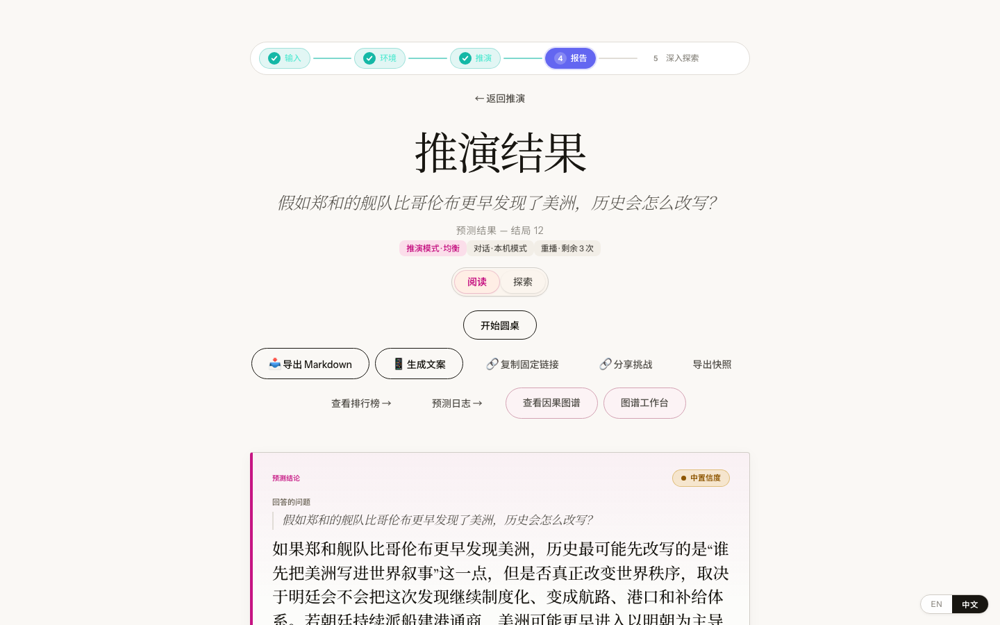

### F08 世界线卡片
每条结局都有标题、概率、故事摘要和对原问题的回答。展开卡片后可以继续阅读完整故事或进入后续入口。
入口：`/result/:id` -> 世界线卡片

### F09 下一步入口
结果页会根据数据和能力开关显示下一步卡片，例如图谱、回放、对比、Agent 追问和分享。不可用的入口会保留原因，而不是静默消失。
入口：`/result/:id` -> `下一步`

## 深聊与圆桌

### F10 结局会客厅 / 神谕密室
从某条世界线进入会客厅后，你可以追问当前结局里的参与者。角色会基于这条世界线已经发生的事回答。
入口：`/result/:id` -> 结局卡片 -> `进入会客厅`
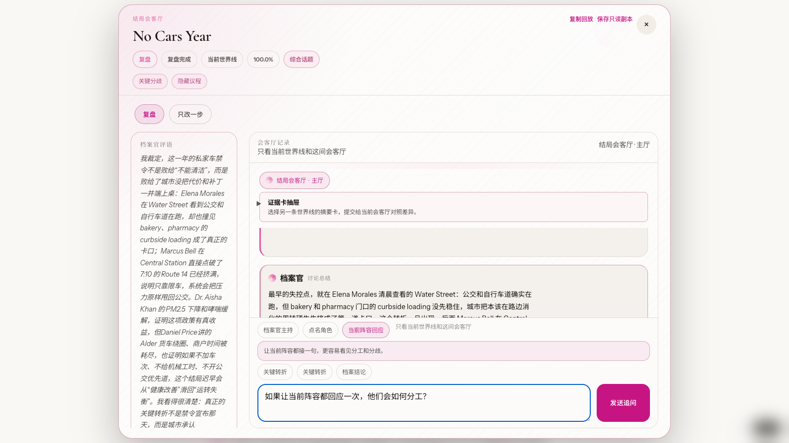

### F11 只改一步
只改一步会聚焦某个关键转折点，不会重新跑完整主推演。它适合追问「如果这一处动了，会发生什么」。
入口：`/result/:id` -> 结局卡片 -> `只改一步`

### F12 跨线画廊
跨线画廊把另一条世界线的摘要放到当前讨论旁边，帮助你对照差异。它只展示摘要和关键引用，不会把完整记录混进当前线。
入口：`/result/:id` -> 多结局结果 -> `其他世界线` / `跨线画廊`
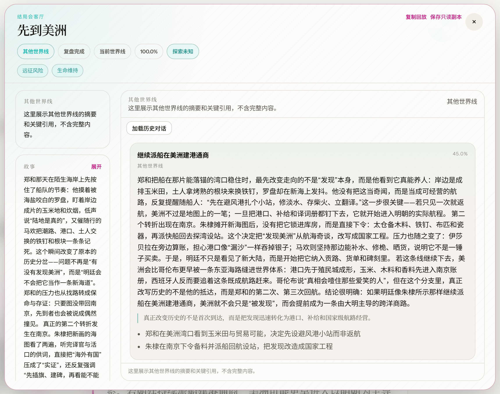

### F13 世界线圆桌
多条结局可用时，世界线圆桌会让不同世界线的代表坐在同一张桌上讨论。已完成的圆桌再次打开时会恢复保存的讨论和 Deep Dive。
入口：`/result/:id` -> `开始圆桌`，圆桌页面为 `/roundtable/:id`
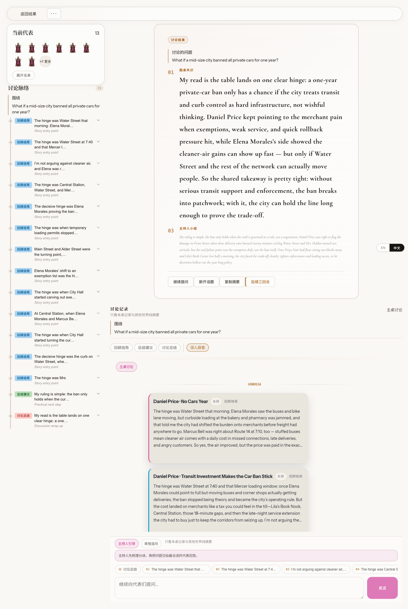

### F14 讨论模式、选角与代表列表
圆桌支持深度剖析、快速过审和交锋模式，也支持自动选角或自定义选角。代表列表会显示每位代表来自哪条世界线，完成后也可以换人重开。
入口：`/roundtable/:id` -> 讨论模式 / 代表列表

### F15 讨论记录、阶段脉络与主持人小结
圆桌主区会显示讨论线程、阶段脉络和最终小结。阶段内容默认按时间线收起，展开后再看完整上下文。
入口：`/roundtable/:id` -> 讨论记录 / 讨论脉络 / 讨论结果

### F16 Deep Dive：1 对 1 访谈
圆桌完成后，Deep Dive 的 1 对 1 访谈可以单独追问一位代表。页面会带上这位代表的世界线、立场和最近原话。
入口：`/roundtable/:id` -> `Deep Dive` -> `1对1 访谈`

### F17 Deep Dive：研究分析师
研究分析师会按步骤查看因果图、参与者记忆和网络证据，然后给出回答。你会看到它调用了哪些工具，以及最终结论。
入口：`/roundtable/:id` -> `Deep Dive` -> `研究分析师`

### F18 Deep Dive：交叉质询
交叉质询会把同一个问题发给多位代表，逐条返回回答。它适合比较不同世界线的代表如何解释同一个决定。
入口：`/roundtable/:id` -> `Deep Dive` -> `交叉质询`

### F19 证据投牌
证据投牌把另一条世界线的摘要卡提交到当前会客厅或圆桌。系统会校验它来自同一个场景，再让主持人或档案官解释差异。
入口：会客厅或圆桌讨论中 -> `提交证据卡` / `提交证据`
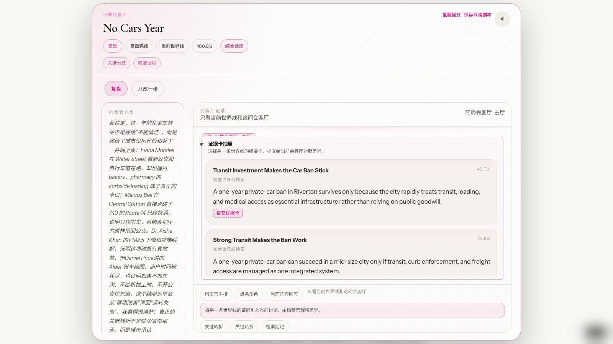

### F20 后续回合
后续回合会在结局讨论后继续三回合短叙事推演，不重开主模拟。它用于快速看这条世界线接下来可能怎么走。
入口：会客厅或圆桌讨论中 -> `后续三回合` / `再聊三轮`
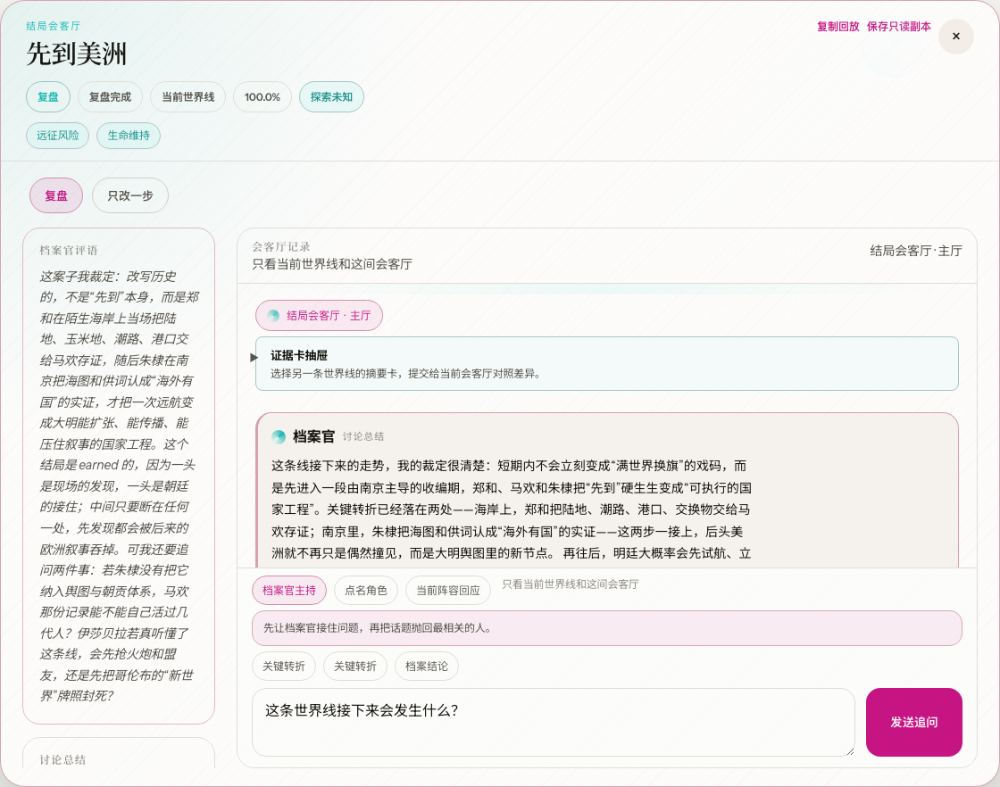

## 图谱可视化

### F21 因果图谱
因果图谱把事件、分叉和结局连成有向图。你可以用它追踪「哪个事件触发了后面的变化」。
入口：`/result/:id` -> `查看因果图谱`，页面为 `/sim/:id/causal-map`
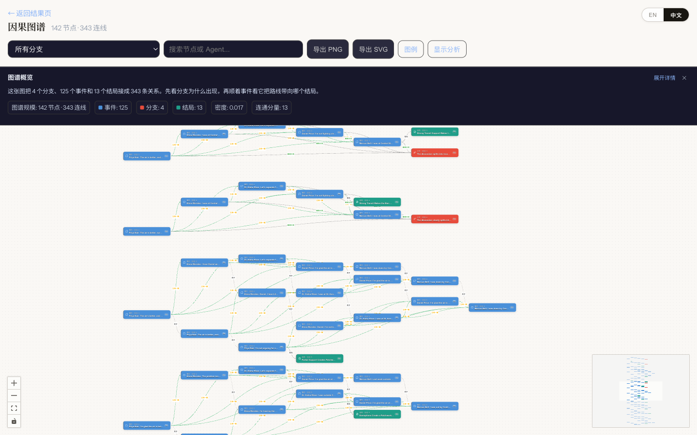

### F22 图谱工作台
图谱工作台集中放置 Causal、Split、Knowledge Graph 三个视图。窄屏会把 Split 收成单图视图，避免横向挤压。
入口：`/result/:id` -> `打开图谱工作台`，页面为 `/workbench/:id`
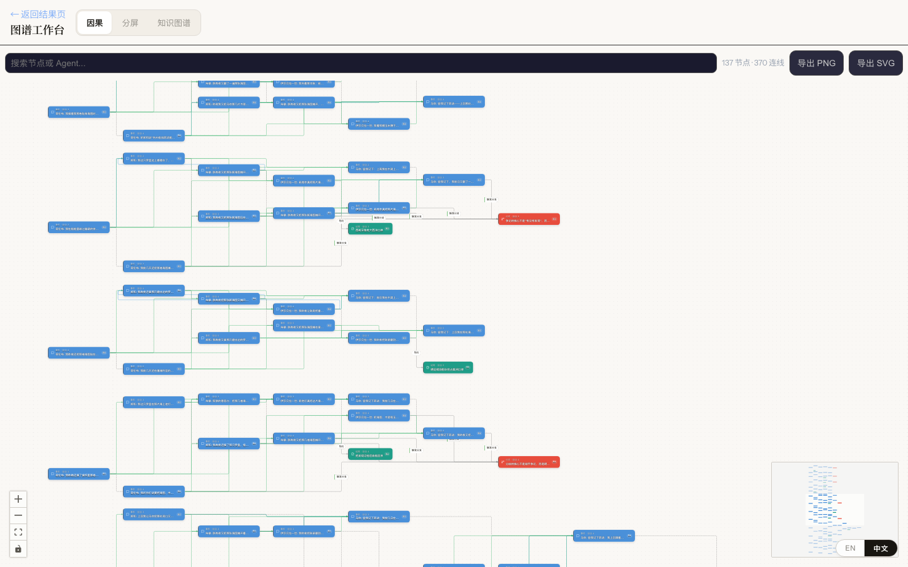

### F23 知识图谱浏览器
知识图谱浏览器用实体、事件和主张来组织结果数据。你可以筛选节点、打开详情，也可以从节点继续追问。
入口：`/result/:id` -> `知识图谱浏览器`，页面为 `/kg-explorer/:id`
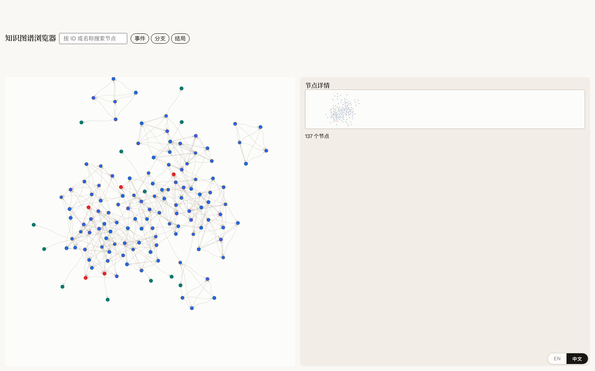

### F24 时间线星系
时间线星系把多条世界线放到同一张时间图里看。它适合快速比较哪些节点在不同走向里反复出现。
入口：`/result/:id` -> `时间线星系`，页面为 `/timeline-galaxy/:id`
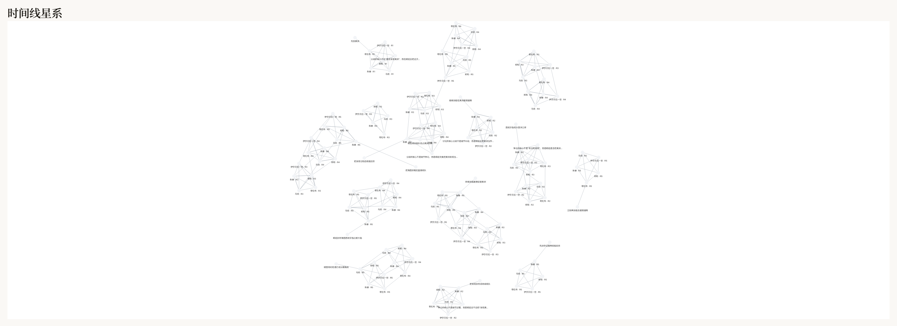

### F25 反事实对比
反事实对比会横向展示原分支和改写后的分支。当前按需页面没有可对比数据时，会显示空态而不是伪造分支。
入口：`/result/:id/compare?branch_a=...&branch_b=...`
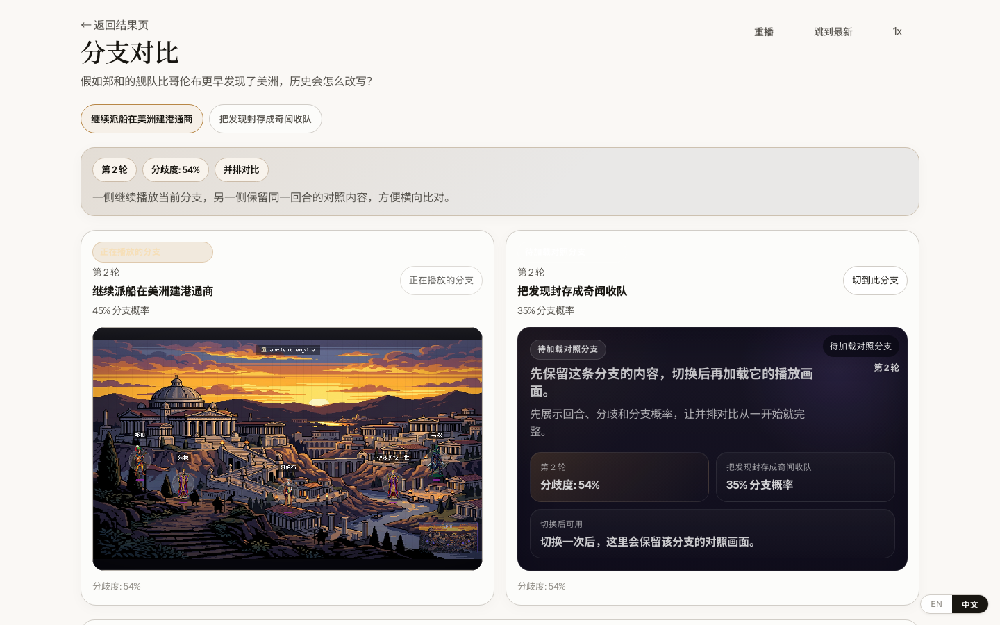

### F26 Replay Trace
Replay Trace 用时间线展示反事实、续跑等 replay 分支从哪里来。当前没有 replay 分支时，页面会显示按需空态。
入口：`/replay/:id`
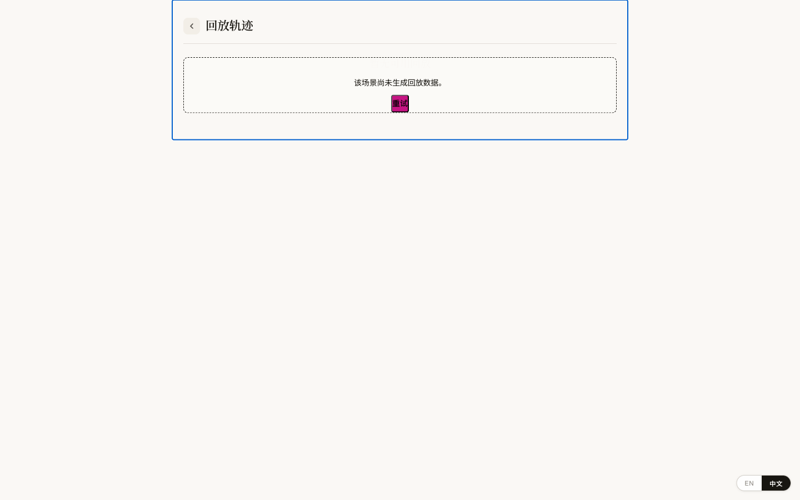

### F27 辩论结果与论点地图
辩论结果页展示比分、角色和裁判结论。需要看论证结构时，可以加载论点地图，把主张、证据、反驳和裁决连起来。
入口：`/debate/:id/result`
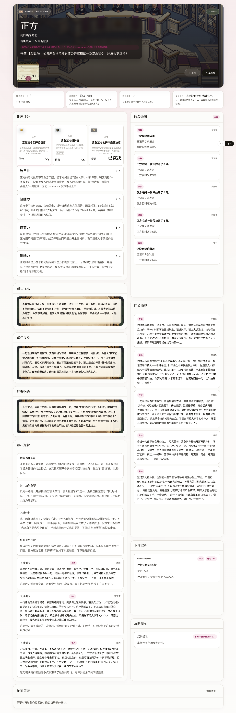

## Agent 与身份

### F28 Agent 身份库
Agent 身份库用于查看、收藏、编辑和删除自定义 Agent。这里也能进入档案、导出备份，或从备份创建新 Agent。
入口：`/agents`
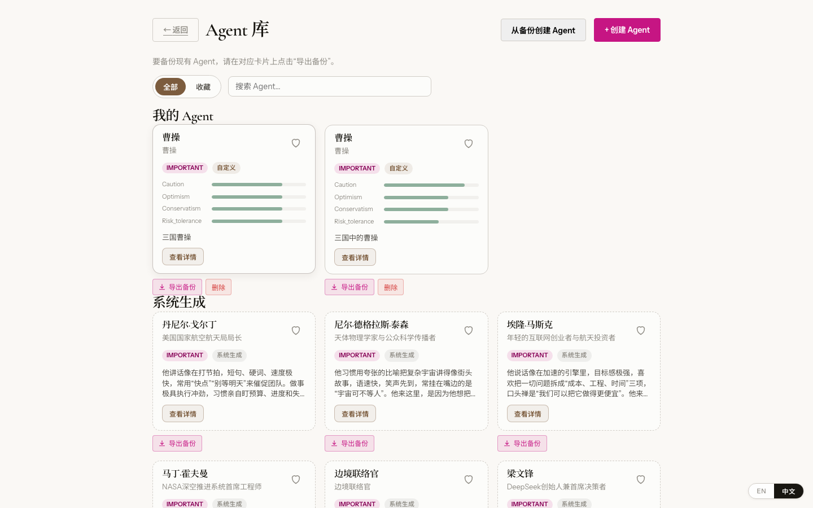

### F29 自定义 Agent 工坊
工坊可以手动创建或编辑自定义 Agent，也支持从 PDF 文档生成 Agent。长文档会尽量保留已成功生成的 Agent，并提示失败数量。
入口：`/agents/new` 或 `/agents/edit/:id`
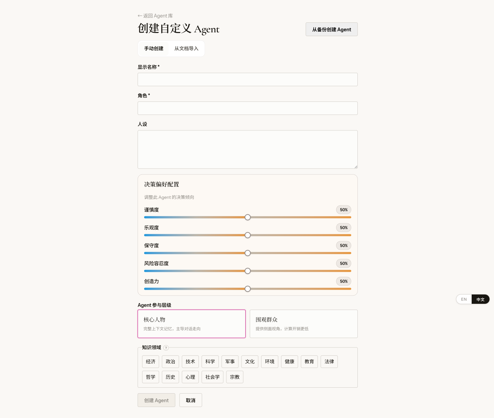

### F30 Agent 档案卡
Agent 档案卡展示人设、记忆、成长事件和来源类型。生成型 Agent 可以从档案继续对话，回放 Agent 保持只读。
入口：结果页 Agent 入口或 `/agents#agent_profile=<id>&tab=memory`
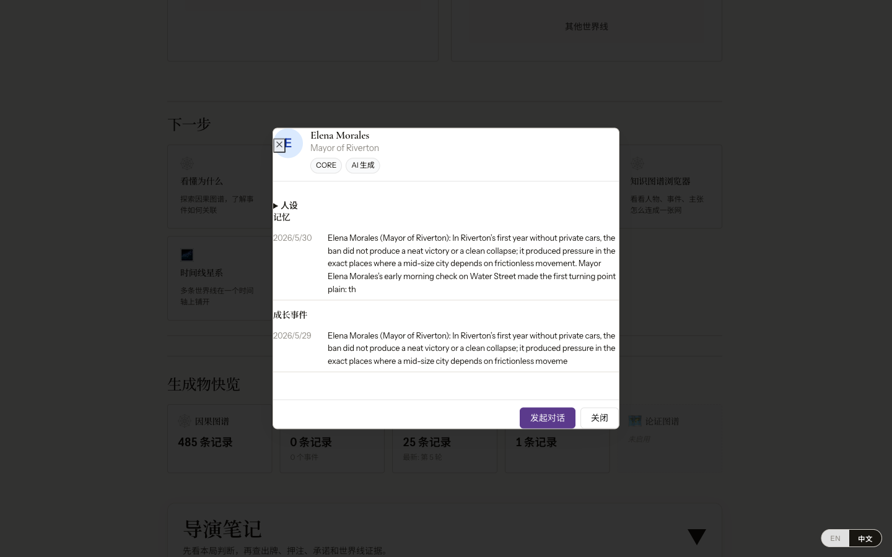

### F31 自定义 Agent 加入推演和辩论
首页会显示自定义 Agent 快速选择器，选中的 Agent 可以加入主推演。创建 Debate 时，前两个选中的自定义 Agent 会传给正反双方。
入口：`/` 首页 -> `Agents` / 自定义 Agent 选择器

### F32 人物备份导入 / 导出
Agent 身份库和工坊提供人物备份导入、导出。导入会创建新的自定义 Agent，不会覆盖已有身份。
入口：`/agents` 或 `/agents/new` -> 备份工具

## 复盘与分享

### F33 预测日志
预测日志记录你对结果的概率判断，之后可以标记是否发生并查看校准情况。绑定场景时会按当前用户校验可见性。
入口：`/me/journal`
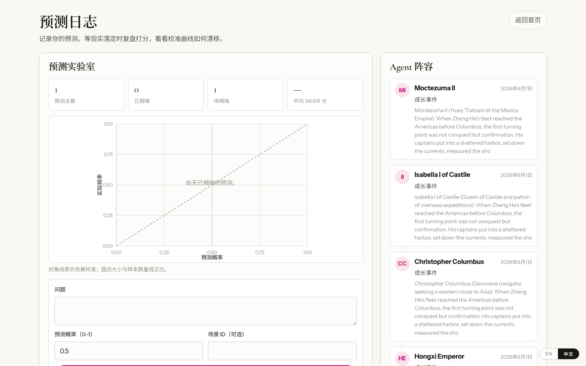

### F34 历史记录
历史页列出过去的推演，可以按状态筛选并重新打开结果。删除场景只影响本地记录，不会把预测日志一起删除。
入口：`/history`
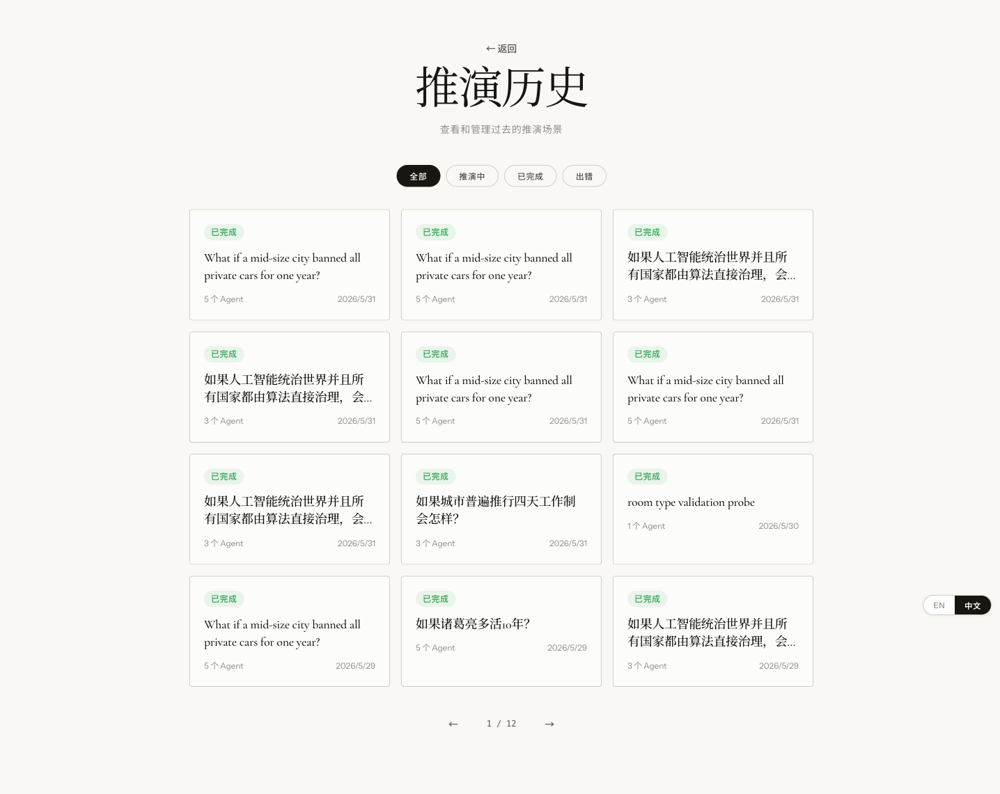

### F35 排行榜
排行榜展示预测分数，也支持按场景类型、日期和 Agent 数筛选。筛选条件会同步到 URL，方便分享当前视图。
入口：`/leaderboard`
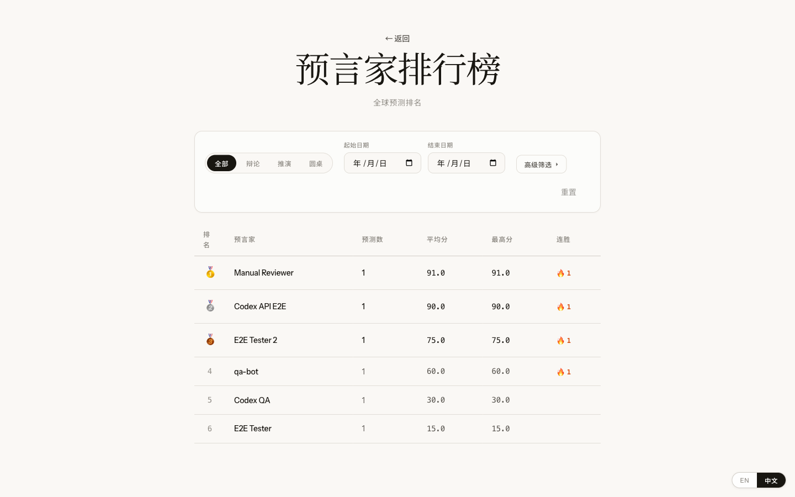

### F36 Snapshot 导入 / 导出
首页可以导入 scenario snapshot ZIP，结果页可以导出当前 scenario。导出会清理密钥、token 和本地 provider 配置。
入口：`/` 首页 -> `Import snapshot`；`/result/:id` -> `Export snapshot`

### F37 分享与预测卡片
结果页可以生成分享文案、复制固定链接，也可以导出 1200x630 的预测卡片。卡片只包含问题、主导结局、可见来源和前几位 Agent 名字。
入口：`/result/:id` -> 分享入口

## 进阶可选

### F38 搜索增强推演
**需配置，见 [CONFIGURATION](CONFIGURATION.md)。** 打开后，系统会在推演前搜索资料，并把相关片段注入角色提示。推荐路径优先使用服务端已配置搜索；高级路径允许本轮使用自己的 provider。
入口：`/` 首页 -> `搜索增强推演`

### F39 来源家族复选框
**需配置，见 [CONFIGURATION](CONFIGURATION.md)。** 开启 `FEATURE_NEW_SOURCES` 后，首页高级设置会显示预测市场、财经资讯、学术文献和深度报道四类来源。它们只有在搜索增强已打开、且 provider 支持域名过滤时才会生效。
入口：`/` 首页 -> 搜索增强 -> 来源复选框
截图包里的首页图只展示搜索增强总入口；来源复选框需要先配置并展开高级设置后才会出现。

### F40 来源家族查询优化
**需配置，见 [CONFIGURATION](CONFIGURATION.md)。** 开启 `FEATURE_FAMILY_QUERY_OPTIMIZATION` 后，系统会先为每类来源生成更合适的搜索词。它没有单独按钮，只在来源复选框和搜索 provider 都可用时影响本轮搜索。
入口：配置 `FEATURE_FAMILY_QUERY_OPTIMIZATION=true`，配合首页来源复选框使用
该功能是后台检索行为，没有独立 UI 或单独截图。

### F41 结果完整报告
**默认开启，见 [CONFIGURATION](CONFIGURATION.md)。** 结果页会显示完整报告入口，按章节汇总关键结论、证据出处和不确定性。证据侧栏可以跳回 replay 里的对应发言；报告也可以在 `/result/:id/report` 独立查看。生成失败、只完成一部分或报告过长时，页面都会给出可读的提示，不影响原本的结果页。报告正文支持表格和删除线等安全 Markdown 展示；有可用 transcript / Agent 数据时，`interview_evidence` 会尝试补充访谈式证据。访谈生成失败时只降级该证据块；主报告走静态 / 失败兜底时，会留下空证据和状态说明。
入口：`/result/:id` -> 完整报告；独立页 `/result/:id/report`
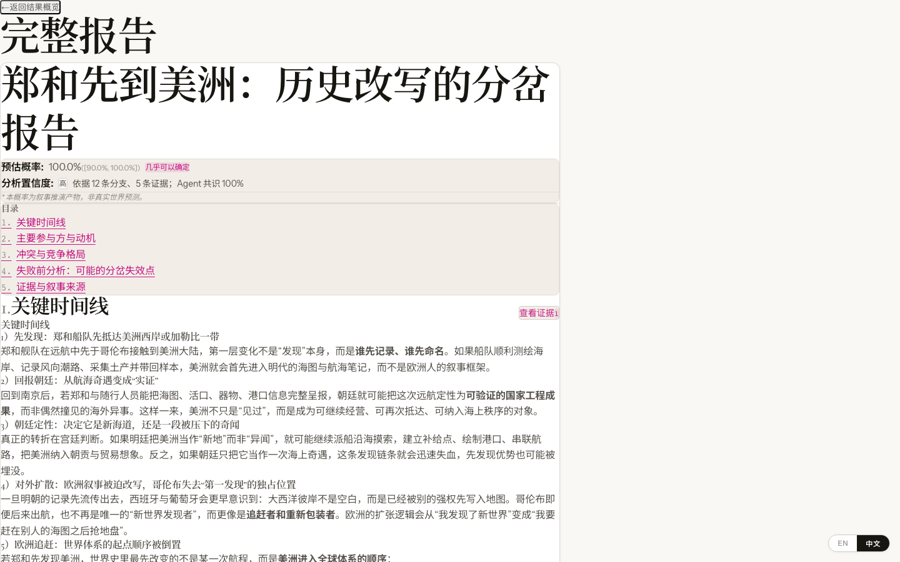

## 更多玩法

### F42 模型配置
**默认开启，见 [CONFIGURATION](CONFIGURATION.md)。** 在「模型配置」页可以保存多套 LLM 接入信息（名称、服务商、Base URL、模型、API 密钥、限速、并发、provider 能力覆盖和原生搜索上游声明），推演或辩论开始前直接挑一套用，不用每次手填。结构化输出和原生搜索是三态设置：自动检测、强制开启、强制关闭；自动检测会跟随 provider 能力，并发值只会收紧本次 profile 的 LLM 调用，不会放大全局上限。测试连接会把普通 LLM 连通性和模型原生搜索探测分开显示；这个探测看的是被测模型 / 上游能否进入 native web-search tool 注入路径，不是服务端全局 Tavily / Exa 等 app-layer 搜索配置。已知官方 provider 的裸 `/v1` Base URL 会按 Responses 形态处理，但探测不会回显完整派生 URL；使用本地或自定义 Responses 代理转发到 xAI / OpenAI 时，仍要显式声明 `xai_responses` 或 `openai_responses` 上游，系统才会按对应官方 native-search adapter 处理；强制关闭原生搜索仍会阻止注入。`/admin/setup` 保存并测试成功的 profile 也会进入同一套选择逻辑：只要 profile 带有 key，首页就会把 LLM 视为已配置，并自动选中可用 profile。服务商下拉与 `/admin/setup` 配置向导使用同一组 preset，当前包括 OpenAI、Anthropic、DeepSeek、Google Gemini、Ollama、本地 LM Studio 和自定义端点；切换 preset 会在 Base URL 为空或仍是旧 preset URL 时自动带出默认地址。密钥只存在本地：列表和编辑表单都不会把它显示出来（编辑时密钥框是空的，只标「密钥已设置」），页面也写明本地单用户部署时密钥以明文存在本地 SQLite。依赖已保存 profile 的报告、续跑 / 重放、分支标题重写、社交文案或评分如果无法恢复同一个 profile，会要求重新选择或提供完整 provider 信息；社交头条卡会退回确定性卡片。
入口：`/model-profiles`；首页和辩论设置里也能直接选已存的配置

### F43 公开分享与画廊
**默认开启，见 [CONFIGURATION](CONFIGURATION.md)。** 结果页的分享弹窗可以导出脱敏后的「公开 artifact」——一份去掉密钥和私密字段的 JSON，或一个能离线打开的单文件 HTML 画廊。适合把推演结果公开分享：导出会去掉 API 密钥等私密字段，你的问题和结局本身会随 artifact 一起公开（毕竟那正是要分享的内容）。
入口：`/result/:id` -> 分享 -> 导出公开 artifact / HTML 画廊

### F44 多次推演分布
**默认开启，见 [CONFIGURATION](CONFIGURATION.md)。** 同一个问题可以一次跑多遍，等待面板会列出每条世界线的进度：首条是完整推演，可点「观看推演」进入实时 `/sim`；后续条目走快速结论，完成后可点「查看结果」。结果页会把这一组推演的结局分布和终局直方图画出来，让你看清哪些结局更稳定、哪些只是偶然。
入口：首页发起多次推演 -> `/result/:id` 的分布 / 概率采样面板

### F45 你的预测 vs 预言机
**默认开启，见 [CONFIGURATION](CONFIGURATION.md)。** 在结果页提交你自己的预测后，系统会把你的判断和 AI 推演出的结局做对比，给出命中情况。如果这条世界线本身无法判定对错，会显示「暂不可评分」并说明原因，而不是硬凑一个分。
入口：`/result/:id` -> 提交预测 -> 「您 vs 预言机」卡片

### F46 社交动态与头条卡
**默认开启，见 [CONFIGURATION](CONFIGURATION.md)。** 结果页的「社交动态」会把推演结果改写成几条社交平台风格的头条卡片，可以一键复制文字或下载图片，方便分享。
入口：`/result/:id` -> 「社交动态」

### F47 文档种子
**默认开启，见 [CONFIGURATION](CONFIGURATION.md)。** 首页可以上传一份 PDF、TXT 或 Markdown，系统会把内容提炼成推演的背景上下文，让 Agent 基于你的资料展开，而不只是凭一句问题。上传不支持的格式会直接提示该用 PDF / TXT / Markdown。
入口：`/` 首页 -> 上传文档作为背景

### F48 本地主题包
**默认开启，见 [CONFIGURATION](CONFIGURATION.md)。** 首页的「本地主题包」收录了一批预设场景（中英双语，含提示词、押注点和素材，可在选包后预览）。点一下就能把场景的问题和推荐设置填入提问框，适合快速上手或课堂演示。主题包放在仓库的 `packs/` 目录，可以自己增删。
入口：`/` 首页 -> 本地主题包 -> 选包 / 管理全部
