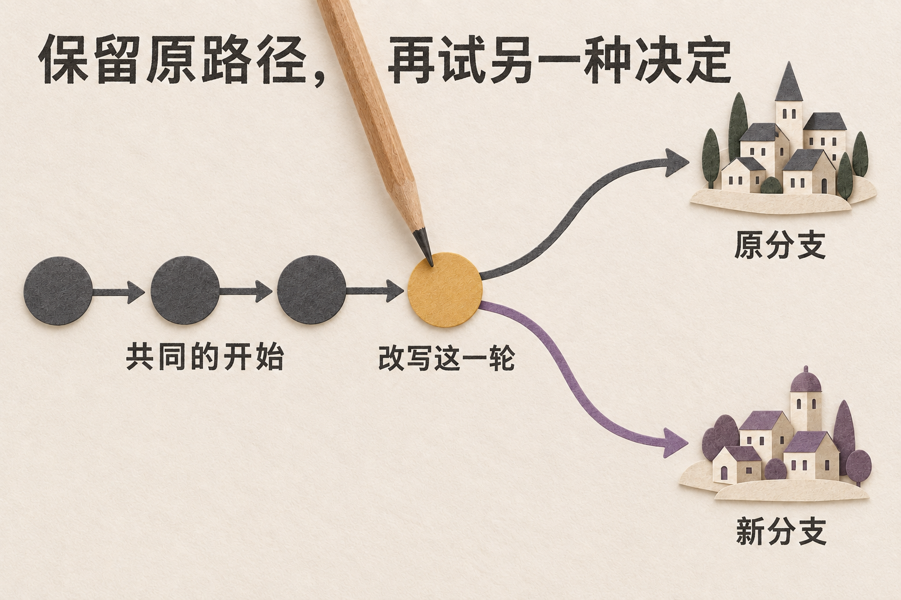
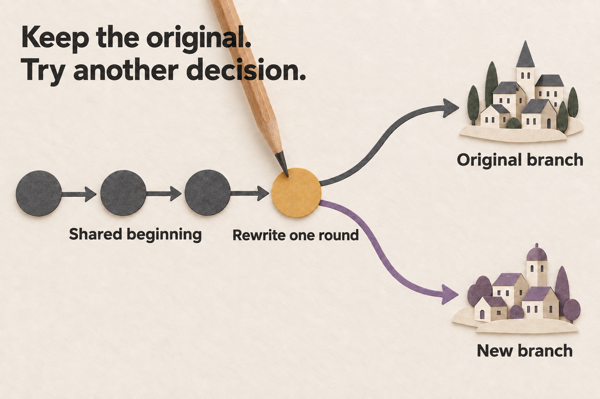

[中文在前 / Chinese first](USAGE.md) · [English first / 英文在前](USAGE.en.md)

# 使用指南 / Usage guide

先用已有样例熟悉结果，再决定是否连接模型。本文中的路径都相对你正在使用的 SwarmOracle；本机默认地址是 http://127.0.0.1:18928 。尚未启动时，按[README](../README.md)操作。

Start with a saved sample, then decide whether to connect a model. Paths in this guide refer to your SwarmOracle instance; the default local address is http://127.0.0.1:18928. If it is not running, follow the [README](../README.en.md).

## 1. 打开官方样例 / 1. Open an official sample

*AI 生成概念插画：先读已有内容，再选择下一步。并非产品截图。*

*AI-generated conceptual illustration: read saved content before choosing the next step. This is not a product screenshot.*

English illustration / 英文配图

以下实拍展示 2026-09-19 的真实应用界面，以虚构的灯港群岛电池分配问题为例。概念插画另有标注。完整界面见[截图导览](SCREENSHOTS.md)。

The screenshots show the app on 2026-09-19 using fictional battery-allocation material set in the island city of Harborlight. Conceptual illustrations have separate labels. See the full [screenshot tour](SCREENSHOTS.en.md).

1. 启动前端和后端，打开首页，选择一个官方样例。共有 3 个随附样例，打开时不需要 API Key，也不会调用模型。 
   Start the frontend and backend, open the home page, and choose an official sample. The three bundled samples need no API key and make no model calls when opened.

2. 读一条结局，再选择两条已有分支进行比较。有保存的证据时，打开证据并查看它指向的角色、轮次和分支。 
   Read one ending, then compare two existing branches. Where saved evidence is available, open it and check the character, round, and branch it points to.

3. 自己的 `.swarm` 文件可从首页导入；仓库示例在 `samples/snapshots/`。导入中途断线时，先到 `/history` 检查是否已出现，再决定是否重试。 
   Import your own `.swarm` file from the home page; repository examples are in `samples/snapshots/`. If the connection drops during import, check `/history` for the imported run before retrying.

官方样例是预先制作的演示数据，不代表真人参与或真实模型现场运行。打开样例不会启动新推演；之后主动追问、重演或生成分析时，才需要可用模型和相应功能。未完成的快照导入后会作为停止的历史保留，不会恢复原来的后台任务。

Official samples contain prepared demonstration data, not evidence of live human participation or a model running now. Opening a sample does not start a new simulation. Later follow-ups, reruns, and analysis generation need a usable model and the matching features. An unfinished snapshot imports as stopped history and does not restart its original background task.

### 首页 / Home

从问题输入区开始，或打开官方样例先阅读已有结果。

Start with a question, or open an official sample to read a saved result.

English screenshot / 英文实拍

## 2. 先读结果，再选下一步 / 2. Read the result and choose a next step

*AI 生成概念插画：从同一结果进入不同操作，并非产品截图。*

*AI-generated conceptual illustration: take different actions from the same result. This is not a product screenshot.*

English illustration / 英文配图

在 `/result/:id`，先核对原问题，再展开结局故事。分支占比只在已完成的终局分支之间计算；它是本次模拟的权重，不是真实事件发生概率。分叉中间节点不算一个独立结局。

At `/result/:id`, check the original question and expand an ending’s story. Branch shares use completed terminal branches only. They are weights within this simulation, not probabilities of real events. An intermediate fork node is not a separate ending.

| 中文 / Chinese | English / 英文 |
| --- | --- |
| **核对依据：** 阅读已保存证据、简报或报告，沿角色、分支、轮次回查。 | **Check the evidence:** read saved evidence, the brief result, or a report, then follow its character, branch, and round references. |
| **追问角色：** 选参与者继续问，或从图谱节点进入带上下文的追问。 | **Ask the characters:** choose a participant for a follow-up or open a contextual question from a graph node. |
| **尝试改变：** 比较两条已有分支，或选择“改写一轮并重演”生成新分支。 | **Try a different decision:** compare two saved branches or choose **Rewrite a turn and replay** to generate a new one. |

需要图谱、回放、会客厅等入口时，展开额外工具。按钮不可用时先读旁边的原因：可能只有一条分支、缺少数据、当前是只读 replay，或服务器关闭了功能。

Expand the additional tools for graphs, replay, chambers, and other views. Read the reason beside an unavailable action: there may be only one branch, missing data, read-only replay, or a disabled server feature.

### 结果页 / Result

展开结局卡，先读完成状态和模拟权重，再选择核对、追问或改变。

Expand an ending, read its status and simulation weight, then choose evidence, questions, or a different decision.

English screenshot / 英文实拍

## 3. 核对证据与报告 / 3. Check evidence and reports

1. 先打开“阅读已保存的证据”。选一条引文，核对是谁在哪条分支、哪一轮说的；不要把报告中的模型合成访谈当作逐字原话或新的真人采访。 
   Open **Read saved evidence** first. Choose a quote and check who said it, in which branch and round. Model-synthesized interviews in a report are not verbatim source statements or new human interviews.

2. 需要了解动作与状态时，打开因果图中的动作账本。检查动作状态、目标、适用规则和变更前后数值；旧推演没有这些记录时会显示不可用。 
   For actions and state, open the Action Ledger in the causal view. Check action status, target, applicable rule, and before/after values. Older runs without those records show unavailable.

3. 简报直接复用已有结果，不额外调用模型。需要更多分析时进入 `/result/:id/report`，主动请求完整分析或翻译。旧报告会单独标明为历史内容。 
   The brief result reuses saved data without another model call. For more analysis, open `/result/:id/report` and request full analysis or translation. Older reports are labeled as historical content.

| 中文 / Chinese | English / 英文 |
| --- | --- |
| **完整 / 部分完成：** 先看保存了哪些章节。`complete` 不保证每一章都成功调用模型；`partial` 只表示当前有部分内容。 | **Complete / partial:** check which sections were saved. `complete` does not guarantee that every section came from a successful model call; `partial` means only some content is available. |
| **生成稿 / 重写稿 / 静态回退：** 这是每章的来源标签。静态回退会附原因，不能当作模型成功生成。 | **Generated / rewritten / static fallback:** these labels describe each section’s origin. Static fallback includes a reason and does not count as a successful model generation. |
| **生成中、失败、取消、跳过、停滞或截断：** 先读状态说明。已经保存的章节仍可阅读；继续生成需要再次发起对应操作。 | **Generating, failed, cancelled, skipped, stalled, or truncated:** read the status explanation. Saved sections remain readable; further generation needs the corresponding explicit action. |

提议、采纳和执行要分开看。例如角色都提到“延长 60 分钟”，并不等于共同承诺已经变更。适用一致采纳规则时，全轮参与者必须明确选择同一目标；即使已采纳，也不能据此断言已经执行。报告中的引文与来源检查不等于通用语义验证，也不证明现实中的因果。

Read proposals, adoption, and execution separately. Characters mentioning “extend by 60 minutes” does not itself change a shared commitment. Under the unanimous-adoption rule, all participants in the round must choose the same target. Even an adopted target does not prove execution. Quote and source checks in a report do not provide general semantic verification or establish real-world causation.

### 已保存的证据 / Saved evidence

选择一条引文，查看对应角色、分支和轮次。

Select a quote and inspect its character, branch, and round.

English screenshot / 英文实拍

## 4. 从图谱详情追问 / 4. Ask from graph details

1. 从结果页进入图谱工作台，或打开知识图谱。点击一个节点，先读详情中的人物、正文、分支、轮次和证据。 
   Open Graph Workbench or Knowledge Graph from the result page. Select a node and read its character, text, branch, round, and evidence in the detail panel.

2. 点击“询问这个节点”。确认面板显示的是你想问的对象与上下文，再输入问题；只有支持对话且有合法来源的节点能继续。 
   Choose **Ask about this node**. Confirm the target and context in the panel before entering a question. Conversation requires a supported node with a valid source.

3. 发送后可接着问第二轮。面板按顺序保留问答；通过“加载更早的消息”或“加载历史对话”继续查看已有记录。 
   Ask another question after the first reply. The panel keeps the questions and answers in order. Use **Load earlier messages** or **Load History** to review saved records.

4. 生成中可点“停止”。面板保留已收到的部分回答并标注停止状态；失败时也会保留问题和已有内容，不会把它们标成成功回答。 
   Select **Stop** during generation. The panel retains received text and labels the reply as stopped. On failure, it also keeps the question and available text without marking the reply successful.

若提示未配置模型，先配置连接；草稿和历史会保留。若只是暂时无法确认可用性，可重新检查或按页面提示尝试发送。只读 replay 不开放新对话。

If the panel says a model is not configured, configure a connection; the draft and history stay available. If readiness is only unknown, retry the check or try sending as the page allows. Read-only replay does not offer new conversations.

工作台的分屏隔条可拖动；用键盘聚焦后，左右方向键调整宽度，Enter 恢复均分。手机上可在对话面板内部滚动，继续访问历史与输入区。

Drag the workbench divider to resize its panels. When it has keyboard focus, use Left/Right to resize and Enter to restore an equal split. On a phone, scroll within the conversation panel to reach history and the input area.

### 节点追问 / Ask about a node

核对对象与上下文，在同一面板发送追问并阅读已完成的回复。

Check the target and context, then ask a follow-up and read the completed reply in the same panel.

English screenshot / 英文实拍

## 5. 比较现有分支，或改写后重演 / 5. Compare saved branches or rewrite and replay

*AI 生成概念插画：比较读取已有两条线，改写会生成新的后续。并非产品截图。*

*AI-generated conceptual illustration: comparison reads two saved paths; rewriting generates a new continuation. This is not a product screenshot.*

English illustration / 英文配图

| 中文 / Chinese | English / 英文 |
| --- | --- |
| **比较已有分支：** 选择两条不同分支，查看发言与状态差异，不需要为比较本身调用模型。 | **Compare existing branches:** choose two different saved branches and inspect speech and state differences. The comparison itself needs no model call. |
| **改写一轮并重演：** 从已保存发言创建新的反事实分支，后续生成需要模型。 | **Rewrite a turn and replay:** create a counterfactual branch from a saved statement. Generating its continuation requires a model. |
| **从 checkpoint 续跑：** 使用可用的检查点创建后续分支；它与修改某个角色的一句话是不同操作。 | **Resume from a checkpoint:** use an available checkpoint to create a continuation branch. This is separate from rewriting one character’s statement. |

1. 在已完成的推演中点击“改写一轮并重演”。核对来源分支，选择实际有发言的回合与 Agent。 
   In a completed run, select **Rewrite a turn and replay**. Check the source branch, then choose a round and Agent with an actual saved statement.

2. 填写“改写后的发言”，点击“创建改写分支”。等待后续推演结束后，再比较原分支和新分支。 
   Enter the **Rewritten statement** and select **Create rewrite branch**. Wait for the continuation to finish, then compare the original and new branches.

3. 比较页按真实分支名显示两侧。只有已保存的来源关系足够明确时，才补充“原始”和“反事实”标签。检查第一处差异及可用的动作、规则和状态来源。 
   The comparison page uses the actual branch names. It adds Original and Counterfactual labels only when saved provenance supports them. Inspect the first difference and any available action, rule, and state sources.

缺少来源发言、处于只读 replay 或功能关闭时不能改写。回放与分支分析会保留分叉前的共同历史，并按所选分支和轮次截点读取；不会混入兄弟分支的后续。

You cannot rewrite without source statements, in read-only replay, or when the feature is disabled. Replay and branch analysis include shared history before the fork and follow the selected branch and round cutoff without mixing in a sibling branch’s continuation.

### 改写一轮 / Rewrite a turn

此图停在提交前：核对来源发言并填写替代内容，确认后才创建改写分支。

This view is before submission. Check the source statement and enter a replacement before creating a rewrite branch.

English screenshot / 英文实拍

## 6. 为新推演配置模型 / 6. Configure a model for a new run

1. 打开 `/admin/setup`，填写 Base URL、模型 ID 和所需 API Key。测试的是当前这组连接；修改字段后需要重新测试，或明确接受“未验证仍保存”。 
   Open `/admin/setup` and enter the Base URL, model ID, and required API key. The test covers that exact combination. After editing a field, test again or explicitly accept saving it unverified.

2. 在 `/model-profiles` 管理保存的配置。首页的 **BYOK** 区可为单次运行覆盖连接；更换远端地址或模型时，提供完整的地址、模型和 key，不要混用旧连接。 
   Manage saved connections at `/model-profiles`. Home-page **BYOK** can override the connection for one run. When replacing a remote endpoint or model, provide the full URL, model, and key rather than mixing it with the old connection.

3. 在高级设置中选推理力度：服务端默认、轻量、均衡或深入。应用会保存所选力度并在后续操作中按规则继承；实际支持、耗时和费用由模型提供方决定。 
   Choose reasoning effort in Advanced Settings: Server default, Light, Balanced, or Deep. The app saves the choice for later operations to inherit. Actual support, latency, and cost depend on the provider.

精确本地地址 `localhost`、`127.0.0.1`、`0.0.0.0`、`host.docker.internal` 和 `[::1]` 可免 key；其它远端地址需要 key。随附的 `127.0.0.1:8317` 加空值／占位 key 只是“未配置”默认值，不证明本机已有模型。完整规则见[配置说明](CONFIGURATION.md)。

Exact local hosts `localhost`, `127.0.0.1`, `0.0.0.0`, `host.docker.internal`, and `[::1]` can be keyless; remote endpoints need a key. The shipped `127.0.0.1:8317` with an empty or placeholder key is an unconfigured default, not proof that a model exists on your computer. See [configuration](CONFIGURATION.en.md) for the full rules.

### 模型连接 / Model connection

此图为保存前的连接表单：填写自己的连接信息，测试后再保存。

This view is before saving. Enter your own connection details, test them, then save.

English screenshot / 英文实拍

## 7. 发起自己的推演 / 7. Start your own simulation

1. 输入清楚的假设问题，例如“如果社区把周末活动改到晚上，居民会怎样协商？”也可选模板或本地主题包，再检查填入的内容。 
   Enter a clear what-if question, such as “If a neighborhood moved its weekend event to the evening, how would residents negotiate?” You can also choose a template or Local Pack, then review what it filled in.

2. 设置 Agent 数和轮数。需要背景时，上传文档或添加初始 Feed；Feed 最多 20 条，至少填写来源和正文。不要把材料中的作者文字当成系统指令。 
   Set the Agent count and rounds. Add background through a document or initial Feed; the Feed accepts up to 20 events, each with a source and text. Treat author notes in the material as context, not system instructions.

3. 按需要展开高级设置，选择模式、Classic / Pixel Theater、推理力度、多次推演和搜索。LLM 连接在单独的 **BYOK** 区。 
   Open Advanced Settings as needed for mode, Classic / Pixel Theater, reasoning effort, multiple runs, and search. The LLM connection has its own **BYOK** section.

4. 点击“开始推演”，核对问题、角色、规模、模型、搜索和材料后确认。模型配置若发生变化，刷新并重新核对。多次推演先显示等待面板，再进入运行与结果。 
   Select **Start Simulation**, review the question, characters, size, model, search, and material, then confirm. If a profile changes, refresh and review it again. Multiple runs begin with a waiting panel before live and result views.

主题包会替换一组相关设置和背景。换成快速开始、教学模板或挑战时，原主题包内容会清除。包里的 Snapshot 演示是打开已有数据的另一条入口；连接中断、结果不明时先查历史。

A Local Pack replaces its related settings and background together. Switching to a Quick Start, education template, or challenge clears the old pack context. A pack’s Snapshot demo opens saved data; if an interrupted import leaves the outcome unclear, check History first.

### 启动前核对 / Launch review

确认前检查问题、角色、轮数、模型和材料。

Check the question, characters, rounds, model, and material before confirming.

English screenshot / 英文实拍

## 8. 观看过程与 Pixel Theater / 8. Follow the run and use Pixel Theater

- 顶部查看轮次、发言进度和已运行时间。Classic 适合看分支树；Pixel Theater 适合看舞台、角色与发言。两者展示同一推演。 
  Read round, speaking progress, and elapsed time at the top. Use Classic for the branch tree or Pixel Theater for the stage, characters, and speech. Both show the same run.

- 在 Pixel 工具栏选择截图范围，再点截图保存 PNG。气泡拥挤或文字较长时，从发言记录读取完整内容。 
  In the Pixel toolbar, choose the capture target and save a PNG screenshot. Use the speech record for full text when bubbles overlap or a statement is long.

- 点击角色可看档案。配置立场、观察到的情绪、分支与轮次分开显示；缺失的情绪数据会标为不可用，不会被写成“中性”。 
  Select a character to view its profile. Configured stance, observed emotion, branch, and round appear separately. Missing emotion data is marked unavailable rather than neutral.

- 有对应功能时，可在运行中使用干预、玩法卡、预测押注和世界线承诺。取消或失败后检查终态；未完成分支不会被当作成功结局。 
  Where supported, use interventions, gameplay cards, prediction bets, and worldline commitments during the run. After cancellation or failure, check the terminal status; unfinished branches do not count as successful endings.

### 已保存的推演过程 / Saved simulation

打开已保存的推演或回放，按轮查看角色发言与分支变化。

Open a saved simulation or replay to inspect character statements and branch changes round by round.

English screenshot / 英文实拍

## 9. 启动一场辩论 / 9. Start a debate

首页输入辩题后，选择辩论入口。辩论固定为正反两方和一名裁决者，依次开场、交锋、反驳、结辩，再给出裁决。首页的 Agent 数和轮数滑块只影响普通推演。

Enter a topic on the home page and choose the debate entry. Debate uses two sides and one judge, with opening, crossfire, rebuttal, closing, and a verdict. The Agent and round sliders on the home page affect ordinary simulations only.

1. 在“核对辩论启动”中检查题目、各方角色、模型与推理力度。要修改时取消返回；确认后才启动。 
   In **Review debate launch**, check the topic, characters, models, and reasoning effort. Cancel to edit; the debate starts only after confirmation.

2. 总费用与请求次数取决于角色准备、发言、总结、可选分析和重试。固定四个发言阶段不等于固定四次模型调用。 
   Total cost and request count depend on role preparation, speech, summaries, optional analysis, and retries. Four speaking phases do not mean four model calls.

3. 在 `/debate/:id` 观看，完成后从结果页按需打开论点地图。历史辩论只读；显式重新启动会创建新运行。 
   Watch at `/debate/:id`, then open the argument map from the result when needed. Historical debates are read-only; an explicit restart creates a new run.

### 已保存的辩论发言 / Saved debate statements

按阶段查看已保存的正反双方发言，再打开结果页阅读裁决。

Review the saved statements from both sides by stage, then open the result page for the verdict.

English screenshot / 英文实拍

## 10. 继续会客厅与圆桌讨论 / 10. Continue in a chamber or roundtable

- **结局会客厅：** 从一条世界线进入，围绕该结局追问。可尝试“只改一步”、证据投牌和后续讨论；模型选择在会客厅自己的高级设置中，不选时继承会客厅或当前推演保存的模型连接；没有保存的连接时才用服务器默认。保存连接失效时，需要重新选择。 
  **Ending Chamber:** enter from a worldline and ask about that ending. Try One Move Only, evidence cards, and follow-up discussion. Its Advanced settings contain the model selector; leaving it blank inherits the room or scenario’s saved model connection. The server default applies only when no connection was saved. Reselect a saved connection if it is no longer usable.

- **世界线圆桌：** 有多个结局时，选择讨论形式和代表。完成后可继续一对一访谈、研究分析或交叉质询。 
  **Worldline Roundtable:** with multiple endings, choose a discussion format and representatives. After completion, continue with a one-to-one interview, research analysis, or cross-examination.

- **保存分析：** 支持保存的回答或分析完成后，再保存为笔记并确认成功提示。笔记仍是模拟分析，不会成为角色记忆、动作记录或已验证事实。 
  **Save analysis:** after a supported reply or analysis finishes, save it as a note and check the success message. The note remains simulation analysis; it does not become Agent memory, an action record, or a verified fact.

### 世界线圆桌 / Worldline Roundtable

查看不同世界线代表的发言，再按需要继续讨论。

Read what representatives from different worldlines say, then continue the discussion as needed.

English screenshot / 英文实拍

## 11. 创建、编辑与导入 Agent / 11. Create, edit, and import Agents

1. 在 `/agents` 打开资料库。点击自定义 Agent 卡片上的“编辑”；创建新角色时打开 `/agents/new`，手动填写或从 PDF 生成，再检查人设。 
   Open the library at `/agents`. Choose **Edit** on a custom Agent card. For a new character, open `/agents/new`, enter the details or generate them from a PDF, then review the persona.

2. 单人物备份导入会创建新身份，不覆盖原角色。Agent Pack 用于预览后整组导入或按选择顺序导出人设。 
   Importing a single-persona backup creates a new identity without overwriting the original. Use an Agent Pack to preview and import a group or export personas in selection order.

3. 遇到重复内容冲突时，换另一份备份或修改有效内容后重新验证；重复点击不会重复提交同一份冲突内容。网络失败可按提示重试。 
   For a duplicate-content conflict, choose another backup or change the content and validate it again. Repeated clicks do not resubmit the same conflicting content. Retry network failures as the dialog allows.

Agent Pack 不携带身份 ID、归属信息、记忆、成长记录、对话或单独存储的凭据。导出会脱敏常见密钥格式，分享前仍需检查自己写的人设文字。

Agent Packs omit identity IDs, ownership data, memories, growth records, conversations, and separately stored credentials. Exports redact common key formats; still review the persona text you wrote before sharing.

### 编辑角色 / Edit a character

核对姓名、背景与立场；创建新角色或修改已有角色时，确认表单内容后再保存。

Review the name, background, and stance. Check the form before saving a new character or changes to an existing one.

English screenshot / 英文实拍

## 12. 分享与记录预测 / 12. Share and keep a prediction journal

启用预测评分时，如果同一推演里有些预测已评分、有些还未评分，重新打开结果页可能继续调用模型评分。只想阅读时，可以使用只读回放。

With prediction scoring enabled, reopening a result may call the model to finish scoring when some predictions are scored and others remain unscored. Use read-only replay when you only want to view the run.

1. 从结果页导出 Markdown、Snapshot、回放链接或预测卡片。保留自己的运行记录可用 Snapshot；给别人阅读时可选 Public Artifact，即适合分享的脱敏阅读文件。 
   Export Markdown, a Snapshot, a replay link, or a prediction card from the result page. Use a Snapshot to keep a run and a Public Artifact, a redacted copy made for sharing, to let someone read it.

2. Public Artifact 支持 JSON、单文件 HTML 和离线 Gallery hash 链接。`/gallery.html` 可打开本地 JSON；这些操作不会发布到在线社区。 
   Public Artifacts support JSON, a single HTML file, and an offline Gallery hash link. `/gallery.html` can open local JSON. These actions do not publish to an online community.

3. 到 `/me/journal` 记录预测与自己的概率判断，保存后检查成功提示。结果明确后更新结果，再查看校准；`/history` 查看已有推演，`/leaderboard` 查看预测榜。 
   At `/me/journal`, record a prediction and your own probability estimate, then check the save confirmation. Resolve the outcome when known and review calibration. Use `/history` for saved runs and `/leaderboard` for prediction scores.

分享前检查问题、姓名、背景材料和用户自填内容。公开 replay 会移除身份与连接等私有字段，但脱敏不能替你判断一段文字是否适合公开。

Before sharing, inspect the question, names, background, and your own text. Public replay removes private identity and connection fields, but redaction cannot decide whether a passage is appropriate to share.

### 分享与导出 / Share and export

在分享面板选择用途；下方可下载公开摘要或复制 Gallery 链接，分享前检查原问题和角色文字。

Choose a sharing format. Download the public summary or copy its Gallery link at the bottom, and review the question and character text before sharing.

English screenshot / 英文实拍

## 排查常见问题 / Troubleshoot common problems

| 中文 / Chinese | English / 英文 |
| --- | --- |
| **样例能开，新推演却不能开始。** 样例不需要模型。检查 `/admin/setup`、选择的 profile 或服务端 LLM 配置。 | **Samples open, but a new run will not start.** Samples need no model. Check `/admin/setup`, the selected profile, or server LLM settings. |
| **页面一直等待。** 确认后端在 `http://127.0.0.1:18927`，前端的 `/api` 和 `/ws` 代理能到达它；用非默认部署时检查对应地址。 | **The page keeps waiting.** Confirm the backend is at `http://127.0.0.1:18927` and the frontend’s `/api` and `/ws` proxies can reach it. Check the matching addresses for other deployments. |
| **按钮缺失或不可用。** 先区分能力检查失败、功能关闭和数据不足。检查失败可重试；管理员调整 `FEATURE_*` 后需重启后端。 | **An action is missing or unavailable.** Distinguish a failed capability check, a disabled feature, and missing data. Retry a failed check; restart the backend after an administrator changes `FEATURE_*`. |
| **旧快照没有情绪、动作或规则。** 这表示原数据没记录，页面会标注不可用。不要从发言猜测缺失状态。 | **An old snapshot lacks emotion, actions, or rules.** The original data did not record them, so the app marks them unavailable. Do not infer missing state from speech. |
| **想开启搜索。** 在高级设置中配置应用层搜索，或选择支持原生搜索的模型配置。两条路径独立，只有返回来源时才显示引用；详见[配置说明](CONFIGURATION.md)。 | **You want search.** Configure app-layer search in Advanced Settings or choose a profile that supports native search. The paths are separate, and citations require returned sources; see [configuration](CONFIGURATION.en.md). |
| **找不到 verified-memory promotion。** 它仍是默认关闭的后端能力，没有界面或 REST 激活入口；已有记忆引用不代表它已启用。 | **You cannot find verified-memory promotion.** It remains a default-off backend capability with no UI or REST activation entry. Existing memory references do not prove it is enabled. |
