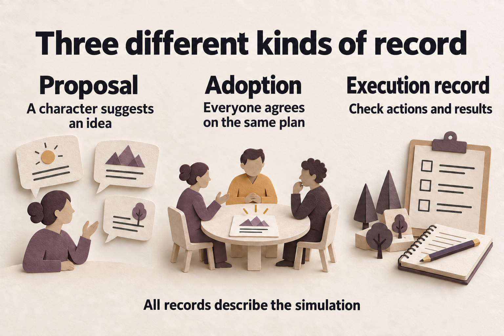

# Wave 2.0 Truth and Reliability Design / Wave 2.0 真实性与可靠性设计

> **历史设计记录 / Historical design record — 2026-07-11**
>
> 本文保留 2026-07-11 的设计与任务语境。任务、命令、行号和预期结果均属历史记录，不是当前操作指引；复选框和批准状态不代表当前实施或验证结果。代码示例及其中的注释、字符串保留原文，中英文共用。
>
> This document preserves the design and task context of 2026-07-11. Tasks, commands, line numbers, and expected results are historical records, not current operating instructions. Checkboxes and approval status do not establish current implementation or verification results. Both languages share the original code examples, including their comments and strings.
>
> 当前指南 / Current guides: [README](../../../README.md) · [使用指南 / Usage](../../USAGE.md) · [配置指南 / Configuration](../../CONFIGURATION.md).

*Conceptual illustration: A decision flow supported by evidence; it is not evidence that historical tasks were completed.*

中文图解

*概念配图：由证据支持的决策流程，不作为历史任务完成证据。*

**Status:** Approved on 2026-07-11

**状态：** 于 2026-07-11 批准。

**Goal:** Make SwarmOracle truthful and dependable under real OpenAI-compatible provider failures before expanding Agent growth, Living World, and community growth features.

**目标：** 在扩展 Agent 成长、Living World 和社区增长功能之前，让 SwarmOracle 在真实 OpenAI 兼容 Provider 故障下仍能如实展示状态并可靠运行。

## Scope / 范围

Wave 2.0 fixes defects demonstrated by current-main tests or runtime evidence:

Wave 2.0 修复由当时 main 分支测试或运行时证据确认的缺陷：

1. OpenAI-compatible streaming must not report truncated output as success.

   OpenAI 兼容流不能将截断输出报告为成功。
2. Slow responses, rate limits, disconnects, cancellation, and recovery must have deterministic contracts and tests.

   慢响应、限流、断连、取消和恢复必须有确定性的合同与测试。
3. Agent identity continuity must persist without SQLite self-contention.

   Agent 身份连续性必须能够持久化，且不造成 SQLite 自身争用。
4. Stance, faction, and relationship projections must support multilingual signals and remain inside documented bounds.

   立场、阵营与关系投影必须支持多语言信号，并处于文档约定的范围内。
5. Report generation must expose honest lifecycle progress and must not present branch weights as statistical confidence.

   报告生成必须如实暴露生命周期进度，不能将分支权重当作统计置信度。
6. Result Agent profiles must retain the observation branch and round that support the displayed state.

   结果页 Agent 档案必须保留支撑展示状态的观测分支与轮次。
7. First-run setup must distinguish a verified connection from an explicit unverified skip.

   首次设置必须区分已经验证的连接与用户明确确认的未验证跳过。
8. Local packs must import every field that the picker promises to use.

   本地主题包必须导入选择器承诺使用的每个字段。
9. The result experience must remain usable at a 390 px viewport.

   结果页在 390 px 视口下必须保持可用。
10. Release evidence and image publication must fail closed instead of claiming unexecuted work passed.

    发布证据和镜像发布必须在条件不满足时失败，不能声称未执行工作已经通过。

## Non-goals / 非目标

- No database schema migration.

  不迁移数据库 schema。
- No deletion or history rewrite of large assets.

  不删除大型资源，也不重写其历史。
- No restriction of localhost or private-network LLM endpoints.

  不限制 localhost 或私有网络 LLM 端点。
- No broad event-sourcing rewrite.

  不进行大范围事件溯源重写。
- No MiroFish Zep/OASIS or dual-social-platform architecture.

  不采用 MiroFish Zep/OASIS 或双社交平台架构。
- No dependency version upgrade without a separate risk decision. Reproducibility work may pin the already-tested set only after that decision.

  没有单独风险决策时不升级依赖版本。只有该决策通过后，可复现性工作才能固定已经测试的依赖集。
- Agent growth timelines, durable Living World projections, gallery routing, new official showcases, and community contribution workflows remain Wave 2.1/2.2 unless a Wave 2.0 fix needs a small compatibility hook.

  Agent 成长时间线、持久化 Living World 投影、Gallery 路由、新官方展示和社区贡献流程仍留在 Wave 2.1/2.2，除非 Wave 2.0 修复需要小型兼容接口。

## Design principles / 设计原则

### Truth before spectacle / 真实性优先于展示效果

Every displayed state must name its evidence coordinates. A value derived from simulated branches is a scenario projection, not a real-world probability. Historical transcript excerpts are not newly conducted interviews. A dry run is planned work, not passed work.

每个展示状态都必须注明其证据坐标。由模拟分支导出的数值属于场景投影，不是现实世界概率。历史转录摘录不是新进行的采访。试运行是计划工作，不是已经通过的工作。

### Existing storage before migration / 优先使用现有存储，再考虑迁移

Wave 2.0 uses existing scenario, branch, message, checkpoint, graph, faction, relationship, identity, and report records. Fixes must not require a new table or destructive migration.

Wave 2.0 使用现有场景、分支、消息、检查点、图、阵营、关系、身份和报告记录。修复不得依赖新表或破坏性迁移。

### Provider behavior as a protocol / 将 Provider 行为视为协议

The LLM client treats an OpenAI-compatible stream as successful only after a valid terminal signal:

LLM 客户端只有收到有效终止信号，才将 OpenAI 兼容流视为成功：

- `[DONE]`, or

  `[DONE]`，或
- a parsed choice with a non-null `finish_reason`, or

  已解析的 choice 包含非空 `finish_reason`，或
- the equivalent terminal event for a supported Responses endpoint.

  受支持 Responses 端点的等效终止事件。

EOF before a terminal signal is a retryable provider failure when no irreversible application-side commit has occurred. Both `data:` and `data: ` SSE field forms are accepted. Rate-limit delays honor a valid bounded `Retry-After`; malformed or excessive values fall back to bounded exponential backoff.

终止信号前出现 EOF 时，只要应用侧尚未进行不可逆提交，就属于可重试的 Provider 故障。SSE 同时接受 `data:` 和 `data: ` 字段形式。限流延迟遵守有效且有上限的 `Retry-After`；格式错误或过大的值回退为有界指数退避。

Timeouts are explicit runtime settings with current behavior as the compatibility default. Cancellation remains observable between provider reads and retry waits. The test suite uses a protocol-faithful local fake HTTP provider rather than asserting on mocks.

超时作为明确运行时设置，以当时行为作为兼容默认值。Provider 读取和重试等待之间仍能观察到取消。测试集使用忠实模拟协议的本地 HTTP Provider，不仅依赖 mock 断言。

### Transaction ownership for identity continuity / 以事务所有权保障身份连续性

An identity creation transaction must not hold a SQLite writer lock while a second connection attempts to persist its vector profile. Relational identity state commits first; profile persistence then runs outside that write transaction. A profile failure is observable and retryable without rolling back the canonical identity.

第二个连接尝试持久化向量档案时，身份创建事务不能仍持有 SQLite 写锁。先提交关系型身份状态，再在该写事务之外持久化档案。档案失败应可观察、可重试，不回滚规范身份。

### Bounded, explainable social projections / 有界且可解释的社交投影

Stance extraction normalizes Unicode text and recognizes a documented multilingual vocabulary. Unknown labels remain neutral. Trust, opposition, alignment, and confidence-like outputs are clamped at their public contract boundary. Tests cover English, Simplified Chinese, mixed labels, empty labels, and repeated extreme evidence.

立场提取规范化 Unicode 文本，并识别文档规定的多语言词表。未知标签保持中性。信任、对立、一致性及类置信度输出在公开合同边界限幅。测试覆盖英文、简体中文、混合标签、空标签和反复出现的极端证据。

### Honest report lifecycle / 如实反映报告生命周期

Report status has distinct non-terminal and terminal meanings:

报告状态明确区分非终态与终态：

- `generating` or `partial`: generation is still progressing;

  `generating` 或 `partial`：仍在生成；
- `complete`: all intended sections reached a terminal result;

  `complete`：所有计划章节均达到终态结果；
- `failed`: generation stopped with a recoverable error;

  `failed`：生成因可恢复错误停止；
- `cancelled`: the user or runtime stopped work.

  `cancelled`：用户或运行时停止了工作。

The frontend continues polling or listening while status is `partial`. SSE events update chapter progress, tool trace, excerpt/interview activity, uncertainty, and failure state. Historical excerpts are labelled as excerpts. A real supplemental interview, if later enabled, must be an explicit budgeted and cancellable operation.

状态为 `partial` 时，前端继续轮询或监听。SSE 事件更新章节进度、工具轨迹、摘录／采访活动、不确定性及失败状态。历史摘录应明确标为摘录。若之后启用真实补充采访，必须将其作为明确、有预算且可取消的操作。

Single-branch runs do not show a probability interval. Multi-branch weights are labelled as simulated branch distribution and never as statistical confidence or real-world likelihood.

单分支运行不展示概率区间。多分支权重标为模拟分支分布，绝不称为统计置信度或现实发生概率。

### Evidence-aware Agent profiles / 带证据坐标的 Agent 档案

The result page derives the most recent message for the selected Agent within the active analysis branch and round, then passes an observation containing branch, round, emotion, and evidence identity to `AgentProfileSheet`. If no supported observation exists, the component explicitly renders a baseline state instead of silently inventing snapshot provenance.

结果页在当前分析分支和轮次范围内寻找所选 Agent 的最新消息，然后向 `AgentProfileSheet` 传入包含分支、轮次、情绪及证据标识的观测。若没有受证据支持的观测，组件明确显示基线状态，不静默虚构快照来源。

### Explicit setup trust state / 明确的设置可信状态

The setup wizard may finish only after either:

设置向导只有满足以下任一条件才可完成：

1. a successful connection test for the current provider/model/key/base URL tuple, or

   当前 Provider、模型、key 和 base URL 组合通过连接测试，或
2. an explicit user acknowledgement that configuration is being saved unverified.

   用户明确确认以未验证状态保存配置。

Changing any connection field invalidates the prior successful result. Localhost remains permitted.

修改任何连接字段都会使之前的成功结果失效。仍然允许 localhost。

### Complete local-pack import / 完整导入本地主题包

Applying a pack imports question, settings, context, system prompt, stakes, and Agent casts through one typed payload. Missing optional fields use existing defaults; they are never silently discarded after being previewed.

应用主题包时，通过一个带类型的载荷导入问题、设置、上下文、system prompt 字段、利害关系和 Agent 角色。缺少可选字段时使用现有默认值；已预览的字段不能再被静默丢弃。

### Fail-closed release evidence / 条件不满足时失败的发布证据

Release dry-run steps are `planned`/`skipped`, never `passed`. Browser teardown failure propagates to the suite result. Container publication must depend on the required verification gate for the exact commit. Local-only ignored build artifacts stay outside Docker context.

发布试运行步骤标为 `planned`／`skipped`，绝不标为 `passed`。浏览器清理失败传播到测试集结果。容器发布必须依赖确切提交所要求的验证门禁。仅供本地使用、已忽略的构建产物不进入 Docker 上下文。

## Component boundaries / 组件边界

- **Backend provider reliability:** LLM client, simulator timeout configuration, and protocol-level tests.

  **后端 Provider 可靠性：** LLM 客户端、模拟器超时配置及协议级测试。
- **Backend truth projections:** identity persistence, stance/faction derivation, report reducer/builder contracts, and focused tests.

  **后端真实状态投影：** 身份持久化、立场／阵营推导、报告 reducer/builder 合同及定向测试。
- **Frontend truth UX:** report progress, Agent observations, setup verification, pack import, responsive result controls, and component tests.

  **前端真实状态体验：** 报告进度、Agent 观测、设置验证、主题包导入、响应式结果控件及组件测试。
- **Release integrity:** signoff script, E2E teardown, workflow dependency, Docker context rules, and script/workflow contract tests.

  **发布完整性：** 验收脚本、E2E 清理、工作流依赖、Docker 上下文规则及脚本／工作流合同测试。

The four boundaries may be investigated in parallel, but implementation is integrated in small TDD commits. No two workers edit the same file concurrently.

四个边界可以并行调查，但实现以小型 TDD 提交集成。两名执行者不得同时编辑同一文件。

## Test strategy / 测试策略

Each behavior follows RED-GREEN-REFACTOR:

每项行为遵循 RED-GREEN-REFACTOR（先失败、再通过、后重构）：

1. Add one focused regression test and run it to observe the expected failure.

   增加一个定向回归测试，运行并观察预期失败。
2. Make the smallest production change that satisfies the contract.

   以最小生产代码变更满足合同。
3. Re-run the focused test, then the containing test file/module.

   重新运行定向测试，再运行其所在测试文件／模块。
4. Run one backend pytest process at a time.

   任何时刻只运行一个后端 pytest 进程。
5. Run frontend focused Vitest tests, then lint, `npx tsc -b`, and the full frontend suite.

   运行前端定向 Vitest 测试，再运行 lint、`npx tsc -b` 和完整前端测试集。
6. Finish with the full backend suite, Docker builds, release signoff, and real browser E2E.

   最后运行完整后端测试集、Docker 构建、发布验收和真实浏览器 E2E。

The fake LLM provider covers normal Chat Completions and Responses streams, slow chunks, valid and invalid `Retry-After`, HTTP 429/5xx, EOF before terminal signal, connection reset, cancellation, and long request bodies. At least one real configured OpenAI-compatible endpoint is re-tested after deterministic tests pass.

模拟 LLM Provider 覆盖正常 Chat Completions 和 Responses 流、缓慢数据块、有效及无效 `Retry-After`、HTTP 429/5xx、终止信号前 EOF、连接重置、取消及长请求体。确定性测试通过后，至少重新测试一个已配置的真实 OpenAI 兼容端点。

## Rollout and safety / 推出与安全边界

- Keep `main` and `origin/main` traceable through small commits.

  通过小型提交保持 `main` 和 `origin/main` 可追溯。
- Preserve user and parallel-agent changes; stop on overlapping dirty files.

  保护用户和并行 Agent 的变更；遇到重叠的未提交文件时停止。
- Do not touch MiroFish's dirty worktree.

  不触碰 MiroFish 的未提交工作树。
- Do not delete the synthetic remote Zep graph without explicit confirmation.

  没有明确确认时，不删除合成的远程 Zep 图。
- Treat dependency locking/version alignment and any future schema change as separate approval gates.

  依赖锁定／版本对齐及未来任何 schema 变更都单独审批。
- If a fix changes a public response shape, preserve compatibility or stop for explicit API approval.

  修复若改变公开响应结构，应保持兼容，否则停止并请求明确的 API 批准。

## Acceptance criteria / 验收标准

Wave 2.0 is complete only when:

只有满足以下全部条件，Wave 2.0 才算完成：

- every confirmed defect has a regression test that was observed failing first;

  每个已确认缺陷都有回归测试，且先观察到该测试失败；
- focused and full test gates pass;

  定向和完整测试门禁均通过；
- controlled provider fault tests and a real provider scenario pass;

  受控 Provider 故障测试和真实 Provider 场景均通过；
- Docker and release evidence are truthful and reproducible within the approved dependency scope;

  在已批准依赖范围内，Docker 与发布证据真实且可复现；
- desktop and 390 px browser E2E pass without result-page horizontal overflow;

  桌面和 390 px 浏览器 E2E 均通过，结果页没有横向溢出；
- an independent final review reports no Critical or Important findings;

  独立最终审查未发现 Critical 或 Important 问题；
- user-facing English and Chinese documentation is synchronized after implementation approval, while `llmdoc` is updated only through the separately confirmed recorder option.

  实施批准后同步面向用户的中英文文档；`llmdoc` 只通过单独确认的 recorder 选项更新。
