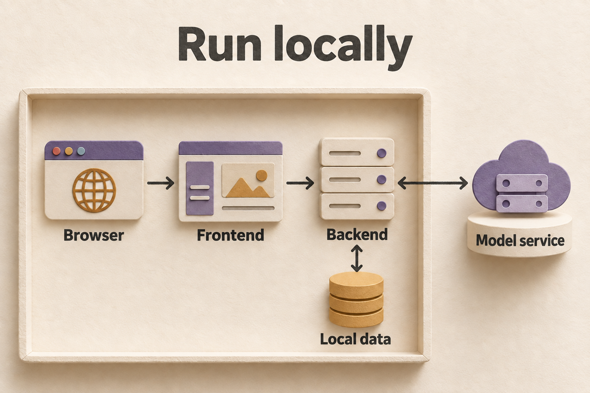

# 前端开发 / Frontend development

React + TypeScript 网页让你查看世界线、核对证据、追问角色、比较分支，并在 Pixel Theater 观看过程。后端保存运行与权限状态；浏览器中的选择和缓存只用于界面。

The React + TypeScript app lets you read worldlines, inspect evidence, ask characters, compare branches, and watch runs in Pixel Theater. The backend owns saved runs and authorization. Browser selections and caches serve the interface.


*网页通过同源 API 与 WebSocket 代理访问后端。*

<details>
<summary>English illustration / 英文配图</summary>



*The web app reaches the backend through same-origin API and WebSocket proxies.*

</details>

## 安装与启动 / Install and start

使用 `package-lock.json` 和 `package.json` 指定的 npm 11.12.1。CI 与镜像使用 Node 22.23.2；声明的兼容范围为 Node 20.x 中的 20.19+ 或 Node 22.12+。以下命令从仓库根目录开始，不升级全局 npm。

Use `package-lock.json` and npm 11.12.1 as specified in `package.json`. CI and images use Node 22.23.2; the declared range is Node 20.19+ within 20.x or Node 22.12+. Run these commands from the repository root. They do not upgrade global npm.

```bash
cd frontend
npx --yes npm@11.12.1 ci
npx --yes npm@11.12.1 run dev
```

Windows PowerShell 可使用 `npx.cmd`，并在每步后检查 `$LASTEXITCODE`。先按[后端说明](../backend/README.md)启动后端，再打开 `http://127.0.0.1:18928`。

On Windows PowerShell, use `npx.cmd` and check `$LASTEXITCODE` after each step. Start the backend using the [backend guide](../backend/README.md), then open `http://127.0.0.1:18928`.

Vite 默认监听 `127.0.0.1:18928`，把 `/api` 和 `/ws` 转发到 `http://127.0.0.1:18927`。后端使用其它地址时，在启动前设置 `SWARM_BACKEND_URL`。

Vite listens on `127.0.0.1:18928` and forwards `/api` and `/ws` to `http://127.0.0.1:18927`. Set `SWARM_BACKEND_URL` before starting Vite if your backend uses another address.

```bash
SWARM_BACKEND_URL=http://127.0.0.1:18927 npx --yes npm@11.12.1 run dev
```

```powershell
$env:SWARM_BACKEND_URL = 'http://127.0.0.1:18927'
npx.cmd --yes npm@11.12.1 run dev
```

## 验证与构建 / Check and build

在 `frontend` 中先测相关文件，再按改动范围运行其余检查。

From `frontend`, test the relevant files first, then select the remaining checks for the change.

| 目的 / Purpose | 命令 / Command |
| --- | --- |
| 单元测试 / Unit tests | `npx --yes npm@11.12.1 test -- --run src/game/PhaserGame.test.ts` |
| 类型检查 / Type checking | `npx --yes npm@11.12.1 exec -- tsc -b` |
| 代码检查 / Lint | `npx --yes npm@11.12.1 run lint` |
| 生产构建，含类型与性能预算 / Production build, including types and performance budgets | `npx --yes npm@11.12.1 run build` |
| 资产来源检查 / Asset provenance | `npx --yes npm@11.12.1 run assets:provenance:check` |

本仓库以 `tsc -b` 为类型门禁；裸 `tsc --noEmit` 不覆盖项目引用。构建通过也不能证明浏览器交互、真实模型或最终 Docker 镜像通过。

This repository uses `tsc -b` for its type gate. A bare `tsc --noEmit` does not cover project references. A successful build does not establish browser behavior, live model success, or final Docker-image validation.

## 预览与浏览器检查 / Preview and browser checks

完成构建并启动后端后，在 `frontend` 运行：

After building and starting the backend, run this from `frontend`:

```bash
npx --yes npm@11.12.1 run preview -- --host 127.0.0.1 --port 18930
```

打开 `http://127.0.0.1:18930`。Preview 和 dev 共用代理配置与 `SWARM_BACKEND_URL`。界面变更应检查桌面和手机、键盘、空态、失败，以及切换用户、场景或分支后是否还出现旧数据。

Open `http://127.0.0.1:18930`. Preview and dev share the proxy configuration and `SWARM_BACKEND_URL`. For UI changes, check desktop and mobile, keyboard use, empty and error states, and stale data after changing users, scenarios, or branches.

Windows 发布脚本若需要向 npx 传递带换行的参数，会仅为该次调用使用已安装的 Git for Windows 中的 Git Bash。普通调用不变；找不到 Git Bash 或已有自定义 script-shell 时会明确停止，可改用 Node 直接运行多行程序。不会修改全局 shell 或 npm 配置。

On Windows, release scripts use the installed Git for Windows Bash only for an npx call that carries newline-containing arguments. Ordinary calls are unchanged. Missing Git Bash or a custom script-shell causes an explicit failure; use Node directly for a multiline program. Global shell and npm settings remain unchanged.

`release:signoff` 包含真实模型调用路径，运行前确认凭据、预算与目标实例。`--dry-run` 只记录计划。签收与容器验证见[贡献指南](../CONTRIBUTING.md)和[部署说明](../deploy/README.md)。

`release:signoff` includes live model paths. Confirm credentials, budget, and the target instance before running it. `--dry-run` records a plan only. See [Contributing](../CONTRIBUTING.md) and [Deployment](../deploy/README.md) for signoff and container validation.

## 主要组成 / Main components

- React 19、TypeScript、Zustand：页面、交互与界面状态。 / React 19, TypeScript, and Zustand: pages, interactions, and interface state.
- i18next：中英界面；报告正文语言独立于界面语言。 / i18next: Chinese and English UI; report language is independent of UI language.
- Tailwind CSS：样式；Phaser：按需加载的 Pixel Theater。 / Tailwind CSS: styling; Phaser: Pixel Theater, loaded on demand.
- [Phaser 自定义入口](experiments/phaser-custom/README.md)：主线与实验共用，修改时需要真实浏览器检查。 / [Custom Phaser entry](experiments/phaser-custom/README.md): shared by the main app and experiment, with real-browser checks for changes.
