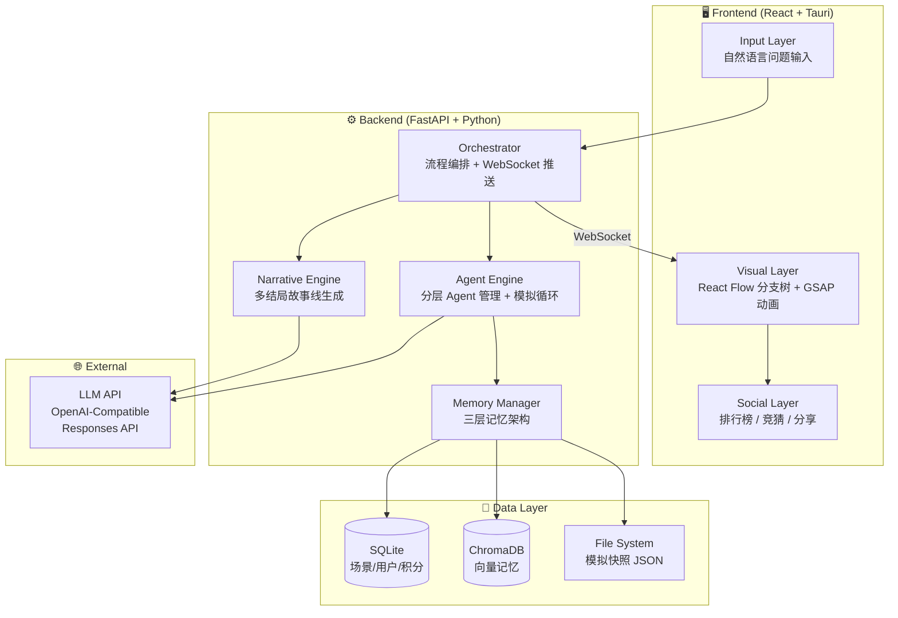

# SwarmOracle — 架构设计与 MVP 开发计划

> 文档类型：historical snapshot
> 当前真值：否
> 阅读方式：本文件保留初版架构与 MVP 计划快照，其中早期关于 Tauri/原生壳等设想不代表当前范围。当前请以 `README.md`、`implement/README.md`、`llmdoc/*` 为准。

> 群体预言机 — AI "如果…会怎样" 预测游乐场
> 灵感来源: MiroFish × 游戏化 × 路线 C 混合可视化

---

## 项目概述

SwarmOracle（群体预言机）是一个开源的**游戏化 AI 预测平台**，用户输入一句 "如果…" 问题，系统启动一组 AI Agent 群体自动推演出多条平行结局，以交互式分支树动画展示。兼具**趣味性**（游戏化竞猜、排行榜）和**实用性**（商业决策预演、舆论走向预测）。

### 与 MiroFish 的关系

SwarmOracle **不是** MiroFish 的 fork 或竞品，而是取其精髓、换一个形态：

| 维度 | MiroFish | SwarmOracle |
|------|---------|-------------|
| 输入 | 上传文档 + 配置参数 | 一句话自然语言 |
| 过程 | 严谨五阶段流水线 | 轻量三阶段（解析→模拟→叙事） |
| 输出 | 分析报告 | 交互式分支树 + 故事动画 |
| 用户 | 研究者/决策者 | 所有人 |

---

## 一、系统架构

### 总体分层



### 三阶段工作流（简化自 MiroFish 的五阶段）

```
阶段 1: 解析 (Parse)
├── 用户输入 "如果诸葛亮多活10年？"
├── LLM 拆解为: 场景设定 + 关键实体 + 变量参数
└── 生成 Agent 角色列表 + 初始立场

阶段 2: 模拟 (Simulate)
├── Agent 群执行多轮交互（每轮每 Agent 1-2 句话）
├── 每 N 轮自动压缩记忆
├── 在关键分歧点分裂为多条分支
└── 通过 WebSocket 实时推送进度

阶段 3: 叙事 (Narrate)
├── Narrative Agent 将原始交互转为可读故事线
├── 为每条分支生成标题 + 摘要 + 概率评分
└── 前端渲染分支树动画
```

---

## 二、上下文窗口管理方案

### 三层记忆架构

```
L0: 即时上下文 (LLM Context Window)
    ├── Agent 系统 prompt (人设 + 规则)     ~500 tokens
    ├── 当前话题 + 最近 2 轮摘要            ~800 tokens
    ├── 检索到的相关记忆片段                ~1000 tokens
    └── 总计: ~2,300 tokens/Agent/轮 (远低于 200K 限制)

L1: 工作记忆 (SQLite)
    ├── 当前模拟 session 的结构化摘要
    ├── 每 5 轮自动浓缩 (由 Summarizer Agent 执行)
    └── 压缩比: ~25:1 (50K tokens → 2K tokens)

L2: 长期记忆 (ChromaDB 向量数据库)
    ├── 全量原始对话 embedding
    ├── 历史模拟的摘要 embedding
    └── 按需检索 Top-K 相关片段 → 注入 L0
```

### Agent 分级策略

```
👑 核心 Agent (3-5 个)  → 大模型, ~4K tokens/轮
🧑 重要 Agent (5-10 个) → 中模型, ~2K tokens/轮
👤 群演 Agent (10-20 个) → 小模型/本地, ~500 tokens/轮
```

---

## 三、LLM 接入配置

✅ **已验证**: 本地 OpenAI-Compatible Responses API 可调用。

```env
# .env 配置
LLM_RESPONSES_URL=http://127.0.0.1:8317/v1/responses
LLM_API_KEY=sk-12345678
LLM_MODEL_NAME=gpt-5.2
LLM_REASONING_EFFORT=high   # low | medium | high
```

**请求格式** (Responses API):
```json
{
  "model": "gpt-5.2",
  "input": "描述曹操对三国统一的看法",
  "reasoning": { "effort": "high" }
}
```

**响应解析**: `response.output[0].content[0].text`

---

## 四、数据模型

### 核心实体

```python
# Scenario: 一次 "如果…" 推演
class Scenario:
    id: str                  # UUID
    question: str            # "如果诸葛亮多活10年？"
    parsed_context: dict     # LLM 解析后的场景设定
    status: enum             # PARSING | SIMULATING | NARRATING | DONE
    created_at: datetime
    user_id: str | None

# Agent: 模拟中的一个角色
class Agent:
    id: str
    scenario_id: str
    name: str                # "曹操"
    persona: str             # 人设描述 (~200 tokens)
    tier: enum               # CORE | IMPORTANT | CROWD
    stance: str              # 初始立场
    emotion: str             # 当前情绪标签

# Branch: 故事分支
class Branch:
    id: str
    scenario_id: str
    parent_branch_id: str | None
    fork_round: int          # 在第几轮分裂
    fork_reason: str         # 分裂原因
    title: str               # "蜀国北伐成功"
    summary: str             # 故事摘要
    probability: float       # 0-1 概率评分
    status: enum             # ACTIVE | PRUNED | COMPLETED

# Round: 单轮模拟
class Round:
    id: str
    branch_id: str
    round_number: int
    messages: list[AgentMessage]  # 该轮所有 Agent 发言
    compressed_summary: str | None  # 压缩后的摘要

# AgentMessage: Agent 单条发言
class AgentMessage:
    agent_id: str
    content: str             # 1-2 句话
    emotion: str
    tokens_used: int
```

---

## 五、API 设计

### REST API

```
POST   /api/health                # 健康检查 + LLM 连通性测试
POST   /api/scenario              # 创建新场景 (输入 "如果…" 问题)
GET    /api/scenario/{id}          # 获取场景状态 + 所有分支
GET    /api/scenario/{id}/branches # 获取分支树结构
GET    /api/branch/{id}/rounds     # 获取某分支的模拟轮次
POST   /api/scenario/{id}/intervene # 用户干预 ("蝴蝶效应")
```

### WebSocket

```
WS /ws/scenario/{id}
  → 服务端推送事件:
    { type: "agent_speak",   data: { agent, message, branch, round } }
    { type: "branch_fork",   data: { parent, children, reason } }
    { type: "branch_prune",  data: { branch_id, reason } }
    { type: "round_summary", data: { branch_id, round, summary } }
    { type: "narration",     data: { branch_id, title, story } }
    { type: "simulation_done" }
```

---

## 六、前端组件架构（React + React Flow + GSAP）

```
App.tsx
├── InputView.tsx                    # "如果…" 输入界面
│   ├── QuestionInput.tsx            # 带自动补全的输入框
│   └── QuickStartCards.tsx          # 预设问题卡片
│
├── SimulationView.tsx               # 主模拟界面
│   ├── BranchTree.tsx               # ⭐ 核心: React Flow 分支树
│   │   ├── BranchNode.tsx           # 自定义节点 (标题 + Agent 头像 + 概率)
│   │   ├── BranchEdge.tsx           # 自定义边 (GSAP 发光流线动画)
│   │   └── ForkAnimation.tsx        # 分支分裂时的 SVG 粒子特效
│   ├── AgentPanel.tsx               # 侧边栏: Agent 列表 + 实时发言
│   │   ├── AgentAvatar.tsx          # 像素头像 + 情绪动画 (spritesheet)
│   │   └── AgentBubble.tsx          # 发言气泡
│   ├── TimelineBar.tsx              # 底部时间轴进度条
│   └── InterventionModal.tsx        # "蝴蝶效应" 干预弹窗
│
├── ResultView.tsx                   # 结果展示
│   ├── BranchCompare.tsx            # 多结局对比卡片
│   ├── StoryReader.tsx              # 故事线阅读器
│   └── ShareCard.tsx                # 社交分享卡片
│
└── LeaderboardView.tsx              # 排行榜 (Phase 2)
```

---

## 七、技术栈汇总

| 层级 | 技术 | 理由 |
|------|------|------|
| **前端** | React 19 + TypeScript | 跨平台最佳，React Native 复用逻辑 |
| **节点图** | React Flow | 原版节点编辑器，功能最完整 |
| **动画** | GSAP + Motion (Framer) | GSAP 处理 SVG 路径动画，Motion 处理布局过渡 |
| **后端** | Python + FastAPI | 异步原生，AI 生态对接最广 |
| **WebSocket** | FastAPI WebSocket | 实时推送模拟进度 |
| **数据库** | SQLite (via SQLModel) | 零配置，MiroFish 也用 SQLite |
| **向量库** | ChromaDB | 开源轻量，本地运行 |
| **LLM** | OpenAI-Compatible Responses API | 支持 reasoning_effort，兼容所有 OpenAI 格式服务 |
| **桌面** | Tauri 2.0 | 比 Electron 轻 10x |
| **部署** | Docker Compose | 前后端 + ChromaDB 一键启动 |

---

## 八、MVP 开发计划（Phase 1: 3-4 周）

### Week 1: 后端核心
- [x] 项目脚手架 (FastAPI + SQLite + ChromaDB)
- [x] 数据模型 + 数据库 migration
- [x] 解析阶段: 自然语言 → 场景设定 + Agent 角色生成
- [x] 模拟引擎核心: Agent 轮次循环 + 记忆压缩
- [x] 分支分裂逻辑: 检测分歧 → 创建子分支

### Week 2: 后端完善 + API
- [x] 叙事引擎: 原始交互 → 可读故事线
- [x] REST API 全量端点
- [x] WebSocket 实时推送
- [x] 基础测试套件

### Week 3: 前端核心
- [x] React + Vite + TypeScript 项目脚手架 + React Router
- [x] InputView: 问题输入 + 快速开始卡片
- [x] BranchTree: React Flow 节点树 + 自定义节点/边
- [x] GSAP 分支生长动画 + SVG 流线特效
- [x] WebSocket 对接: 实时更新分支树

### Week 4: 前端完善 + 集成
- [x] AgentPanel: 像素头像 + 发言气泡
- [x] ResultView: 多结局对比 + 故事阅读器
- [x] 蝴蝶效应干预功能
- [ ] Docker Compose 一键部署
- [x] README + 演示

---

## 九、项目目录结构

```
swarmoracle/
├── backend/
│   ├── app/
│   │   ├── main.py              # FastAPI 入口
│   │   ├── models/              # SQLModel 数据模型
│   │   ├── services/
│   │   │   ├── parser.py        # 阶段1: 问题解析
│   │   │   ├── simulator.py     # 阶段2: 模拟引擎
│   │   │   ├── narrator.py      # 阶段3: 叙事引擎
│   │   │   ├── memory.py        # 三层记忆管理
│   │   │   └── llm_client.py    # OpenAI-Compatible Responses API 客户端
│   │   ├── api/
│   │   │   ├── scenarios.py     # REST 路由
│   │   │   └── ws.py            # WebSocket
│   │   └── config.py            # 配置 (从 .env 加载)
│   ├── tests/
│   ├── pyproject.toml
│   └── Dockerfile
├── frontend/
│   ├── src/
│   │   ├── pages/               # 页面组件 (React Router)
│   │   ├── components/          # 通用组件
│   │   ├── hooks/               # React custom hooks
│   │   ├── stores/              # Zustand 状态管理
│   │   ├── assets/sprites/      # 像素资源
│   │   └── styles/              # 全局样式
│   ├── package.json
│   └── Dockerfile
├── .env.example                     # LLM 配置模板
├── docker-compose.yml
├── README.md
├── README_CN.md
└── LICENSE                          # AGPL-3.0
```

---

## 十、WebSocket 实时通信流程

```
前端                          后端
  |                             |
  |-- POST /api/scenario ------>|  创建场景
  |<---- { id: "xxx" } --------|
  |                             |
  |-- WS /ws/scenario/xxx ---->|  建立 WebSocket
  |                             |  [阶段1: 解析]
  |<-- { type: "status",        |
  |      data: "parsing" } ----|
  |                             |  LLM 解析问题...
  |<-- { type: "agents_ready",  |
  |      data: [Agent×20] } ---|  Agent 列表就绪
  |                             |  [阶段2: 模拟]
  |<-- { type: "status",        |
  |      data: "simulating" } -|
  |                             |  Round 1...
  |<-- { type: "agent_speak" } -|  ×20 条 (每 Agent 1条)
  |<-- { type: "round_summary"}-|  本轮摘要
  |                             |  Round 2...
  |<-- { type: "agent_speak" } -|  ×20 条
  |                             |  Round 3... 检测到分歧!
  |<-- { type: "branch_fork",   |
  |      data: {parent, [A,B]} }|  分支分裂!
  |                             |  后续轮次在 A、B 分支并行推演...
  |                             |  [阶段3: 叙事]
  |<-- { type: "status",        |
  |      data: "narrating" } --|
  |<-- { type: "narration" } ---|  分支A 故事
  |<-- { type: "narration" } ---|  分支B 故事
  |<-- { type: "simulation_done"|
  |                             |
```

---

## 十一、关键决策记录

### 决策 1: React + TypeScript（而非 Vue 3）
- React Flow 是原版节点图库，功能更完整
- React Native 支持跨平台移动端
- 社区更大，招贡献者更容易

### 决策 2: 项目命名 SwarmOracle
- "Swarm" 传达群体智能，"Oracle" 传达预测/预言
- 技术感和品牌感兼具

### 决策 3: 开源许可 AGPL-3.0
- 允许 fork 和修改
- 商用必须同时公开全部源代码
- MongoDB、Grafana、Nextcloud 同款

### 决策 4: Agent 规模扩展策略
- MVP 阶段 20-30 个 Agent
- 后期扩展采用分层代理架构（分组 → 代表推演 → 群众扩散）
- 1000 个 Agent 实际只需 20 次 LLM 调用/轮
