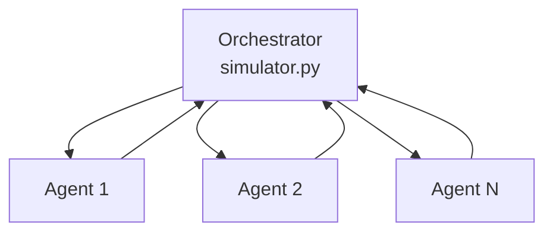
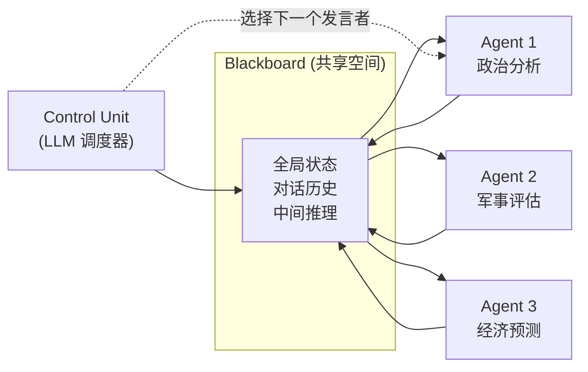
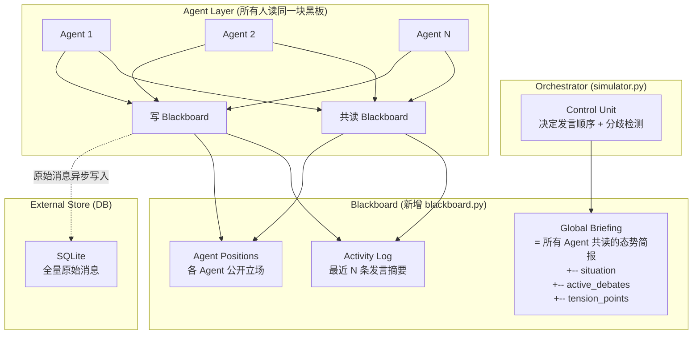

# 多 Agent 系统上下文管理：前沿技术全景 × SwarmOracle 接入方案

> 文档类型：historical snapshot
> 当前真值：否
> 阅读方式：本文件保留研究与方案分析记录，不代表当前实现状态；若与当前代码不一致，以 `llmdoc/*` 和 `README.md` 为准。

> 综合学术界 + 工业界 2025-2026 最新进展，结合 SwarmOracle 现有架构给出可落地方案

---

## 一、当前 SwarmOracle 架构诊断

### 现状：星型拓扑



| 环节 | 代码位置 | 上下文负担 |
|------|---------|-----------|
| 每轮消息收集 | `backend/app/services/simulator.py` 的 `_gather_agent_messages` | 全部 Agent 响应汇入 Orchestrator |
| 分歧检测 | `backend/app/services/simulator.py` 的 `_detect_fork` | 最近 3 轮全部消息 |
| 记忆压缩 | `backend/app/services/memory.py` 的 `compress_rounds` | 每 N 轮暴力压缩 25:1 |
| Agent 上下文 | `backend/app/services/memory.py` 的 `build_agent_context` | ~2300 tokens/Agent/轮 |

**核心瓶颈**：20 Agent x 10 轮 = Orchestrator 处理 200+ 条消息，压缩导致 95% 细节丢失。

---

## 二、前沿技术全景（2025-2026）

### 技术矩阵速览

| # | 范式 | 代表 | 核心思想 | 适用场景 |
|---|------|------|---------|---------|
| 1 | **Context Engineering** | Google ADK | 上下文是一等公民，分离 Session/Working Context/Artifact | 长对话 + 多轮 |
| 2 | **Blackboard 架构** | LbMAS | 共享黑板取代点对点消息，控制器动态调度 Agent | 协作推理 |
| 3 | **分层树型** | MLPO | Leader Agent 管理 Worker，层层压缩信息 | 大规模 Agent |
| 4 | **外部存储 + 引用** | Anthropic Research | Agent 写文件系统，只回传引用 | 信息密集 |
| 5 | **协议标准化** | MCP + A2A | Agent 间通信 + 工具接入统一协议 | 跨系统集成 |

---

### 2.1 Google ADK：Context Engineering

Google 在 2025 Cloud NEXT 发布的 Agent Development Kit 将"上下文"提升为**架构原语**，核心概念：

```
+---------------------------------------------+
|              Session (持久层)                 |
|  +-- events[]    全部消息/动作的时序日志        |
|  +-- state{}     键值状态 (session/user/app)  |
|  +-- artifacts[] 大型产出物的引用              |
+---------------------------------------------+
|          Working Context (临时层)             |
|  = f(session, compaction, retrieval)         |
|  每次 LLM 调用时动态构建，只包含当前需要的信息   |
+---------------------------------------------+
```

**关键创新**：
- **Context Compaction**（上下文压实）：滑动窗口自动摘要旧事件，可配置 `compaction_interval` + `overlap_size` + 自定义 summarizer
- **三级 State 作用域**：session 级（当前对话）、user 级（跨会话）、app 级（全局共享）
- **Artifact 引用模式**：大型输出存为 artifact，上下文里只放引用元数据

> **SwarmOracle 契合度**：5/5 — 直接映射到现有三层记忆架构

### 2.2 Blackboard 架构（LbMAS 框架）

2025 年学术界重新发现了经典 AI 的黑板架构，应用于 LLM 多 Agent 系统：



**核心优势**：
- **共享上下文**：所有 Agent 共读同一块黑板，消除信息孤岛
- **动态调度**：Control Unit（可以是 LLM）根据黑板状态决定下一个发言 Agent
- **Token 效率**：避免 Agent 间重复传递相同信息，论文报告 token 减少 30-50%

> **SwarmOracle 契合度**：4/5 — 群体讨论天然适合黑板模式

### 2.3 分层树型 + MLPO Leader 训练

arXiv 2025 论文 *"How to Train a Leader: Hierarchical Reasoning in Multi-Agent LLMs"* 提出 Multi-agent guided Leader Policy Optimization (MLPO)：

```
Level 0: Orchestrator (全局规划)
    | 委派子目标
Level 1: Group Leaders (领域汇总)
    | 管理组内讨论
Level 2: Worker Agents (具体发言)
```

**关键发现**：
- Leader Agent 经 MLPO 训练后，分配任务的质量显著提升
- 层级间只传递**结构化摘要**（JSON），不传原始对话
- 支持对数级扩展：Agent 数 x10，Leader 数仅 x3

> **SwarmOracle 契合度**：3/5 — 适合 Phase 3 大规模扩展

### 2.4 Anthropic: 外部存储 + 引用模式

[Anthropic Engineering Blog](https://www.anthropic.com/engineering/multi-agent-research-system) 的三个关键实践：

| 实践 | 做法 | 效果 |
|------|------|------|
| **Filesystem Output** | Subagent 输出写外部存储，只回传轻量引用 | 避免"传话游戏"信息衰减 |
| **Clean Context Spawn** | 上下文将满时，spawn 新 subagent + handoff 摘要 | 永不爆炸 |
| **Effort Scaling** | 简单任务 1 agent/3 calls，复杂任务 10+ agents | 资源按需分配 |

> **SwarmOracle 契合度**：5/5 — 最低成本/最高收益的改造方向

### 2.5 协议标准化：MCP + A2A

| 协议 | 发起者 | 关注点 | 现状 (2026.03) |
|------|--------|--------|---------------|
| **MCP** | Anthropic | Agent <-> 工具/数据源 | 事实标准，被 Google/AWS/Azure 采纳 |
| **A2A** | Google | Agent <-> Agent 通信 | Linux Foundation 托管，v0.3 (gRPC + 签名安全) |

> **SwarmOracle 契合度**：2/5 — 当前阶段不需要跨系统集成，但值得跟踪

---

## 三、SwarmOracle 接入方案设计

> [!IMPORTANT]
> **核心原则**：优化的目标是"用结构化方式让所有 Agent 更高效地看到全貌"，而不是"让每个 Agent 看到更少"。群体讨论的涌现性（跨领域启发、意外分歧、蝴蝶效应）是 SwarmOracle 的核心价值，必须保持。

### 推荐架构：Blackboard 共享感知 + 结构化压缩



### 分阶段实施路线

#### Phase 1：结构化压缩 + 全局态势简报（推荐立即做）

> **设计原则**：所有 Agent 必须看到**同一份共享上下文**。不做按角色过滤，保持群体讨论的涌现性和跨领域启发。

改造 `backend/app/services/memory.py` 的 `compress_rounds` 压缩质量：

```python
# 当前: 暴力压缩为 2-3 句摘要 -> 95% 细节丢失
COMPRESS_PROMPT = "将以下 Agent 发言压缩为结构化摘要...{summary: '2-3句'}"

# 优化: 结构化态势简报 -> 保留冲突/转折/关键原话
COMPRESS_PROMPT = """将以下讨论压缩为"态势简报"，重点保留分歧和转折信号:

{messages_text}

输出 JSON:
{{
  "situation": "当前局势一句话",
  "active_debates": ["正在争论的焦点"],
  "key_quotes": ["最具转折性的 1-2 句原话（保留说话人）"],
  "tension_points": ["可能导致历史分裂的紧张点"],
  "consensus": "共识摘要(如有)"
}}"""
```

**核心改变**：不是让每个 Agent 看得更少，而是让**所有人更高效地感知全貌**。

预期效果：
- 所有 Agent 共享同一份简报 -> 保持涌现性（军事 Agent 仍能受经济观点启发）
- 结构化保留分歧信号 -> `tension_points` 直接服务于分支检测
- 信息保真度从 5% -> ~40%（关键原话 + 冲突焦点被显式保留）

---

#### Phase 2：Blackboard 共享空间（中等改动）

新增 `blackboard.py`：

```python
class Blackboard:
    """中央共享空间 — 所有 Agent 共读同一块黑板"""

    def __init__(self):
        self.global_summary = ""       # 全局态势摘要
        self.agent_positions = {}      # {agent_id: "当前立场摘要"}
        self.tension_level = 0         # 0-10 紧张度
        self.unresolved = []           # 悬而未决问题
        self.activity_log = []         # 最近 K 条发言的轻量索引
        self._raw_store = {}           # ref -> DB

    def post(self, agent_id, message, emotion, diverge=None):
        """Agent 写入黑板 (发言后调用)"""
        ref = save_to_db(message)      # 原始消息写 DB
        self.activity_log.append({
            "agent": agent_id,
            "summary": summarize_one_liner(message),  # 1句话摘要
            "emotion": emotion,
            "ref": ref,
        })
        if len(self.activity_log) > 20:
            self.activity_log = self.activity_log[-20:]

    def get_shared_briefing(self, max_entries=10):
        """生成全局共享简报 — 所有 Agent 读到相同内容"""
        return {
            "summary": self.global_summary,
            "recent": self.activity_log[-max_entries:],
            "tensions": self.unresolved,
            "positions": self.agent_positions,
        }
```

**Orchestrator 改造**：

```python
# 当前 simulator.py: Orchestrator 收集所有消息
messages = await _gather_agent_messages(...)  # 所有结果汇入

# 优化: 所有 Agent 读同一块黑板，Orchestrator 只做调度
async def process_agent(agent, blackboard):
    briefing = blackboard.get_shared_briefing()  # 所有人读同一份
    ctx = build_agent_context(agent, setting_bg, topic, briefing)
    result = await llm_call_json(ctx)
    blackboard.post(agent["id"], result["content"], result["emotion"])
    return result
```

预期效果：
- 所有 Agent 共读同一块黑板 -> **保持群体讨论的共享感知**
- Orchestrator 上下文固定为 Blackboard 全局摘要 (~500 tokens)，**不再线性增长**
- 跨领域信息自然流通，分歧信号不被过滤

---

#### Phase 3：分层树型扩展（大规模场景）

当 Agent > 50 时启用：

```
Orchestrator
  +-- 政治组 Leader (管理 曹操/刘备/孙权)
  |     +-- Group Blackboard
  +-- 军事组 Leader (管理 关羽/张飞/司马懿)
  |     +-- Group Blackboard
  +-- 经济组 Leader (管理 诸葛亮/荀彧)
        +-- Group Blackboard

信息流:
  Worker -> Group Blackboard -> Leader 摘要 -> Global Blackboard -> Orchestrator
```

每层 Blackboard 独立管理上下文，Leader 定期向上汇报摘要。

> [!WARNING]
> Phase 3 的组间信息壁垒可能削弱涌现性。需要设计"跨组广播"机制确保重要信息（分歧信号、转折事件）仍能跨组传播。

---

## 四、技术方案对照表

| 维度 | 当前 | Phase 1 | Phase 2 | Phase 3 |
|------|------|---------|---------|---------|
| **拓扑** | 星型 | 星型 + 结构化压缩 | 共享黑板 | 树型 + 分层黑板 |
| **Orchestrator 负载** | O(NxR) | O(NxR) 但压缩更优 | O(1) 固定 | O(log N) |
| **Agent 上下文** | 所有人看同样内容 | 所有人看同一份**高质量**摘要 | 所有人**共读同一块黑板** | 组内黑板 + 跨组摘要 |
| **涌现性保持** | OK 但信息太粗 | OK 结构化保留冲突 | OK 共享感知 | 需注意组间信息壁垒 |
| **信息损失** | 暴力压缩 95% | 结构化压缩 ~60% 保真 | 分级压缩 ~70% 保真 | 领域专家压缩 ~80% 保真 |
| **改动量** | -- | ~30 行 | ~170 行 + 新文件 | ~800 行 + 重构 |
| **适用 Agent 数** | <=20 | <=25 | <=100 | 100+ |

---

## 五、学术论文推荐阅读

| 论文 | 年份 | 核心贡献 | SwarmOracle 参考价值 |
|------|------|---------|-------------------|
| *"LbMAS: LLM-based Multi-Agent System with Blackboard"* | 2025 | 黑板架构 + 动态调度 | 直接参考 Phase 2 设计 |
| *"How to Train a Leader: MLPO"* | 2025 | 层级 Leader 训练方法 | Phase 3 Leader 设计参考 |
| *"Memory in LLM-MAS: A Taxonomy and Review"* | 2025.12 | 多 Agent 记忆分类学 | 全面理解记忆设计空间 |
| *"MCP for Multi-Agent Systems"* | 2025.04 | MCP 在多 Agent 场景的应用 | 未来跨系统集成参考 |
| *Google ADK Context Engineering Blog* | 2025 | Working Context / Compaction | Phase 1 直接参考 |

---

## 六、结论与建议

### 行动优先级

```
紧急度高 <------------------------------------> 紧急度低
  Phase 1                Phase 2              Phase 3
  结构化压缩              Blackboard共享空间     树型拓扑
  (1-2天, 改memory.py)   (1周, 新增blackboard)  (2周, 重构simulator)
```

### 核心洞察

1. **学术界共识**：2025年12月的综述论文明确指出，多 Agent 记忆是**独立的研究前沿**，需要同步、访问控制、可扩展性三位一体
2. **工业界趋势**：Google ADK 的"Context Engineering"已成为主流范式 -- 上下文不是字符串拼接，而是系统架构
3. **Anthropic 实战**：子 Agent 写外部存储 + 回传引用，是最低成本最高收益的优化
4. **Blackboard 复兴**：经典 AI 黑板架构在 LLM 时代焕发新生，特别适合 SwarmOracle 的群体讨论场景
5. **协议演进**：MCP (工具接入) + A2A (Agent 通信) 正在成为标准，SwarmOracle 未来可接入生态

### 最终建议

> [!IMPORTANT]
> **核心原则**：优化的目标是"用结构化方式让所有人更高效地看到全貌"，而不是"让每个人看到更少"。群体讨论的涌现性（跨领域启发、意外分歧、蝴蝶效应）是 SwarmOracle 的核心价值，必须保持。

SwarmOracle 的群体推演场景（多 Agent 平行讨论 + 分支分裂）与 **Blackboard 架构**最为契合。建议：

- **Phase 1 立即做**：改造 `compress_rounds` 为结构化态势简报，保留冲突/转折/关键原话，所有 Agent 共享同一份
- **Phase 2 中期做**：引入 Blackboard 共享空间（所有 Agent 共读同一块黑板），Orchestrator 退化为调度器
- **Phase 3 按需做**：超过 50 Agent 时引入分层树型 + 组内黑板（但需注意组间信息壁垒对涌现性的影响）
